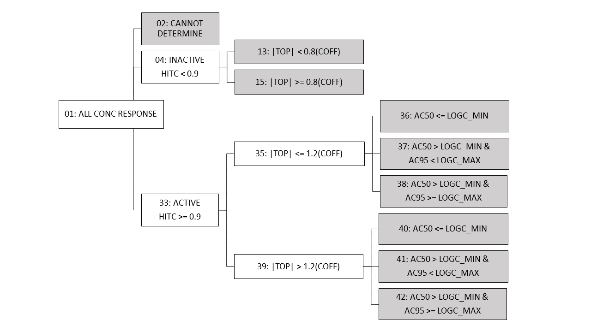

```{css, code = readLines(params$my_css), hide=TRUE, echo = FALSE}
```

```{r eval = TRUE, echo=FALSE, hide=TRUE, message = FALSE, warning=FALSE}
# Primary Packages #
#library(tcpl)
#library(tcplfit2)
# Data Formatting Packages #
library(dplyr)
library(magrittr)
library(data.table)
library(DT)
# Plotting Packages #
library(ggplot2)
library(RColorBrewer)
library(colorspace)
library(viridis)
# Table Packages #
library(htmlTable)
library(kableExtra)
```

<a href="https://cran.r-project.org/web/packages/tcpl/index.html"></a>

# Introduction
After fitting, a continuous hit call (hitc) is calculated as the product of three proportional weights. Several potency estimates are also calculated for the winning model, including activity concentrations at specified levels of response, such as concentration at 50% of maximal activity (AC50) and concentration at activity observed at the cutoff (ACC), and a benchmark dose (BMD) at a specified benchmark response (BMR). This vignette will review the statistics behind the activity and potency estimates available for each concentration-response series and how the user may interpret these values alongside other available information, such as fit categories, representative samples, and cytotoxicity burst thresholds. Overall, this Data Interpretation vignette seeks to enhance user confidence in reviewing and using ToxCast data for different tasks.

# Hit Calls
In tcpl v2, activity hit calls (hitc) were binary, where 0 was negative, 1 was positive, and −1 corresponded to concentration-response series that tcpl was “unable to fit” (e.g., <4 concentrations). In tcpl v3 onwards, the hitc is the product of three proportional weights, and the resulting continuous value is between 0 and 1, though the values are not normally distributed and tend to approach 0 or 1. Hitcalls that approach 1 indicate concentration-response series with biological activity in the measured response (i.e. 'active' hit). $Hitc$ is typically binarized into active or inactive designations, depending on the level of stringency required by the user. For current ToxCast work, a $hitc$ greater than or equal to 0.90 is labeled active, whereas anything less was considered inactive. This threshold of 0.90 was based on other $tcplfit2$ implementations with in vitro screening data [(Nyffeler et al., 2023)](https://www.sciencedirect.com/science/article/pii/S0041008X23001527) and reflects the apparent bimodal nature of the $hitc$ distribution, where a preponderance of the $hitc$ fall between 0 and 0.1 and 0.9 and 1.0. Users may interpret the continuous $hitc$ into active or inactive designations based on different thresholds. Further testing through implementation of this new functionality may reveal appropriate thresholds for different applications or assays. The “unable to fit” series now appear as model “none” with a $hitc$ of 0 (inactive). Negative $hitc$ in tcpl v3.2 correspond to curves that suggest biological activity in an unintended direction, as further described below.

Continuous $hitc$ as defined in [tcplfit2 R package](https://cran.r-project.org/web/packages/tcplfit2/index.html) is calculated as the product of three proportional weights representing the confidence that: 

* $p1$: “the winning AIC value is less than that of the constant model.” 
  * Determine whether the constant model – if allowed to win – is a better fit than the winning model – i.e., is the winning model essentially flat or not.The constant model may never be selected as the winning model, but if the constant model has the lowest AIC compared to other models, the calculated continuous hitc will be zero.
* $p2$: “at least one median response is greater than the cutoff.” 
  * At least one dose group has a central tendency of the response values “outside” the cutoff band (consider bi-directional). Response is greater than cutoff in “+” direction and less than cutoff in “–” direction.
* $p3$: “the top of the fitted curve is above the cutoff”
  * Determine whether the predicted maximal response exceeds the cutoff, i.e. the response corresponding to the effect size of interest.

See [Sheffield et al., 2021](https://doi.org/10.1093/bioinformatics/btab779) for more information on tcplfit2.

# Cutoff
The cutoff is a user-defined level of efficacy that corresponds to statistical and/or biological relevant change from baseline for each assay endpoint. All versions of tcpl provide methods for estimation of the baseline sampling variability, or noise around the assay controls, including calculation of the median absolute deviation over all response values given by wells that may represent baseline response (the BMAD), such as the neutral or vehicle control or the first two concentrations in the concentration series for all chemicals screened as defined by Level 4 methods. Users define mc5 methods depending on assay and data type, with some common cutoff thresholds used to establish a cutoff including $3*BMAD$, 20% percent change, or 1.2*log10 fold-change.  Operationally in tcpl, the efficacy cutoff value ($\mathit{coff}$) is defined as the maximum of all values given by the methods assigned at level 5. When two or more methods (i.e. cutoff values) are applied for processing, the largest cutoff value is always selected as the cutoff for the endpoint. In the event only one method is applied, then that will serve as the efficacy cutoff for the endpoint. Failing to assign a level 5 method will result in every concentration series being called active. For a complete list of level 5 methods, see <font face="CMTT10"> tcplMthdList(lvl = 5) </font> or <font face="CMTT10"> ?MC5\_Methods </font>.

While the ToxCast pipeline supports bidirectional fitting, sometimes it is necessary to censor the hitcalls of responses in the biologically irrelevant direction. Level 5 now contains two methods for "overwriting" the hitcall value. If applied, the continuous hitcall product will be preserved, but the hitcall value for any biologically irrelevant response (i.e., response in an unintended direction, such as an increase observed when the assay examines inhibition only) will be multiplied by negative 1.

```{r ow_table, warning = FALSE, echo = FALSE}
Method <- c(27,28)
Method_Name <- c("ow_bidirectional_loss", "ow_bidirectional_gain")
Description <- c(
  "Multiply winning model hitcall (hitc) by -1 for models fit in the positive analysis direction. Typically used for endpoints where only negative responses are biologically relevant.",
  "Multiply winning model hitcall (hitc) by -1 for models fit in the negative analysis direction. Typically used for endpoints where only positive responses are biologically relevant.")

# Compile all of the information for the table.
output <-  data.frame(Method,Method_Name,Description)

# Export/print the table to an html rendered table.
htmlTable(output,
          align = 'l',
          align.header = 'l',
          rnames = FALSE  ,
          css.cell =  ' padding-bottom: 5px;  vertical-align:top; padding-right: 10px;min-width: 5em ',
          caption="Table 1: Level 5 overwrite (ow) methods for hitcalls in unintended direction."
          )
```

# Potency Estimates
Curve-fitting enables determination of various metrics of potency, i.e., concentrations at which some amount of *in vitro* bioactivity is expected to occur, as illustrated below. This is provided in two sections, Activity Concentrations at Specified Response and Benchmark Dose (BMD), due to differences in the mathematical approach for computing these values, noting that logic for computation of the BMD is controlled in the R package tcplfit2.

<center>


</center>

## Activity Concentrations at Specified Response

An activity concentration is the estimated concentration inducing a specified level of response (activity). A common potency metric used from tcpl is the activity concentration at 50% of maximal activity, or **AC50**. The default baseline region is defined as ± $3*BMAD$⁠, and the ACB is the concentration at which the model first reaches a default of $3*BMAD$⁠, whereas ACC is defined as the concentration at which the model reaches the user-defined cutoff. Note that potency metrics such as **AC50** are reported even if the hit call is inactive if a non-constant model could be fit to the data.

All versions of tcpl output the activity concentrations as described in Table 2. 

```{r warning = FALSE, echo = FALSE}
Activity_Concentration_uM <- c("AC5", "AC10", "AC20", "AC50", "ACB", "ACC", "AC1SD")
Specified_Level_of_Response <- c("Concentration at 5% of the maximal response",
                 "Concentration at 10% of the maximal response",
                 "Concentration at 20% of the maximal response",
                 "Concentration at 50% of the maximal response",
                 "Concentration at baseline of 3*BMAD", 
                 "Concentration at the user-defined cutoff",
                 "Concentration at 1 standard deviation from baseline")

output <- data.frame(Activity_Concentration_uM, Specified_Level_of_Response)

htmlTable(output,
        align = 'l',
        align.header = 'l',
        rnames = FALSE  ,
        css.cell =  ' padding-bottom: 5px;  vertical-align:top; padding-right: 10px;min-width: 5em ',
        caption="Table 2: Activity Concentrations at Specified Response.",
        tfoot="&dagger;Additional information about the different well types, and their use in describing baseline activity, is available in the Data Processing vignette.")

```


## Benchmark Dose

A Benchmark Dose (BMD) is the activity concentration observed at the Benchmark Response (BMR) level. In the current implementation of tcpl and tcplfit2, BMR is only defined as 1.349 standard deviations of baseline response in the two lowest concentrations of treatment wells or neutral controls wells, as defined by Level 4 methods. <font face="CMTT10">tcpl</font> uses the following definitions and assumptions for setting the BMR:

BMR is a change from the mean response at baseline $(𝜇(𝑏))$ by some multiple $(𝑐)$ of the standard deviation of the baseline $(𝑠𝑑(𝑏))$.

<center>

$𝜇(𝑏)+𝑐∗𝑠𝑑(𝑏)=𝐵𝑀𝑅=𝜇(𝐵𝑀𝐷)$

</center>

Here, the baseline $(𝑏)$ is defined as samples from the two lowest concentrations across chemicals within an assay endpoint and the $𝑐=1.349a$ ([(Yang et al., 2017)](https://doi.org/10.1186/1471-2164-8-387)).

A 90% confidence interval around the BMD, bounded by the benchmark dose lower bound (BMDL) and the benchmark dose upper bound (BMDU), is also computed and provided to reflect the uncertainty in the BMD estimate. The calculation of these confidence intervals will occasionally fail due to a singular matrix inverse, and in these cases, BMDU and BMDL will not be reported. This case occurs when the data are especially noisy and the confidence interval around the BMD approaches infinity. The winning model may return a $\mathit{bmd}$ estimate that falls outside of the tested concentration range, so bounds are placed to censor the estimate values. The lower and upper bounds for $\mathit{bmd}$ estimates are $0.1*\text{the lowest test concentration}$ and $10*\text{the the highest test concentration}$, respectively. If the calculated $\mathit{bmd}$ estimate is below or above the lower or the upper bounds, the value at the bound will be returned as the bounded $\mathit{bmd}$ estimate instead.

# Fit Categories {#fitc}

<center></center>

A hierarchical fit category ($\mathit{fitc}$) decision tree is used to bin each fit as shown in Figure 2. Each fit falls into one leaf of the tree using the described logic with the final $\mathit{fitc}$ indicated with gray boxes. Abbreviations are defined as: $\mathit{conc}$ = concentration; $\mathit{hitc}$ = hit call; $\mathit{|top|}$ = absolute value of the modeled curve top; $\mathit{coff}$ = cutoff; $log_c(min)$ = minimum log~10~ concentration tested; $log_c(max)$ = maximum log~10~ concentration tested; AC~50~ = $50 \%$ activity concentration; AC~95~ = $95 \%$ activity concentration.

After curve fitting, all concentration series are assigned a fit category ($\mathit{fitc}$) based on similar characteristics and shape. Logic is based on relative activity, efficacy, and potency comparisons as shown in Figure 5. For continuity purposes, $\mathit{fitc}$ numbering has been conserved from past <font face="CMTT10">tcpl</font> versions. Grouping all series into $\mathit{fitc}$ enables quality control and can be useful in data cleaning applications, especially when considered with Level 6 flags. In <font face="CMTT10">invitrodb v3-3.5</font>, a common filtering approach removed the least reproducible curve-fits, i.e. those with very low AC~50~ (below the screened $\mathit{conc}$ range) and low efficacy (within 1.2-fold of the cutoff) as well as 3+ flags. However, preliminary investigation into <font face="CMTT10">invitrodb v4.1-4.2</font> has suggested that removing curve fits with 4 or more flags, or possibly filtering based on specific flags in combination with fitc such as fitc 36, may be a more appropriate filtering approach due to changes in curve fitting and flags in <font face="CMTT10">invitrodb v4</font> and beyond. The stringency of filtering for flags should be explored in a fit-for-purpose way.

Fit category is largely based upon the relative efficacy and, in the case of actives, the location of the AC~50~ and concentration at $95 \%$ activity (an estimate of maximum activity concentration, AC~95~) compared to the tested concentration range. All concentration response curves are first split into active, inactive, or cannot determine. “Cannot determine” is indicative of exceptions that cannot be curve-fit, e.g. a concentration series with fewer than 4 concentrations. Active designations are determined for $\mathit{fitc}$ based on whether the $\mathit{hitc}$ surpasses the 0.90 threshold. For those series that are designated inactive with a $\mathit{hitc}$ less than 0.90, $\mathit{fitc}$ can be used to indicate to what extent the curve represents borderline inactivity via comparison of top modeled efficacy to the cutoff (i.e, the absolute value of the modeled top is less than 0.8 times the cutoff).

For active curves, efficacy, as represented by the modeled top, is compared to 1.2 times the cutoff (less than or equal to, or greater than), thereby differentiating curves that may represent borderline activity from moderate activity. Active curves also have potency metrics estimated, e.g., AC~50~ and AC~95~ values, that can be compared to the range of concentrations screened to indicate curves for which potency estimates are more quantitatively informative. Curves for which the AC~50~ is less than or equal to the minimum concentration tested ($\mathit{fitc}$ = 36, 40) may indicate AC~50~ values that are less quantitatively informative than AC~50~ values within the concentration range screened. When the AC~50~ is greater than the minimum concentration tested but the AC~95~ is greater than or equal to the maximum concentration tested ($\mathit{fitc}$ = 38, 42), it is possible the maximum activity was not fully observed in the concentration range screened. $\mathit{Fitc}$ for curves where the AC~50~ and AC~95~ are both within the concentration range screened ($\mathit{fitc}$ = 37, 41) represent the most quantitatively informative AC~50~ values.

$\mathit{Fitc}$ 36 describes a curve that is of low efficacy and with a low AC~50~, below the concentration range screened. These are more likely to be noise or less reproducible fits. $\mathit{Fitc}$ 41 and 42 are the ideal $\mathit{fitc}$ for reproducible curves, as demonstrated by these two $\mathit{fitc}$ comprising the majority of positive ($\mathit{hitc}$ > 0.9) curves in <font face="CMTT10">invitrodb v4.1</font>. $\mathit{Fitc}$ 40 indicates a curve with at least moderate efficacy, but an AC~50~ below the concentration range screened. These chemicals may be positive or reference chemicals screened in the incorrect concentration window to observe their minimum activity. These curves may also represent high-confidence positives for which we have limited understanding of the slope of the concentration-response curve, and as such, the AC~50~ may be associated with more uncertainty.

# Flags (Level 6)

In addition to the continuous $hitc$ and the $fitc$, cautionary flags on curve-fitting can provide context to interpret potential false positives (or negatives) in ToxCast data, enabling the user to decide the stringency with which to filter these targeted in vitro screening data. Cautionary flags on fitting were developed in previous versions of <font face="CMTT10">tcpl</font> and have been stored at Level 6. These flags are programmatically generated and indicate characteristics of a curve that need extra attention or potential anomalies in the curve or data.

For example, a curve may be considered a single point hit with activity not at the highest concentration tested, but re-inspection of the flagged curve could indicate a potential false positive. Other flags may suggest borderline activity, overfitting, or cell viability assays that are fit with gain-loss as the winning model. It is important to note that flags have no effect on the $hitc$ or potency estimates, but they may indicate that a curve requires further examination to aid in data interpretation. For a full list of flags implemented and descriptions, refer to Table 2.

<!--#Table 12-->
```{r lvl-6-flag-table, warning = FALSE, echo = FALSE}
# First column - Level 6 Method ID
Method <- c(5:11, 13:15, 17:20)

# Second column - Level 6 Flag Names
FlagNames <- c("modl.directionality.fail", "singlept.hit.high", "singlept.hit.mid",
               "multipoint.neg", "bmd.high", "noise", "border", "low.nrep", 
               "low.nconc", "gnls.lowconc", "efficacy.50", "ac50.lowconc", 
               "viability.gnls", "no.med.gt.3bmad")
# Third column - Level 6 Flag Descriptions
FlagDescription <- c("Flag series if model directionality is questionable, i.e. if the winning model
                     direction was opposite, more responses $(resp)$ would have exceeded the cutoff 
                     $(coff)$. If loss was winning directionality $(top < 0)$,
                     flag if $count(resp < -1 * coff) < 2 * count(resp > coff)$. 
                     If gain was winning directionality
                     $(top > 0)$, flag if $count(resp > coff) < 2 * count(resp < -1 * coff)$.",
                     "Flag single-point hit that's only at the highest conc tested, where series is 
                     an active hit call $(hitc >= 0.9)$ with the median response observed above 
                     baseline occurring only at the highest tested concentration tested.",
                     "Flag single-point hit that's not at the highest conc tested, where series is 
                     an active hit call $(hitc >= 0.9)$ with the median response observed above 
                     baseline occurring only at one concentration and not the highest concentration
                     tested.", 
                     "Flag multi-point miss, where series is an inactive hit call $(hitc < 0.9)$ 
                     with multiple median responses observed above baseline.",
                     "Flag series if modeled benchmark dose $(BMD)$ is greater than AC~50~ 
                     (concentration at 50% maximal response). This is indicates high 
                     variability in baseline response in excess of more than half of the maximal 
                     response.", 
                     "Flag series as noisy if the quality of fit as calculated by the root mean 
                     square error $(rmse)$ for the series is greater than the cutoff $(coff)$; 
                     $rmse > coff$",
                     "Flag series if borderline activity is suspected based on modeled top 
                     parameter $(top)$ relative to cutoff $(coff)$; $|top| <= 1.2 * coff$ or 
                     $|top|>= 0.8 * coff$.",
                     "Flag series if the average number of replicates per concentration is less than
                     2; $nrep < 2$.",
                     "Flag series if 4 concentrations or less were tested; $nconc <= 4$.",
                     "Flag series where winning model is gain-loss $(gnls)$ and the gain AC~50~ is less 
                     than the minimum tested concentration, and the loss AC~50~ is less than the mean 
                     tested concentration.",
                     "Flag low efficacy hits if series has an active hit call $(hitc >= 0.9)$ and 
                     efficacy values (e.g. top and maximum median response) less than 50%; 
                     intended for biochemical assays. If $hitc >= 0.9$ and $coff >= 5$, then flag when 
                     $top < 50$ or $max\\_med < 50$. If $hitc >= 0.9$ and $coff < 5$, then flag when 
                     $top < \\log_{2}(1.5)$ or $max\\_med < \\log_{2}(1.5)$.",
                     "Flag series with an active hit call $(hitc >= 0.9)$ if AC~50~ (concentration 
                     at 50% maximal response) is less than the lowest concentration tested; if 
                     $hitc >= 0.9$ and $AC_{50} < 10^{\\log_c(min)}$, then flag.", 
                     "Flag series with an active hit call $(hitc >= 0.9)$ if denoted as cell 
                     viability assay with winning model is gain-loss $(gnls)$; if $hitc >= 0.9$, 
                     $modl = gnls$ and $cell\\_viability\\_assay = 1$, then flag.",
                     "Flag series where no median response values are greater than baseline as 
                     defined by 3 times the baseline median absolute deviation $(bmad)$; both $nmed_gtbl_pos$ and $nmed_gtbl_neg = 0$, where $nmed_gtbl_pos/_neg$ is the number of medians greater than $3 * bmad$ or less than $-3 * bmad$")

# Consolidate all columns into a table.
output <- data.frame(Method, FlagNames, FlagDescription)

# Export/print the table into an html rendered table.
htmlTable(output,
          align = 'l',
          align.header = 'l',
          header = c("Method", "Name", "Description"),
          rnames = FALSE,
          css.cell =  ' padding-bottom: 5px;  vertical-align:top; padding-right: 10px;min-width: 5em ',
          
          caption = "Table 2: Level 6 Methods - Cautionary Flags" #,
          #tfoot = "Level 6 flag descriptions are pulled from ##SOURCE## <SOURCE>."
)
```

# Representative Samples {#chid}

Multiple samples of the same chemical (many spids per chid) may be tested for a given assay endpoint. The  <font face="CMTT10">**tcplSubsetChid**</font> function subsets multiple-concentration Level 5 (MC5) or single-concentration Level 2 (SC2) data to select the "best" single tested sample to represent that chemical for a given endpoint. The function uses a series of logic to select the "representative sample" in MC and SC. Representative sample designation for a tested chemical are stored in the MC5_chid and SC2_chid tables, where 1 indicates if ID (M5ID or S2ID, respectively) is a representative sample, else 0.

## MC Representative Samples
To select a representative sample in MC, a "consensus hitc" is made by taking the mean of all binarized sample hitc, with ties defaulting to active. After the chemical-wise hitc is made, the samples corresponding to chemical-wise hit call are logically ordered using the fit category, the number of the flags, and AC50, then the first sample for every chemical is selected. This logic prioritizes active over inactive hit calls when there is a disagreement among samples, but then attempts to pick the representative sample with the highest quality curve, with the goal of minimizing false negatives. Logic encompasses the following:

1. Hitc are first binarized to active (1) or inactive (0), where hitc >= 0.9 is deemed active. Mean of the binarized hitc across samples is calculated for the chemical. Representative sample must match mean activity call (active or inactive), where a mean activity hit call >= 0.5 is considered active.
2. Samples are prioritized first by [Fit Categories](fitc). Generally AC50 values within concentration range (fitc = 37, 41) are prioritized over AC50 values above concentration range (fitc = 38, 42) then AC50 values below concentration range (fitc = 36, 40)
4. Samples are then sorted based on number of flags. Curve fits for samples with fewer flags are prioritized.
5. Finally, if all things are equal, the sample with a lower AC50 is selected over higher AC50.

## SC Representative Samples
To select a representative sample in SC, a "consensus hitc" is made by taking the mean of all sample hitc, with ties defaulting to active. After the chemical-wise hitc is made, the samples in the consensus hitc are ordered based on lowest concentration tested and the sample with the maximum median response is selected.

# Variable Matrices

The  <font face="CMTT10">tcplVarMat </font> function creates chemical-by-endpoint matrices, combining summary information for single-concentration and/or multiple-concentration screening. Such a matrix can be useful for understanding which chemicals were tested, and what hit calls and potency values resulted from this screening. For example, one might ask, "Which chemicals were screened in either single-concentration or multi-concentration for some assay endpoint, and if multi-concentration screening was performed, what potency was estimated for any observed activity?" 

For variable matrices from <font face="CMTT10">tcplVarMat </font>, a representative sample is selected using the tcplSubsetChid function in cases where a chemical-by-endpoint was tested in multiple samples (performed separately for multiple-concentration or single-concentration screening). When multiple sample-assay series exist for one chemical, a single series is selected by the <font face="CMTT10"> tcplSubsetChid </font> function. See the [Representative Samples section](chid) for more information. <br/>

 1. "ac50" -- The active concentration at 50% maximal response ($\mathit{AC_{50}}$) for the winning model. <br/>
 2. "ac50_verbose" -- The $\mathit{AC_{50}}$ for the winning model, with text inserted in place for some situations touched on below. <br/>
 3. "acc" -- The active concentration at user-defined cutoff ($\mathit{ACC}$ ) for the winning model. <br/>
 4. "acc_verbose" -- The $\mathit{ACC}$ for the winning model, with text inserted in place for some situations touched on below. <br/>
 5. "mc_hitc" -- The hit-call for the winning model in multiple-concentration (MC) screening. <br/>
 6. "sc_hitc" -- The hit-call in single concentration (SC) screening. <br/>

<font face="CMTT10">tcplVarMat </font> produces matrices of combined sc-mc output. For the $\mathit{AC_{50}}$ and $\mathit{ACC}$ matrices specifically, values are inserted in place to show complete views of what was tested and what the results. Further, "ac50_verbose" and "acc_verbose" replace such values with text. $\mathit{AC_{50}}$ and $\mathit{ACC}$ are:

- Value as reported when the chemical is tested in MC and positive
- Set to 1e6 when the chemical is tested but negative in MC. In _verbose matrices, these are indicated as "MC neg".
- Set to 1e7 when the chemical is not tested in MC but was screened in SC with a positive hitcall for the same aeid. In _verbose matrices, these are indicated as "SC pos, No MC".
- Set to 1e8 when the chemical is not tested in MC but was screened in SC with a negative hitcall for the same aeid. In _verbose matrices, these are indicated as "SC neg, No MC".
- Left as NULL if chemical is not tested in either MC or SC.

Both SC and MC data are required for <font face="CMTT10">tcplVarMat</font>. As a result, the "API" driver is not currently supported for invitrodb v4.1 since it does not return SC data.

In addition, additional matrices can be defined by the 'add.vars' parameter. The 'add.vars' parameter will take any Level 4 or 5 field and create the respective matrix.

```{r varmat_use, eval = FALSE}
# create matrices with all chemicals and assays; the entire database
varmat <- tcplVarMat()
# create matrices using a subset of chemicals and/or aeids
aeids <- c(80)
dtxsid <- c("DTXSID80379721", "DTXSID10379991", "DTXSID7021106", "DTXSID1026081")
varmat <- tcplVarMat(aeid = aeids, dsstox_substance_id = dtxsid)
# create extra matrices by adding vars
varmat <- tcplVarMat(aeid = aeids, add.vars = c("m4id", "resp_max", "max_med"))
```

<font face="CMTT10">**tcplVarMat**</font> returns a list of chemical by assay matrices (data.tables) where the rows are given by the dsstox_substance_id and corresponding chnm (chemical name) columns and the colnames are given by assay endpoint name (aenm). To export this list, save to a .xlsx. Each matrix will have its own sheet.

```{r varmat_save, eval = FALSE}
library(writexl)
write_xlsx(varmat, path = "varmat_output.xlsx")
```

# Cytotoxicity Burst Distribution
Estimates of chemical concentrations that elicit cytotoxicity and/or cell stress have been informative for contextualizing bioactivity screening data in ToxCast by providing information on the likelihood that these data may be confounded by assay interference resulting from cytotoxicity and/or cell stress, particularly when a parallel or in-well estimate of cell viability is unavailable. As such, general estimates of the median and lower bound concentrations that might elicit cytotoxicity and/or cell stress in vitro have previously been calculated using the <font face="CMTT10">**tcplCytoPt**</font> function, which considers activity across a suite of cell-based assays based on updates to previous work [(Judson et al., 2016)](https://pubmed.ncbi.nlm.nih.gov/27605417/).

The burst threshold can be used to infer activity above or below an estimated threshold of generalized cell stress and/or cytotoxicity, where users can define the degree of difference between some observed bioactivity and estimates of cell stress and/or cytotoxicity needed in order to discern "selective" activity (i.e., bioactivity thought to occur independently of cell stress and/or cytotoxicity) vs. "non-selective" activity (i.e., bioactivity that appears to occur concomitantly with estimates of the concentration needed for cell stress and/or cytotoxicity).

These estimated concentration threshold values have been released in the “cytotox” table of invitrodb and are also provided on the CompTox Chemicals Dashboard (CCD) Bioactivity Summary Plot, as shown in the BPA example below. 

<center>


</center

## Burst Endpoints
Recognizing the substantial impact of cytotoxicity in confounding screening results, assays will often include parallel screens to try to capture non-specific activation of many targets as cells approach death. 

The <font face="CMTT10"> tcplCytoPt</font> function uses the assay endpoints listed in the $\mathit{burst\_assay}$ field of the "assay\_component\_endpoint" table, where 1 indicates including the assay endpoint in the calculation. The "burst" assay endpoints can be identified by running  <font face="CMTT10"> tcplLoadAeid(fld = "burst\_assay", val = 1) </font>. 

## Implementation
The cytotoxicity point is simply the median AC$_{50}$ for a set of assay endpoints defined within the <font face="CMTT10"> tcpl</font>  database. <font face="CMTT10">tcplCytoPt </font> outputs estimates in logged and unlogged concentration units. In addition to the cytotoxicity point (cytotox_median), a lower bound estimate (cytotox_lower_bnd) is defined by the cytotoxicity point minus 3 times the calculated global median absolute deviation (cytotox_median_um $- 3 * globalMAD$). A cytotox_median is reported for any chemical in the database with at least one active hit call in the set of assay endpoints defined as "burst" related (73 assay endpoints in invitrodb v4.2). For a chemical to be included in a computation of the global median absolute deviation (global_MAD), an estimate of the variance expected for a chemical tested in many cytotoxicity and cell stress assays, the chemical must be assayed in greater than or equal to 60 assay endpoints annotated as “burst” endpoints with an active hit call in at least 3 of those 60 "burst" assay endpoints. This typically includes chemicals that were highly screened, based on inclusion in initial ToxCast Phase I and II chemical screening. Additional filtering of burst assay data was also required to ensure only losses in cell viability were included and any cell proliferation responses were excluded (for a subset of bidirectional endpoints). 

The global MAD gives an estimate of overall cytotoxicity window using a set of highly screened chemicals to estimate variability in cytotoxicity data, and then allows for a cytotoxicity distribution to be determined for chemicals with greater than 5% activity across tested "burst" assay endpoints. The cytotoxicity point for chemicals with a burst percentage of less than 5% is set to a default value of $3$. $10^3 = 1000$, therefore, when using micromolar units, $3$ is equivalent to $1$ millimolar. $1$ millimolar was chosen as an arbitrary high concentration given it's outside the typical testing range for ToxCast data and based on the principle that all compounds are toxic if given in high enough concentration.

# Assay Description Documents
Given ToxCast includes a heterogeneous set of assays across a diverse biological space, annotations in the database help flexibly aggregate and differentiate processed data whereas assay documentation aligned with international standardization efforts can make ToxCast data more useful and interpretable for use in decision-making. Assay Element and Auxillary Annotation structure is described in tcpl's Introduction vignette, whereas how to access databased annotation information is described in the Data Retrieval vignettes.

The [OECD Guidance Document 211 (GD211)](https://ntp.niehs.nih.gov/sites/default/files/iccvam/suppdocs/feddocs/oecd/oecd-gd211-2014-508.pdf) is a standard for comprehensive assay documentation describing non-guideline in vitro test methods and their interpretation. This template is intended to harmonize non-guideline, *in vitro* method descriptions to allow assessment of the relevance of the test method for biological responses of interest and the quality of the data produced. Unlike the assay element annotations which are often short in a standardized format or use a controlled term list, the assay_descriptions fields have no character limit for text. A compiled report of these assay description documents are available on the [ToxCast Downloadable Data page](https://www.epa.gov/chemical-research/exploring-toxcast-data-downloadable-data).

# Adminstered Equivalent Doses {#aed}
The highest level assumption in the *in vitro* to *in vivo* extrapolation (IVIVE) approach employed here is that the *in vitro* bioactive concentration in a ToxCast assay endpoint is roughly equivalent to a human plasma concentration *in vivo*. For a review of IVIVE and httk models for it, please see: [Breen et al, 2021](https://pubmed.ncbi.nlm.nih.gov/34056988/)

For invitrodb v4.2 onward, a new multi-concentration level 7 (MC7) table contains pre-generated AED values using several potency metrics from invitrodb and a subset of models from the High-throughput Toxicokinetics R package <font face="CMTT10"> httk </font>. As implemented, this MC7 table provides users with pre-calculated estimates of the *in vivo* human administered dose (mg/kg/day) based on the *in vitro* bioactive concentrations as seen in ToxCast screening data.

## Implementation
AEDs are generated in a separate .R script using the [httk R package](https://cran.r-project.org/web/packages/httk/index.html) because of the resource-intensive nature of running the Monte Carlo simulations to get estimates of plasma concentration for the median (50th %-ile) and most sensitive (95th %-ile) toxicokinetic individuals for both the 3-compartment steady state (3compartmentss) model and the physiologically-based toxicokinetic (pbtk) model. Given the large number of chemicals and endpoints included in invitrodb v4.2, generation of the MC7 table as configured with the options below took 24 hours using 40 cores.

### Options Applied

```{r aed_table, warning = FALSE, echo = FALSE}
Parameter <- c("Library(httk)", "httk::calc_mc_oral_equiv()", "httk models used", "httk and QSPRs", "Potency metrics used for httk::calc_mc_oral_equiv()", "Filters on m4id")
Options_Applied <- c("Version 2.3.1", 
                     "species = ‘Human’ </br> 
                      restrictive.clearance=T</br>
                      output.units=’mgpkgpday’</br> 
                      Caco2.options, which revise the fraction bioavailable using estimates of absorption and gut permeability, were kept as default (Caco2.options = list(Caco2.Pab.default = 1.6, Caco2.Fabs=TRUE, Caco2.Fgut=TRUE, overwrite.invivo=FALSE, keepit100=FALSE))",
                      "*3compartmentss*: employs 3 compartments and steady-state assumption with 1 mg/kg/day dosing, assumes clearance = 1/plasma concentration at steady state. When fraction unbound is unavailable, model assumes it is just a very small number </br> 
                      *pbtk*: multi-compartment model that does not assume steady-state kinetics. Requires estimates of intrinsic clearance and fraction unbound; not available for quite as many chemicals as 3compartmentss",
"Quantitative structure property relationships is loaded via load_sipes2017(), load_pradeep2020(), and load_dawson2021() to be able to make AED estimates for as many chemicals as possible.", 
  "ac50, acc, bmd",
  "Hitc >= 0.9 </br>
Number of mc6 flags is >= 4 </br>
Fit category is not 36. This removes borderline responses resulting in ac50 below the concentration range screened, which is not considered to be quantitatively informative.
.")

# Compile all of the information for the table.
output <-  data.frame(Parameter, Options_Applied)

# Export/print the table to an html rendered table.
htmlTable(output,
          align = 'l',
          align.header = 'l',
          rnames = FALSE  ,
          css.cell =  ' padding-bottom: 5px;  vertical-align:top; padding-right: 10px;min-width: 5em ',
          caption="Table 3: Options Applied when extrapolating Adminstered Equivalent Doses."
          )
```

# Analytical QC and Applicability Domain

There is high value in understanding the outcomes of solubilization and chemical stability in the vehicle chosen to solubilize the chemical, i.e. a chemical's applicability domain for *in vitro* screening. This informs what chemicals and samples should screened in future experiments. It also helps inform future structural models to understand which chemicals will be stable and detectable in solubilization, and further provide insight into possible degradation products that could be synthesized or purchased. Most critically, this information promotes understanding of uncertainty in estimates of initial experimental concentration of chemicals. 

To establish a resource of applicability domain information at the substance and sample level, a retrospective analysis of the analytical QC data for the ToxCast/Tox21 chemical library was conducted. This involved reviewing legacy reports from gas chromatography-mass spectrometry (GCMS), liquid chromatography-mass spectrometry (LCMS), and Nuclear Magnetic Resonance (NMR) experiments. Additional Analytical QC, such as for the PFAS chemical library, and integration efforts are ongoing. 

```{r warning = FALSE, echo = FALSE}
Field <- c("dtxsid", "chnm", "spid", "qc_level", "pass_or_caution", "t0", "t4", 
"call", "annotation", "flags", "average_mass", "log10_vapor_pressure_OPERA_pred", "logKow_octanol_water_OPERA_pred")

Description <- c("Unique identifier from U.S. EPA Distributed Structure-Searchable Toxicity (DSSTox) Database", 
                 "Chemical name", "Sample ID", "Level of analytical QC: substance or sample", 
                 "Indication of analytical QC pass or caution. Considered caution unless T0 or T4 is A, B or T0 and T4 are I with S call", 
                 "Grade at T0. Grade options include: </br> </br>
                 A: Molecular Weight (MW) Confirmed, Purity >90% </br> 
                 B: MW Confirmed, Purity 75-90% </br> 
                 C: MW Confirmed, Purity 50-75% </br> 
                 D: CAUTION Purity <50% </br> 
                 Ac: Purity > 90% CAUTION Low Conc. 5-30% of expected value </br> 
                 Bc: Purity 75-90% CAUTION, Low Conc. 5-30% of expected value </br>
                 Cc: Purity 50-75% CAUTION, Low Conc. 5-30% of expected value</br>
                 Fc: CAUTION Very Low Conc. <5% of expected value. Biological Activity Unreliable</br>
                 Z: MW Confirmed, No Purity Info </br> 
                 I: ISOMERS Two or more isomers detected </br>
                 M: DEFINED MIXTURE Two or more components </br> 
                 F: CAUTION Incorrect MW. Biological Activity Unreliable</br>
                 Fns: CAUTION No Sample Detected. Biological Activity Unreliable</br>
                 U: Unknown/Inconclusive</br>
                 ND: Not Determined,W:Sample Withdrawn",
                 "Grade at T4. Same options at T0.", 
                 "Call options include:</br> </br>
                 S: Stable</br>
                 T: CAUTION Chemical transformation </br>
                 L: CAUTION Physical loss</br>
                 X: CAUTION Unstable, reason undetermined", 
"Annotation note from analytical QC manual curation",
"Interpretative flags set based on observed substance or sample level QC (T0, T4, calls) or physicochemical properties", 
"Mass",
"OPERA predicted log10 vapor pressure", 
"OPERA predicted Octanol-water partition coefficient")

output <- data.frame(Field, Description)

htmlTable(output,
        align = 'l',
        align.header = 'l',
        rnames = FALSE  ,
        css.cell =  ' padding-bottom: 5px;  vertical-align:top; padding-right: 10px;min-width: 5em ',
        caption="Table 4: Fields in the Chemical_Analytical_QC Table.")

```

# Example Integrations with Other Computational Toxicology Tools

## Evaluate ToxCast AEDs for a single chemical and target

This section will explore how one can compare in vivo Points of Departure (PODs) from the [Toxicity Reference Database (ToxRefDB)](https://www.epa.gov/comptox-tools/downloadable-computational-toxicology-data#AT) with administered equivalent doses (AEDs) from ToxCast *in vitro* bioactivity data from invitrodb. The process can be adapted for any given chemical and target depending on available data in either database.

The following example will consider "Pentachlorophenol" and "liver toxicity"

### Consider ToxRefDB *in vivo* toxicity benchmarks as POD-Traditional

First, export ToxRefDB batch download results for any chemical from the [CompTox Chemicals Dashboard] (https://comptox.epa.gov/dashboard/batch-search) Batch Search or [CTX Hazard APIs)](https://www.epa.gov/comptox-tools/computational-toxicology-and-exposure-apis). Check out the [<font face="CMTT10">ctxR</font> R Client package](<https://cran.r-project.org/web/packages/ctxR>) for more guidance on interacting with the CTX APIs.

After loading all chemical-specific data for "Pentachlorophenol", filter results to only include "liver"-related effects
```{r txrf-data-liver-subset, eval=FALSE}
toxref_chnm_liver <- toxref_batch_download_chnm %>% 
  filter(endpoint_target == 'liver') 
```

Next identify the observed lowest effect (significantly different from control in source document i.e. treatment related=1) and lowest observed adverse (deemed adverse by study reviewer in source document i.e. critical_effect=1) effect levels at minimum dose_adjusted (mg/kg/day) value.

```{r txrf-lel-determination, eval=FALSE}
toxref_chnm_liver_lel<-toxref_chnm_liver %>% 
  summarise(lel=min(dose_adjusted[treatment_related==1]), 
            loael=min(dose_adjusted[critical_effect==1]))
```

### Consider ToxCast *in vitro* bioactivity data as POD-NAM

First, query the invitrodb database for all assay annotations, and filter results to consider only "liver"  derived tissue-based endpoints.

```{r txct-annotations-liver-subset, warning=FALSE, eval=FALSE}
toxcast_annotations_subset <- tcplLoadAeid(fld = "tissue", val = "liver", add.fld = "tissue")
```

For this subset of endpoints of targeted interest, pull assay results (mc5-mc6) for the chemical "Pentachlorophenol"
```{r txct-data-pull, fig.align='center',class.source="scroll-300",message=FALSE, eval=FALSE}
# Load the chemical data from the database
chnm <- 'Pentachlorophenol'
chem <- tcplLoadChem(field = 'chnm',val = chnm)
                     
# Load mc5 data from the database for the specified chemical
mc5 <- tcplLoadData(lvl = 5, # data level 
                        fld = 'spid', # field to query on
                        val = chem[,spid], # value for each field (fld)
                        type = 'mc') # data type - MC

#Join with level 6 flag information
mc6 <- tcplPrepOtpt(tcplLoadData(lvl=6, fld='m4id', val=mc5$m4id, type='mc'))
setDT(mc6)
mc6_mthds <- mc6[ , .( mc6_mthd_id = paste(mc6_mthd_id, collapse=",")), by = m4id]
mc6_flags <- mc6[ , .( flag = paste(flag, collapse=";")), by = m4id]
mc5$mc6_flags <- mc6_mthds$mc6_mthd_id[match(mc5$m4id, mc6_mthds$m4id)]
mc5[, flag.length := ifelse(!is.na(mc6_flags), 
                     count.fields(textConnection(mc6_flags), sep =','), NA)]

# filter the potency and activity using coarse filters related to hitc, flags, fitc
mc5[hitc>=0.9 & flag.length < 3, use.me := 1]
mc5[hitc>=0.9 & is.na(flag.length), use.me := 1]
mc5[hitc>=0.9 & flag.length >= 3, use.me := 0]
mc5[fitc %in% c(36,45), use.me := 0]
mc5[hitc<0.9, use.me := 0]
mc5[use.me==0, ac50 := as.numeric(NA)]
mc5[use.me==0, hitc := 0]
mc5[hitc==0, ac50 := as.numeric(NA)]
mc5[hitc>=0.9,ac50_uM := ifelse(!is.na(ac50), ac50, NA)]

#Filter to only liver endpoints
toxcast_mc5_liver <- mc5[aeid %in% toxcast_annotations_subset$aeid,]
```

Obtain a summary of the ToxCast AC50 values with the 5th and 50th percentiles, as well as the mean.

```{r httk-prep, eval=FALSE}
# Calculating summary statistics for ac50 values for httk processing to calculate AED
toxcast_mc5_liver_summary <- toxcast_mc5_liver[,list(
  p5.ac50uM = quantile(ac50_uM, probs=c(0.05), na.rm=T),
  p50.ac50uM = quantile(ac50_uM, probs=c(0.50), na.rm=T),
  mean.ac50uM = mean(ac50_uM, na.rm=T))]
```

[Administered Equivalent Doses](aeds) can be accessed from Level 7, or calculated *ad hoc* using the [High-throughput Toxicokinetics R package (httk)](https://cran.r-project.org/web/packages/httk/index.html). Potency estimates and model options can be adjusted based on use case. In this example, modeling assumptions when estimating the AEDs with httk were: 

- Species options include ‘Rat’, ‘Rabbit’, ’Dog’, ’Mouse’ or default ‘Human'
- Which quantile from Monte Carlo steady-state simulation (for Css)? The scaling factor is the inverse of the steady state plasma concentration (Css) predicted for a 1 mg/kg/day exposure dose rate. This simulates variability and propagates uncertainty to calculate an upper 95th percentile Css,95 for individuals who get higher plasma concentrations from the same exposure, i.e. 95th concentration quantile produces the 5th dose quantile (most sensitive measure).;
- Restrictive clearance indicates the chemical is protein-bound such that it is relatively unavailable for hepatic metabolism or renal excretion; whereas, non-restrictive clearance assumes the chemical rapidly disassociates from the protein for metabolism and excretion 

```{r httk-aed, warning=FALSE, message=FALSE, eval=FALSE}
# Generate AEDs
toxcast_aed_liver_summary <- toxcast_mc5_liver_summary %>% 
      summarize(aed.p5ac50.hu.css.50 = calc_mc_oral_equiv(conc=p5.ac50uM, 
                  dtxsid = 'DTXSID7021106', which.quantile=c(0.95),
                  species='Human', restrictive.clearance=T, 
                  output.units='mgpkgpday', model='3compartmentss'),
        aed.p50ac50.hu.css.50 = calc_mc_oral_equiv(conc=p50.ac50uM, 
                  dtxsid = 'DTXSID7021106', which.quantile=c(0.95),
                  species='Human', restrictive.clearance=T, 
                  output.units='mgpkgpday', model='3compartmentss'),
        aed.meanac50.hu.css.50 = calc_mc_oral_equiv(conc=mean.ac50uM, 
                  dtxsid = 'DTXSID7021106', which.quantile=c(0.95),
                  species='Human', restrictive.clearance=T, 
                  output.units='mgpkgpday', model='3compartmentss'))
  
```

### Compare POD-Traditional with POD-NAM

POD-Traditional (ToxRefDB LEL and LOAEL) and POD-NAM (ToxCast-derived AEDs for 5%, 50%, and mean AC50 values) can be compared once converted to to mg/kg/day units. 
``` {r compare, echo=FALSE}
#create comparison table
POD <- c("ToxRefDB LEL", 
            "ToxRefDB LOAEL",
            "ToxCast AED at 5th percentile AC50", 
            "ToxCast AED at 50th percentile/median AC50", 
            "ToxCast AED at mean AC50")
Value <- c("1.5",
          "1.5", 
          "2.273744",
          "7.666872", 
          "16.09772")

Table <- as.data.table(t(data.frame(POD, Value)))
setnames(Table, as.character(Table[1,]))
Table <- Table[-1,]

htmlTable(Table,
        align = 'l',
        align.header = 'l',
        rnames = FALSE  ,
        css.cell =  ' padding-bottom: 5px;  vertical-align:top; padding-right: 10px;min-width: 5em ',
)
```

For the "Pentachlorophenol liver toxicity" example provided here, the POD estimated from ToxRefDB (POD-Traditional) is more protective compared to the lowest summary estimate from ToxCast (POD-NAM)

## Apply ToxCast to examine EcoTox hazard for a single chemical

ToxCast data are predominantly based on mammalian models, but still may have value in ecological risk assessments. This section will explore how one may review ToxCast derived values in combination with curated values from [Ecotoxicology (ECOTOX) Knowledgebase](https://cfpub.epa.gov/ecotox/) as well as cross-species applicability through [Sequence Alignment to Predict Across Species Susceptibility (SeqAPASS)](https://seqapass.epa.gov/seqapass/) tool. The process can be adapted for any given chemical and target depending on available data in either database.

### Consider POD-NAM and POD-Traditional
Repeat steps outlined above. This example will utilize a new chemical of interest: [17alpha-Ethinylestradiol (EE2, DTXSID5020576)](https://comptox.epa.gov/dashboard/chemical/invitrodb/DTXSID5020576). Consider ToxCast and ToxRefDB to set POD-NAM and POD-Traditional, respectively.

```{r txct-data-pull2, fig.align='center',class.source="scroll-300",message=FALSE, eval=FALSE}
# identify the lel and loaels from toxref chemical subset
toxref_chnm_POD<-toxref_chnm_EE2 %>% 
  summarise(lel=min(dose_adjusted[treatment_related==1]), 
            loael=min(dose_adjusted[critical_effect==1]))

# Load the chemical data from the database
chem <- tcplLoadChem(field = 'dsstox_substance_id',val = "DTXSID5020576")

# Load mc5 data from the database for the specified chemical
mc5 <- tcplLoadData(lvl = 5, # data level 
                        fld = 'spid', # field to query on
                        val = chem[,spid], # value for each field (fld)
                        type = 'mc') # data type - MC

#Join with level 6 flag information
mc6 <- tcplPrepOtpt(tcplLoadData(lvl=6, fld='m4id', val=mc5$m4id, type='mc'))
setDT(mc6)
mc6_mthds <- mc6[ , .( mc6_mthd_id = paste(mc6_mthd_id, collapse=",")), by = m4id]
mc6_flags <- mc6[ , .( flag = paste(flag, collapse=";")), by = m4id]
mc5$mc6_flags <- mc6_mthds$mc6_mthd_id[match(mc5$m4id, mc6_mthds$m4id)]
mc5[, flag.length := ifelse(!is.na(mc6_flags), 
                     count.fields(textConnection(mc6_flags), sep =','), NA)]

# filter the potency and activity using coarse filters related to hitc, flags, fitc
mc5[hitc>=0.9 & flag.length < 3, use.me := 1]
mc5[hitc>=0.9 & is.na(flag.length), use.me := 1]
mc5[hitc>=0.9 & flag.length >= 3, use.me := 0]
mc5[fitc %in% c(36,45), use.me := 0]
mc5[hitc<0.9, use.me := 0]
mc5[use.me==0, ac50 := as.numeric(NA)]
mc5[use.me==0, hitc := 0]
mc5[hitc==0, ac50 := as.numeric(NA)]
mc5[hitc>=0.9,ac50_uM := ifelse(!is.na(ac50), ac50, NA)]

# Calculating summary statistics for ac50 values for httk processing to calculate AED
toxcast_mc5_EE2_summary <- mc5[,list(
  p5.ac50uM = quantile(ac50_uM, probs=c(0.05), na.rm=T),
  p50.ac50uM = quantile(ac50_uM, probs=c(0.50), na.rm=T),
  mean.ac50uM = mean(ac50_uM, na.rm=T))]

# Generate AEDs
toxcast_aed_EE2_summary <- toxcast_mc5_EE2_summary %>% 
      summarize(aed.p5ac50.hu.css.50 = calc_mc_oral_equiv(conc=p5.ac50uM, 
                  dtxsid = 'DTXSID5020576', which.quantile=c(0.95),
                  species='Human', restrictive.clearance=T, 
                  output.units='mgpkgpday', model='3compartmentss'),
        aed.p50ac50.hu.css.50 = calc_mc_oral_equiv(conc=p50.ac50uM, 
                  dtxsid = 'DTXSID5020576', which.quantile=c(0.95),
                  species='Human', restrictive.clearance=T, 
                  output.units='mgpkgpday', model='3compartmentss'),
        aed.meanac50.hu.css.50 = calc_mc_oral_equiv(conc=mean.ac50uM, 
                  dtxsid = 'DTXSID5020576', which.quantile=c(0.95),
                  species='Human', restrictive.clearance=T, 
                  output.units='mgpkgpday', model='3compartmentss'), 
        aed.minac50.aeid807.hu.css.50 = calc_mc_oral_equiv(conc=0.0002448276, 
                  dtxsid = 'DTXSID5020576', which.quantile=c(0.95),
                  species='Human', restrictive.clearance=T, 
                  output.units='mgpkgpday', model='3compartmentss'))
```

``` {r compare2, echo=FALSE}
#create comparison table
POD <- c("ToxRefDB LEL", 
            "ToxRefDB LOAEL",
            "ToxCast AED at 5th percentile AC50", 
            "ToxCast AED at 50th percentile/median AC50", 
            "ToxCast AED at mean AC50")
Value <- c("0.00012",
          "0.00021", 
          "2.26e-07",
          "0.00661", 
          "0.01994")

Table <- as.data.table(t(data.frame(POD, Value)))
setnames(Table, as.character(Table[1,]))
Table <- Table[-1,]

htmlTable(Table,
        align = 'l',
        align.header = 'l',
        rnames = FALSE  ,
        css.cell =  ' padding-bottom: 5px;  vertical-align:top; padding-right: 10px;min-width: 5em ',
)
```
These summary POD-NAM values are calculated using all ToxCast endpoints. Additional inspection of individual endpoints and annotations may be warranted. Utilize the SeqAPASS column to filter to endpoints annotated with SeqAPASS protein targets, i.e. enter “NP_” into SeqAPASS search box.

<center></center>

### Consider SeqAPASS
The [SeqAPASS](https://seqapass.epa.gov/seqapass/) tool has been developed to predict a species relative intrinsic susceptibility to chemicals with known molecular targets (e.g., pharmaceuticals, pesticides) as well as evaluate conservation of molecular targets in high-throughput screening assays (i.e., ToxCast), molecular initiating events (MIEs), and early key events in the adverse outcome pathway (AOP) framework as a means to extrapolate such knowledge across species. After copying the NCBI protein Accession numbers for ToxCast endpoints of interest, visit the SeqAPASS web interface to understand potential for cross-species comparison. Note that new users will need to request a free log-in to access this resource and should review the [SeqAPASS User Guide](https://www.epa.gov/comptox-tools/seqapass-user-guide) for example workflows.

### Consider EcoTox
The ECOTOX widget in SeqAPASS gives the user the option to create a species and chemical filter that will link out to ECOTOX. The widget allows for rapid access of curated empirical toxicity data from the ECOTOXicology (ECOTOX) Knowledgebase that can be compared to sequence-based predictions of chemical susceptibility from SeqAPASS results.

All curated endpoint data may not be relevant for comparison and weight of relevance of these species-specific endpoints may also depend on SeqAPASS percent similarity. Additionally, ECOTOX records often cannot always be easily converted into mg/kg/day internal dose values for comparison. This is especially true for the non-dietary exposures, such as the aqueous exposures, where there are no chemical concentration measurements in the organisms across different species and life stages observed. These are considerations that can be further explored by reviewing the curated information and source documents from the [ECOTOXicology (ECOTOX) Knowledgebase](https://cfpub.epa.gov/ecotox/).

### Compare
An example of cross species extrapolation is described in [Vliet et al, 2023](https://academic.oup.com/toxsci/article/193/2/131/7127920#). Overall, this study demonstrates a framework for utilizing bioinformatics and existing data to build weight of evidence for cross-species extrapolation and provides a technical basis for extrapolating data to prioritize hazard in non-mammalian vertebrate species.
