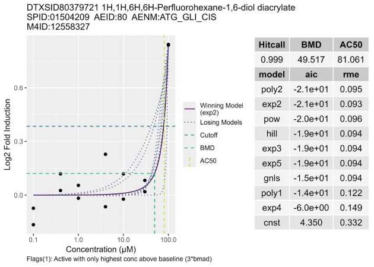

<!-- This CSS script ensures autonumbering of equations-->
<script type="text/x-mathjax-config">
  MathJax.Hub.Config({ TeX: { equationNumbers: {autoNumber: "all"} } });
</script>


<script>
$(document).ready(function() {
  $items = $('div#TOC li');
  $items.each(function(idx) {
    num_ul = $(this).parentsUntil('#TOC').length;
    $(this).css({'text-indent': num_ul * 10, 'padding-left': 0});
  });

});
</script>

```{css, echo=FALSE}
.scroll-100 {
  max-height: 100px;
  overflow-y: auto;
}

.noticebox {
  padding: 1em;
  background: lightgray;
  color: blue;
  border: 2px solid black;
  border-radius: 10px;
}
```

# R Packages

```{r echo=TRUE, message=FALSE, warning=FALSE}
# Primary Packages #
library(tcpl)
library(tcplfit2)
# Data Formatting Packages #
library(dplyr)
library(magrittr)
# Plotting Packages #
library(ggplot2)
library(RColorBrewer)
library(colorspace)
library(viridis)
# Table Packages #
library(htmlTable)
library(kableExtra)
```


# Introduction

This vignette describes how the user can retrieve data from the ToxCast database, known as invitrodb, using <font face="CMTT10">tcpl</font>. The MySQL version of the ToxCast database containing all the publicly available ToxCast data is available for download at: <https://www.epa.gov/chemical-research/exploring-toxcast-data-downloadable-data>.

::: {.noticebox data-latex=""}

**NOTE:**

Users must be connected to the ToxCast database (invitrodb), or a replicate of the database, to utilize many of these functions and execute the examples in this vignette.  Please see the introductory vignette in this package for more details.

:::

## Overview of Key Functions

To support different data retrieval needs within <font face="CMTT10">tcpl</font>, there are a number of functions which query the database and return information to the local R session.

## Overview of Data Nomenclature

Throughout this vignette we will use abbreviated designations for data retrieved from the database or to refer to processing steps within <font face="CMTT10">tcpl</font>. For data from single concentration assays we use 'SC.' 'MC' is used for assay data with multiple concentrations. A particular data or processing level is indicated by appending the level id/number to the end of the 'SC' or 'MC' designation. For example, if we are discussing single concentration data from level 2 processing, then we will use the abbreviation 'SC2.'

### Assay Elements

The <font face="CMTT10">tcplLoadAsid</font>, <font face="CMTT10">tcplLoadAid</font>, <font face="CMTT10">tcplLoadAcid</font>, and <font face="CMTT10">tcplLoadAeid</font> functions load relevant assay ids and names for the respective assay elements based on the user specified parameters. 

```{r tcplLoad, eval = FALSE}
# List all assay source IDs
tcplLoadAsid() 
# Create table of all assay endpoint ids (aeids) per assay source
aeids <- tcplLoadAeid(fld="asid", # field to query on
                      val=14, # value for each field
                              # values should match their corresponding 'fld'
                      add.fld = c("aid", "anm", "acid", "acnm")) # additional fields to return
```

### Data

The <font face="CMTT10">tcplQuery</font> function allows a user to provide an SQL query to load data from the MySQL database into the R session. In the following chunk we provide an example, but any valid SQL query can replace the one provided in our example.

```{r tcplquery, eval = FALSE}
# Load sample table using a MySQL query.
samples <- tcplQuery("SELECT * FROM sample;")
```

The <font face="CMTT10">tcplLoadData</font> function can be used to load the data from the MySQL database into the R session. Further, the <font face="CMTT10">tcplPrepOtpt</font> function can be used in combination with <font face="CMTT10">tcplLoadData</font> to add useful chemical and assay annotation information, mapped to the retrieved data.

```{r tcplPrepOtpt, eval=FALSE}
# Load multi concentration data from level 2,
# and map only the chemical annotation information.
mc2_fmtd <- tcplPrepOtpt(
  tcplLoadData(
    lvl = 2, # data level
    fld = 'acid', # field to query on
    val = 49, # value for each field
             # values should match their corresponding 'fld'
    type = 'mc' # data type
  ),
  ids = 'spid' # additional annotation fields to add - just chemical info
               # - (Default): map assay and chemical annotation
               # - 'acid' OR 'aeid': map only assay annotation
               # - 'spid': map only chemical annotation
)
# Print the first 6 rows of 'mc2_fmtd'
head(mc2_fmtd)
```

When loading data, the user must indicate the applicable fields and ids for the corresponding data level of interest. Loading level 0 (SC0 and MC0), MC1, and MC2 data the assay component id ($\mathit{acid}$) will always be used. As described in Table 1 of the tcpl Data Processing vignette, SC1 and MC3 processing levels perform data normalization where assay component ids ($\mathit{acid}$) are converted to assay endpoint ids ($\mathit{aeid}$). Thus, the SC1 and MC3 data tables contain both $\mathit{acid}$ and ($\mathit{aeid}$) ID's.  Data can be loaded using either id as long as it is properly specified. Loading SC2, MC4, and MC5, one should always use the assay endpoint id ($\mathit{aeid}$). Selected id(s) are based on the primary key within each table containing data. Examples of loading data are detailed in later sections.

### Assay Annotations

Assay source, assay, assay component, and assay endpoint are registered via tcpl scripting into a collection of tables. The database structure takes the annotations and organizes them as attributes of the assay conductors, the assays (i.e., experiments), the assay components (i.e., raw readouts), or the assay endpoints (i.e., normalized component data) enabling aggregation and differentiation of the data generated through ToxCast and Tox21. The annotations capture four types of information:

i. Identification information
ii. Design information such as the technology, format, and objective aspects that decompress the assay’s innovations,
iii. Target information such as the target of technological measurement and the
biologically intended target, and
iv. Analysis information about how the data were processed and analyzed.

```{r annotation_query_ex, eval = FALSE}
#load libraries and connections
library(RMySQL)
con <- dbConnect(drv = RMySQL::MySQL(), user="user", pass="pass", db="InvitroDB", host="host")
#query database using RMySQL:
#use source table to identify which ids are needed in subsequent queries.
tcplLoadAsid()
source <- tcplLoadAeid(fld="asid", val=1, add.fld = c("aid", "anm", "acid", "acnm"))
#select annotation and subset by ids or name
assay <- dbGetQuery(con, "SELECT * FROM invitrodb.assay where aid=1;")
component <- dbGetQuery(con, "SELECT * FROM invitrodb.assay_component;")
component <- subset(component, acid %in% source$acid)
endpoint <- dbGetQuery(con, "SELECT * FROM invitrodb.assay_component_endpoint;")
endpoint <- endpoint[grepl("ATG", endpoint$assay_component_endpoint_name),]
```

### Chemical Information

The <font face="CMTT10">tcplLoadChem</font> function returns chemical information for user specified parameters, e.g. the chemical name (chnm) and chemical id (chid). The <font face="CMTT10">tcplLoadClib</font> function provides more information about the ToxCast chemical library used for sample generation.

### Methods

The <font face="CMTT10">tcplMthdList</font> function returns methods available for processing at a specified level (i.e. step in the <font face="CMTT10">tcpl</font> pipeline). The user defined function in the following code chunk utilizes the <font face="CMTT10">tcplMthdList</font> function to retrieve and output all available methods for both the SC and MC data levels.

```{r mthd_list, eval = FALSE}
# Create a function to list all available methods function (SC & MC).
method_list <- function() {
  # Single Concentration
  ## Level 1
  sc1 <- tcplMthdList(1, 'sc')
  sc1[, lvl := "sc1"]
  setnames(sc1, c("sc1_mthd", "sc1_mthd_id"), c("mthd", "mthd_id"))
  ## Level 2
  sc2 <- tcplMthdList(2, 'sc')
  sc2[, lvl := "sc2"]
  setnames(sc2, c("sc2_mthd", "sc2_mthd_id"), c("mthd", "mthd_id"))
  
  # Multiple Concentration
  ## Level 2
  mc2 <- tcplMthdList(2, 'mc')
  mc2[, lvl := "mc2"]
  setnames(mc2, c("mc2_mthd", "mc2_mthd_id"), c("mthd", "mthd_id"))
  ## Level 3
  mc3 <- tcplMthdList(3, 'mc')
  mc3[, lvl := "mc3"]
  setnames(mc3, c("mc3_mthd", "mc3_mthd_id"), c("mthd", "mthd_id"))
  ## Level 4
  mc4 <- tcplMthdList(4, 'mc')
  mc4[, lvl := "mc4"]
  setnames(mc4, c("mc4_mthd", "mc4_mthd_id"), c("mthd", "mthd_id"))
  ## Level 5
  mc5 <- tcplMthdList(5, 'mc')
  mc5[, lvl := "mc5"]
  setnames(mc5, c("mc5_mthd", "mc5_mthd_id"), c("mthd", "mthd_id"))
  # Compile the Output
  mthd.list <- rbind(sc1, sc2, mc2, mc3, mc4, mc5)
  mthd.list <- mthd.list[, c("lvl", "mthd_id", "mthd", "desc")]
  # Return the Results
  return(mthd.list)
}

# Run the 'method_list' functions and store output.
amthds <- method_list()
# Print the available methods list.
amthds
```

The <font face="CMTT10">tcplMthdLoad</font> function returns the method assignments for specified id(s). Later sections provide more detailed examples for utilizing the <font face="CMTT10">tcplMthdLoad</font> function for individuals ids.

# Retrieving Level 0 Data

Prior to the pipeline processing provided in this package, all the data must go through pre-processing, i.e. raw data to database level 0 data. Pre-processing the data should transform data from heterogeneous assays into a uniform format.  This is executed using dataset specific R scripts.  After pre-processing is complete and the formatted data matches the level 0 format, it can be loaded into the database using <font face="CMTT10">tcplWriteLvl0</font>, as described in the tcpl Data Processing vignette. The standard level 0 format is identical for both testing paradigms, SC or MC. Users can inspect the level 0 data and calculate assay quality metrics prior to running the processing pipeline.

## Load SC0 Data

```{r sc0, eval = FALSE}
# Load Level 0 single concentration data for a single acid to R.
sc0 <- tcplLoadData(lvl=0, # data level
                    fld="acid", # field to query on
                    val=1, # value for each field
                           # values should match their corresponding 'fld'
                    type = "sc") # data type - single concentration

# Alternatively, load data in and format with tcplPrepOtpt.
sc0 <- tcplPrepOtpt(tcplLoadData(lvl=0, fld="acid", val=1, type = "sc"))
```

Since we are not able to connect to the database directly in this vignette, we have provided a sample dataset in the package to illustrate what the results should look like.

```{r sc0_data_ex,warning=FALSE,message=FALSE}
# Load the example data from the package.
data(sc_vignette,package = 'tcpl')
# Save the single concentration level 0 data in the 'sc0' object.
sc0 <- sc_vignette[["sc0"]]
# Print the first 6 rows of the data.
head(sc0) %>%
  # format output into a table
  kbl() %>%
  # format the output rendering to allow horizontal scrolling
  scroll_box(width = "100%") %>% 
  # reduce the size of the table text to improve readability
  kable_styling(font_size = 10)
```


## Load MC0 Data

```{r mc0, eval = FALSE}
# Load Level 0 multiple concentration data.
mc0 <- tcplPrepOtpt(
  tcplLoadData(lvl=0, # data level
               fld="acid", # field to query on
               val=1, # value for each field
                      # values should match their corresponding 'fld'
               type = "mc") # data type - multiple concentrations
)
```

We again can use one of the provided datasets in this package to demonstrate what the above results should look like.

```{r mc0_data_ex,warning=FALSE,message=FALSE}
# Load the example data from the package.
data(mc_vignette,package = 'tcpl')
# Save the multiple concentration level 0 data in the 'mc0' object.
mc0 <- mc_vignette[["mc0"]]
# Print the first 6 rows of the data.
head(mc0) %>%
  # format output into a table
  kbl() %>%
  # format the output rendering to allow horizontal scrolling
  scroll_box(width = "100%") %>% 
  # reduce the size of the table text to improve readability
  kable_styling(font_size = 10)
```

## Review MC assay quality

```{r mc0_aq, eval = FALSE}
# Create a function to review assay quality metrics using indexed Level 0 data.
aq <- function(ac){
  # obtain level 1 multiple concentration data for specified acids
  dat <- tcplPrepOtpt(tcplLoadData(1L, "acid", aeids$acid, type="mc"))
  
  # keep only observations with good well quality (wllq = 1)
  dat <- dat[wllq==1]
  
  # obtain summary values for data and remove missing data (i.e. NA's)
  agg <- dat[ ,
              list(
                # median response values (rval) of neutral wells (wllt = n)
                nmed = median(rval[wllt=="n"], na.rm=TRUE), 
                # median absolute deviation (mad) of neutral wells (wllt = n)
                nmad = mad(rval[wllt=="n"], na.rm=TRUE), 
                # median response values of positive control wells (wllt = p)
                pmed = median(rval[wllt=="p"], na.rm=TRUE),
                # median absolute deviation of positive control wells (wllt = p)
                pmad = mad(rval[wllt=="p"], na.rm=TRUE),
                # median response values of negative control wells (wllt = m)
                mmed = median(rval[wllt=="m"], na.rm=TRUE),
                # median absolute deviation of negative control wells (wllt = m)
                mmad = mad(rval[wllt=="m"], na.rm=TRUE)
                ),
              # aggregate on assay component id, assay component name,
              # and assay plate id
              by = list(acid, acnm, apid)]
  
  # Z prime factor: separation between positive and negative controls,
  # indicative of likelihood of false positives or negatives. 
  # - Between 0.5 - 1 are excellent,
  # - Between 0 and 0.5 may be acceptable,
  # - Less than 0 not good
  # obtain the z-prime factor for positive controls and neutral
  agg[ , zprm.p := 1 - ((3 * (pmad + nmad)) / abs(pmed - nmed))]  
  # obtain the z-prime factor for negative controls and neutral
  agg[ , zprm.m := 1 - ((3 * (mmad + nmad)) / abs(mmed - nmed))]
  
  agg[ , ssmd.p := (pmed - nmed) / sqrt(pmad^2 + nmad^2 )]
  agg[ , ssmd.m := (mmed - nmed) / sqrt(mmad^2 + nmad^2 )]
  
  # Coefficient of Variation (cv) of neutral control
  # - Ideally should be under 25%
  agg[ , cv     := nmad / nmed] 
  
  agg[ , sn.p :=  (pmed - nmed) / nmad]
  agg[ , sn.m :=  (mmed - nmed) / nmad]
  agg[ , sb.p :=  pmed / nmed]
  agg[ , sb.m :=  mmed / nmed]
  
  agg[zprm.p<0, zprm.p := 0]
  agg[zprm.m<0, zprm.m := 0]
  
  acqu <- agg[ , list( nmed   = signif(median(nmed, na.rm = TRUE)),
                       nmad   = signif(median(nmad, na.rm = TRUE)),
                       pmed   = signif(median(pmed, na.rm = TRUE)),
                       pmad   = signif(median(pmad, na.rm = TRUE)),
                       mmed   = signif(median(mmed, na.rm = TRUE)),
                       mmad   = signif(median(mmad, na.rm = TRUE)),
                       zprm.p = round(median(zprm.p, na.rm=TRUE),2),
                       zprm.m = round(median(zprm.m, na.rm=TRUE),2),
                       ssmd.p = round(median(ssmd.p, na.rm=TRUE),0),
                       ssmd.m = round(median(ssmd.m, na.rm=TRUE),0),
                       cv = round(median(cv, na.rm=TRUE),2),
                       sn.p = round(median(sn.p, na.rm=TRUE),2),
                       sn.m = round(median(sn.m, na.rm=TRUE),2),
                       sb.p = round(median(sb.p, na.rm=TRUE),2),
                       sb.m = round(median(sb.m, na.rm=TRUE),2)
  ), by = list(acid, acnm)]
  # Return the Results.
  return(acqu)
} #per acid 

# Run the 'aq' function & store the output. 
assayq <- aq(ac)
# Print the first 6 rows of the assay quality results.
head(assayq)
```

# Retrieving Processed Single-Concentration (SC) Data and Methods

The goal of SC processing is to identify potentially active compounds from a large screen at a single concentration. After processing, users can inspect SC activity hit calls and the applied methods.

## Load SC2 Data

```{r sc2, eval = FALSE}
# Load Level 2 single concentration data for a single aeid.
sc2 <- tcplPrepOtpt(
  tcplLoadData(lvl=2, # data level
               fld="aeid", # id field to query on
               val=3, # value for the id field
               type = "sc") # data type - single concentration
)
# Alternatively, data for a set of aeids can be loaded with a vector of ids.
sc2 <- tcplPrepOtpt(
  tcplLoadData(lvl=2, fld="aeid", val=aeids$aeid, type = "sc")
)
```

## Load SC Methods

```{r sc2_mthd, eval = FALSE}
# Create a function to load methods for single concentration data processing
# steps for given aeids.
sc_methods <- function(aeids) {
  # load the level 1 methods assigned for the single concentration aeid's
  sc1_mthds <- tcplMthdLoad(lvl=1, type ="sc", id=aeids$aeid)
  # aggregate the method id's by aeid
  sc1_mthds<- aggregate(mthd_id ~ aeid, sc1_mthds, toString)
  # reset the names of the sc1_mthds object
  setnames(sc1_mthds, "mthd_id", "sc1_mthd_id")
  
  # load the level 2 methods assigned for the single concentration aeid's
  sc2_mthds <- tcplMthdLoad(lvl=2, type ="sc", id=aeids$aeid)
  # aggregate the method id's by aeid
  sc2_mthds<- aggregate(mthd_id ~ aeid, sc2_mthds, toString)
  # reset the names of the sc2_mthds object
  setnames(sc2_mthds, "mthd_id", "sc2_mthd_id")
  
  # Compile the Output 
  methods <- merge( merge(aeids, sc1_mthds,  by = "aeid", all = TRUE), 
                  sc2_mthds, by = "aeid", all = TRUE )
  # Return the Results
  return(methods)
}

# Run the 'sc_methods' function and store the output.
smthds <- sc_methods(aeids)

# Print the assigned sc methods.
smthds
```

# Retrieving Processed Multi-Concentration (MC) Data and Methods

The goal of MC processing is to estimate the hitcall, potency, efficacy, and other curve-fitting parameters for sample-assay endpoint pairs. After processing, users can inspect the activity hitcalls, model parameters, concentration-response plots, and the applied methods for the multiple concentration data. 

## Load MC5 Data

```{r mc5_data, eval = FALSE}
# Load Level 5 MC data summary values for a set of aeids.
# (NOTE: As before, the user can obtain data for individual aeids.)
mc5 <- tcplPrepOtpt(
  tcplLoadData(lvl=5, # data level
               fld="aeid", # fields to query on
               val=aeids$aeid, # value for each field
                               # values should match their corresponding 'fld'
               type = "mc") # data type - MC
)

# For tcpl v3.0.0 and future releases, to output mc5_param information with
# the default mc5 results then 'add.fld' must be set to TRUE.
# (NOTE: Default for add.fld is FALSE, unless otherwise specified.)
mc5 <- tcplPrepOtpt(
  tcplLoadData(lvl=5, # data level
               fld="aeid", # fields to query on
               val=aeids$aeid, # value for each field
                               # values should match their corresponding 'fld'
               type = "mc", # data type - multiple concentration
               add.fld=TRUE) # return additional parameters from mc5_param 
  )
```

## Load MC Methods

```{r mc5_methods, eval = FALSE}
# Create a function to load methods for MC data processing
# for select aeids.
mc_methods <- function(aeids) {
  # acid
  ## load the methods assigned to level 2 for given acids
  mc2_mthds <- tcplMthdLoad(2,aeids$acid)
  ## aggregate the assigned methods by acid
  mc2_mthds<- aggregate(mthd_id ~ acid, mc2_mthds, toString)
  ## rename the columns for the 'mc2_mthds' object
  setnames(mc2_mthds, "mthd_id", "mc2_mthd_id")
  
  # aeid
  ## load the methods assigned to level 3 for given aeids
  mc3_mthds <- tcplMthdLoad(3,aeids$aeid)
  ## aggregate the assigned methods by aeid
  mc3_mthds<- aggregate(mthd_id ~ aeid, mc3_mthds, toString)
  ## rename the columns for the 'mc3_mthds' object
  setnames(mc3_mthds, "mthd_id", "mc3_mthd_id")
  ## load the methods assigned to level 4 for given aeids
  mc4_mthds <- tcplMthdLoad(4,aeids$aeid)
  ## aggregate the assigned methods by aeid
  mc4_mthds<- aggregate(mthd_id ~ aeid, mc4_mthds, toString) 
  ## rename the columns for 'mc4_mthds' object
  setnames(mc4_mthds, "mthd_id", "mc4_mthd_id")
  ## load the methods assigned to level 5 for given aeids
  mc5_mthds <- tcplMthdLoad(5,aeids$aeid)
  ## aggregate the assigned methods by aeid
  mc5_mthds<- aggregate(mthd_id ~ aeid, mc5_mthds, toString)
  ## rename the columns for 'mc5_mthds' object
  setnames(mc5_mthds, "mthd_id", "mc5_mthd_id")

  # Compile the Results.
  ## merge the aeid information with the level 2 methods by acid
  acid.methods <- merge(aeids, mc2_mthds,by.x = "acid", by.y = "acid")
  ## merge the level 3, 4, and 5 methods by aeid
  mthd35 <- merge(
    merge(mc3_mthds, mc4_mthds, by = "aeid", all = TRUE),
    mc5_mthds, by = "aeid", all = TRUE
    )
  ## merge all methods information by aeid
  methods <- merge(acid.methods, mthd35,by.x = "aeid", by.y = "aeid")
  # Print the Results.
  print(methods)
  # Return the Results.
  return(methods)
}

# Run the 'methods' function and store the output.
mmthds <- mc_methods(aeids)

# Print the assigned mc methods.
mmthds
```

# Plotting

<font face="CMTT10">tcplPlot</font> is tcpl’s single flexible plotting function, allowing for interactive yet consistent visualization of concentration-response curves via customizable parameters. As a standalone plotting utility built with the R library <font face="CMTT10">plotly</font> to display the additional curve-fitting models, <font face="CMTT10">tcplPlot</font> implements the R library <font face="CMTT10">plumber</font> to provide representational state transfer-application programming interface (<font face="CMTT10">REST API</font>) functionality. The <font face="CMTT10">tcplPlot</font> function requires the selection of a level (`lvl`), field (`fld`), and value (`val`) to load the necessary data and display the associated plots. Level 4, `lvl = 4`, plots the concentration-response series fit by all models. Level 5, `lvl = 5`, extends Level 4 plotting by highlighting the winning model with activity hit call presented. Level 6 multi-concentration plotting, including lists of flags, are not currently supported by <font face="CMTT10">tcplPlot</font>. Moreover, only multi-concentration plotting is currently supported.

Customization of output is possible by specifying parameters, including `output`, `verbose`, `multi`, `by`, `fileprefix`, `nrow`, `ncol`, and `dpi`.  

- The `output` parameter indicates how the plots will be presented. In addition to outputs viewable with the R console, <font face="CMTT10">tcplPlot</font> supports a variety of publication-quality file type options, including raster graphics (PNG, JPG, and TIFF) to retain color quality when printing to photograph and vector graphics (SVG and PDF) to retain image resolution when scaled to large formats.

- The `verbose` parameter results in a plot that includes a table containing potency and model performance metrics; `verbose = FALSE` is default and the only option in console outputs.  

- The `multi` parameter allows for single or multiple plots per page. `multi = TRUE` is the default option for PDF outputs, whereas `multi = FALSE` is the only option for other outputs. If using the parameter option `multi = TRUE`, the default number of plots per page is set by the `verbose` parameter. The default number of plots per page is either 6 plots per page (`verbose = FALSE`) or 4 plots per page (`verbose = TRUE`).

- The `by` parameter indicates how files should be divided, typically by $aeid$ or $spid$.

- The `fileprefix` parameter allows the user to set a custom filename prefix. The standard filename is tcplPlot_sysDate().output (example: tcplPlot_2023_08_02.jpg) or, if `by` parameter is set, tcplPlot_sysDate()_by.output (example: tcplPlot_2023_08_02_aeid_80.pdf). When a `fileprefix` is assigned the default _tcplPlot_ prefix is replaced with the new filename. (example: myplot_2023_08_02_aeid_80.pdf or myplot_2023_08_02.jpg).

- The `nrow` parameter specifies the number of rows for the multiple plots per page; this is 2 by default. The `ncol` parameter specifies the number of columns for the multiple plots per page; this is 3 by default. If `verbose = FALSE`, `ncol` is 2. `nrow` and `ncol` can customize the number of plots included per page. Both `nrow` and `ncol` must be greater than 0. While there is no hard coded upper limit to the number of rows and columns, the underlying technology has a dimension limitation of `nrow = 9` and `ncol = 7`.

- The `dpi` parameter specifies image print resolution for image file output types (PNG, JPG, TIFF, SVG); this is 600 by default. 

The following examples demonstrate <font face="CMTT10">tcplPlot</font> functionality through available the variety of customization options: 

## Output PDF of Verbose, Multiple Plots per Page, by AEID and/or SPID

The following two examples produce plots of Level 5 MC data for the selected $aeids$. A new pdf is generated for each endpoint. Filtering can be applied if only plots for a subset of samples ($spids$) are desired.

```{r mc_plot_pdf_aeid, eval = FALSE}
# Plot Level 5 MC data for aeids 3157-3159 and outputs plots separate pdfs by aeid.
tcplPlot(lvl = 5, # data level
         fld = "aeid", # field to query on
         val = 3157:3159, # values must be listed for each corresponding 'fld'
         by = "aeid", # parameter to divide files
         multi = TRUE, # multiple plots per page - output 4 per page
         verbose = TRUE, # output all details if TRUE
         output = "pdf") # output as pdf

# Loading required mc_vignette data for example below
data(mc_vignette, package = 'tcpl')
mc5 <- mc_vignette[["mc5"]]

# Plot Level 5 MC data from the mc_vignette R data object for a single aeid 80 and
# spids "TP0001652B01", 01504209", "TP0001652D01", "TP0001652A01", and "1210314466" 
tcplPlot(lvl = 5, # data level
         fld = c("aeid", "spid"), # field to query on
         val = list(mc5$aeid, mc5$spid), # values must be listed for each corresponding 'fld'
         by = "aeid", # parameter to divide files
         multi = TRUE, # multiple plots per page - output 4 per page
         verbose = TRUE, # output all details
         output = "pdf", # output as pdf
         fileprefix = "output_pdf") # prefix of the filename
```
<center></center>

## Output Image File (JPG) of Single Verbose Plot, by AEID and SPID

This example illustrates a Level 5 verbose plot for a single endpoint and single sample of output type “jpg”. 

```{r mc_plot_jpg, eval = FALSE}
# Plot a verbose plot of Level 5 MC data for single aeid 80 and spid 01504209 and 
# output as jpg.
tcplPlot(lvl = 5, # data level
         fld = c('aeid','spid'), # field to query on
         val = list(80,'01504209'), # values must be listed for each corresponding 'fld'
         # values should match their corresponding 'fld'
         multi = FALSE, # single plot per page
         verbose = TRUE, # output all details
         output = "jpg", # output as jpg
         fileprefix = "output_jpg")
```

<center></center>

## Output to Console, by M4ID or AEID and SPID

Due to the dynamic nature of _m#_ids, the first example code chunk does not include a corresponding plot. Here, the $m4id$ value (482273) corresponds with the <font face="CMTT10">mc_vignette</font> R data object. To run test this code, a valid $m4id$ value must be supplied. 

The second example includes a level 5 plot for one endpoint and one sample of output type “console”. Only 1 concentration series can be output in console at a time. 
```{r mc_plot_console, eval = FALSE}
# Create Level 4 plot for a single m4id.
tcplPlot(lvl = 4,  # data level
         fld = "m4id", # field to query on 
         val = 482273, # values must be listed for each corresponding 'fld'
         multi = FALSE, # single plot
         verbose = FALSE, # do not output all details
         output = "console") # output in R console

# Plot of Level 5 MC data for single aeid (80) and spid (01504209)
# and output to console.
tcplPlot(lvl = 5, # data level
         fld = c('aeid','spid'), # field to query on
         val = list(80, '01504209'), # values must be listed for each corresponding 'fld'
         multi = FALSE, # single plot
         verbose = FALSE, # do not output all details
         output = "console") # output in R console
```
<center></center>


# Additional Examples

Below are a few case examples for retrieving various bits of information from the database.

## Load Data for a Specific Chemical

In this example, we illustrate the necessary steps for extracting information about the compound *Bisphenol A* found within the database. The user will define the chemical of interest, isolate all associated sample ids ($\mathit{spids}$), and then load all data for the given chemical. 

```{r BPA, eval = FALSE}
# Provide the chemical name and assign to 'chnm'.
chnm <- 'Bisphenol A'
# Load the chemical data from the database.
chem <- tcplLoadChem(field = 'chnm',val = chnm)
# Load mc5 data from the database for the specified chemical.
BPA.mc5 <- tcplLoadData(lvl = 5, # data level 
                        fld = 'spid', # field to query on
                        val = chem[,spid], # value for each field (fld)
                        type = 'mc') # data type - MC
```

## Plot Sample Subset 

In this example, we illustrate how to plot by endpoint for a sample subset, as opposed to plotting all samples tested within an endpoint. The user will load data for the select endpoints, isolate the samples of interest, and then plot by endpoint for the sample subset. 

```{r spid_plot, eval=FALSE}
# Load Level 5 multiple concentration data summary values for select aeids.
mc5 <- tcplPrepOtpt(
  tcplLoadData(lvl=5, # data level
               fld='aeid', # id field to query on
               val=tcplLoadAeid(fld="asid",val = 25)$aeid, # value for each field
               type='mc', # data type - MC
               add.fld=TRUE) # return additional parameters from mc5_param
  )

# Identify sample subset.
spid.mc5 <- mc5[spid %in% c("EPAPLT0018N08", "EPAPLT0023A16", "EPAPLT0020C11", 	
                            "EPAPLT0018B13","EPAPLT0018B14","EPAPLT0018B15"),]

# Plot by endpoint for sample subset.
tcplPlot(lvl = 5, # data level
         fld = c("spid","aeid"), # fields to query on
         val = list( # value for each field, must be same order as 'fld'
           spid.mc5$spid, # sample id's
           spid.mc5$aeid  # assay endpoint id's
           ),
         by = "aeid", # parameter to divide files
         multi = TRUE, # multiple plots per page - output 6 per page if TRUE
         verbose = TRUE, # output all details if TRUE
         output = "pdf", # output as pdf
         fileprefix = "output/upitt") # prefix of the filename
```
