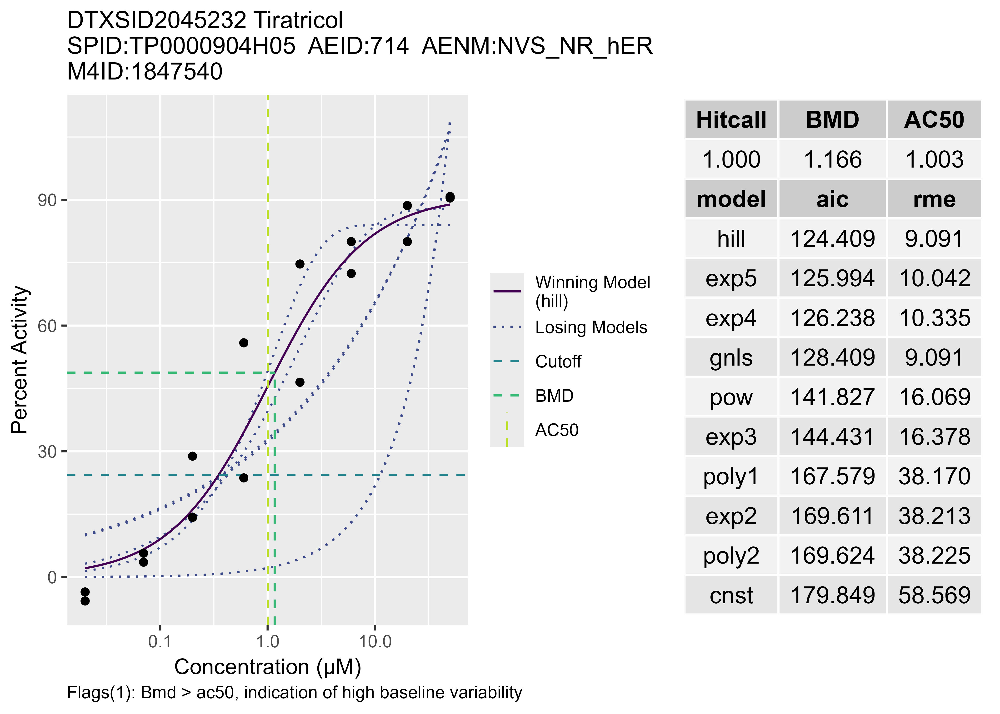
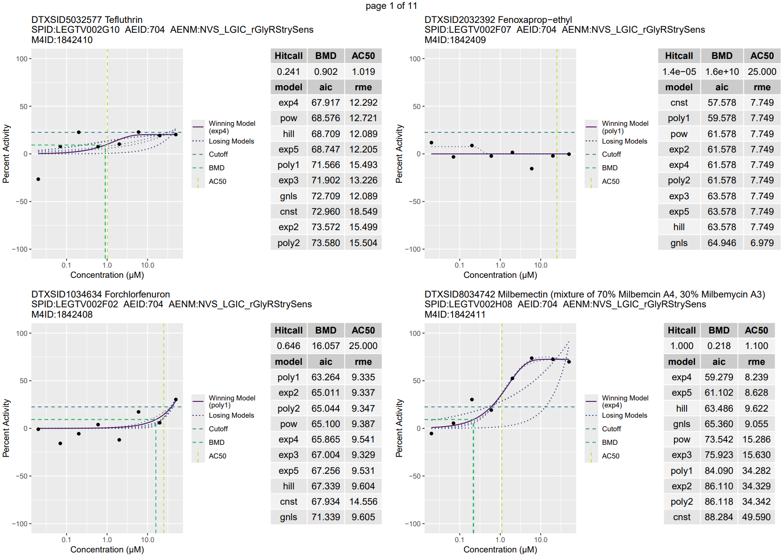

```{css, echo=FALSE}
.scroll-300 {
  max-height: 300px;
  overflow-y: auto;
}

.noticebox {
  padding: 1em;
  background: lightgray;
  color: blue;
  border: 2px solid black;
  border-radius: 10px;
}
```

```{r setup, include = FALSE}
devtools::load_all()
library(DT)
# helper function for printing
printFormattedTable <- function(res_dt, widen = c()) {
  datatable(res_dt, style = 'bootstrap', class = 'table-bordered table-condensed', rownames = FALSE, options = list(scrollX = TRUE, autoWidth = TRUE, dom = 't', columnDefs = list(list(width = '1000px', targets = widen))))
}
library(httptest)
start_vignette("api")
```

# Introduction

This vignette describes how the user can retrieve ToxCast data (invitrodb v4.1) from the CCTE Bioactivity API, using <font face="CMTT10">tcpl</font>. The API documentation can be found at <https://api-ccte.epa.gov/docs/bioactivity.html>. <font face="CMTT10">tcpl</font> interfaces to the CCTE API through the R package <font face="CMTT10">ccdR</font> (<https://cran.r-project.org/web/packages/ccdR>), which wraps the API endpoints and provides helpful functions for storing meta-information related to your connection.

::: {.noticebox data-latex=""}

**NOTE:** Users must have a personal API key for full functionality of many of these functions and executing the examples in this vignette. To obtain an API key, send an email request to <ccte_api@epa.gov>.

:::

## Setup API Connection

After loading <font face="CMTT10">tcpl</font>, use the function <font face="CMTT10">tcplConf</font> to set options for connecting to the API. While a regular database connection requires 5 different options to be filled, using an API connection requires just two: <font face="CMTT10"> $TCPL_PASS </font> and <font face="CMTT10"> $TCPL_DRVR </font>. These two can be set using <font face="CMTT10">tcplConf</font> like the following:

```{r setup-api}
tcplConf(pass = "<api-key-from-ccte_api@epa.gov>",
         drvr = "API")
```

::: {.noticebox data-latex=""}

**NOTE:** When <font face="CMTT10">tcpl</font> is loaded, the default configuration sets the options to <font face="CMTT10">tcpl</font>'s application API key to support new users testing out the package. Its use not recommended for regular users; instead, it is highly recommended to obtain a personal API key. For this, send an email request to <ccte_api@epa.gov>.

:::

## Overview of Key Functions

To support different data retrieval needs within <font face="CMTT10">tcpl</font>, there are a number of functions which query the API and return information to the local R session.

## Overview of Data Nomenclature

Throughout this vignette we will use abbreviated designations for data retrieved from the database or to refer to processing steps within <font face="CMTT10">tcpl</font>. For data from single concentration assays we use 'SC' (there is no API data available for SC). 'MC' is used for assay data with multiple concentrations. A particular data or processing level is indicated by appending the level id/number to the end of the 'SC' or 'MC' designation. For example, if we are discussing multiple concentration data from level 3 processing, then we will use the abbreviation 'MC3.'

### Assay Elements

The <font face="CMTT10">tcplLoadAsid</font>, <font face="CMTT10">tcplLoadAid</font>, <font face="CMTT10">tcplLoadAcid</font>, and <font face="CMTT10">tcplLoadAeid</font> functions load relevant assay ids and names for the respective assay elements based on the user specified parameters. 

```{r tcplLoad, eval = FALSE}
# List all assay source IDs
tcplLoadAsid() 
# Create table of all assay endpoint ids (aeids) per assay source
aeids <- tcplLoadAeid(fld="asid", # field to query on
                      val=14, # value for each field
                              # values should match their corresponding 'fld'
                      add.fld = c("aid", "anm", "acid", "acnm")) # additional fields to return
```

### Data

<font face="CMTT10">tcplQueryAPI</font> is a general querying function which is flexible enough to handle most kinds of queries users may have for the API. Unlike <font face="CMTT10">tcplQuery</font>, <font face="CMTT10">tcplQueryAPI</font> does not accept a MySQL query but instead has a few arguments which can be set to mimic a request to the various API endpoints. <font face="CMTT10">tcplQueryAPI</font> is used mostly as a helper function to other <font face="CMTT10">tcplLoad</font> functions, but is available to users for more specific and/or personalized requests.

```{r tcplQueryAPI, eval = FALSE}
# Request and load all assays+annotations for specified asid
data <- tcplQueryAPI(resource = "data", # resource to query from API, either 'data' or 'assay'
                     fld = "aeid", val = 891, # field and val to query on
                     return_fld = c("spid", "chnm", "hitcall")) # specify the return fields, leave NULL for all fields
```

The <font face="CMTT10">tcplLoadData</font> function can be used to load data from the CCTE API into the R session. To add useful chemical and assay annotation information, mapped to the retrieved data, remove <font face="CMTT10">add.fld = FALSE</font> or conversely set <font face="CMTT10">add.fld = TRUE</font>. When connected to the API as the data source, **only MC (multiple concentration) screening data is available**. In addition, **only levels 3, 4, 5, 6, and 'agg' are available**. The output will look as similar as possible to regular <font face="CMTT10">tcplLoadData</font> output, though some less common columns may not be available and the column order may differ.

```{r tcplLoadData, eval=FALSE}
# Load multi concentration data from level 4
mc4_dat <- tcplLoadData(
    lvl = 4, # data level
    fld = 'aeid', # field to query on
    val = 891, # value for each field
             # values should match their corresponding 'fld'
    type = 'mc', # data type, default, not necessary
    add.fld = FALSE # FALSE will only show fields/columns which are usually
                    # returned for this level, default TRUE will return all available
  )
```

When loading data, the user must indicate the applicable fields and ids which are query-able via the CCTE API. These such fields include and are limited to "AEID", "m4id", "SPID", and "DTXSID". Any other fields will result in error. While supplying multiple ids (through `val`) are valid, multiple fields are not, so combinations of fields are not compatible with <font face="CMTT10">tcplLoadData</font> when connected to the API. If some or no data is found, <font face="CMTT10">tcplLoadData</font> will return whatever it finds, and list in output which val(s) were not found. Examples of loading data are detailed in later sections.

### Assay Annotations

Assay source, assay, assay component, and assay endpoint are registered via tcpl scripting into a collection of tables, which in the CCTE APIs are joined into one. The annotations capture four types of information:

i. Identification information
ii. Design information such as the technology, format, and objective aspects that decompress the assay’s innovations
iii. Target information, such as the target of technological measurement, biological intended target, and biological process
iv. Analysis information about how the data were processed and analyzed

```{r annotation_query_ex, eval = FALSE}
# load all assays and their annotations
assays <- tcplQueryAPI(resource = "assay")
```

# Retrieving Processed Multi-Concentration (MC) Data and Annotations

The goal of MC processing is to estimate the hitcall, potency, efficacy, and other curve-fitting parameters for sample-assay endpoint pairs. API data is stored for levels 3 through 6, users can inspect the activity hitcalls, model parameters, concentration-response plots, and the applied methods for the multiple concentration data.

## Load Data

Load filtered data on a sample by endpoint level. Set add.fld = FALSE to limit fields to those which are defaults for each level when loading from invitrodb directly. Leaving add.fld = TRUE (default) will return all of the API's fields, which contain fields from levels 3 through 6.

### By aeid
```{r data_by_aeid}
# Load Level 5 MC data for an aeid
mc5 <- tcplLoadData(lvl=5,    # data level
               fld="aeid",    # fields to query on
               val=704,       # values should match their corresponding 'fld'
               type = "mc",   # data type, default, not needed
               add.fld=FALSE) # restrict to just level 5 parameters 
```

```{r, echo = FALSE}
printFormattedTable(mc5)
```
### By spid
```{r data_by_spid}
# Load Level 5 MC data for an aeid
mc5 <- tcplLoadData(lvl=5,         # data level
               fld="spid",         # fields to query on
               val="TP0000904H05", # values should match their corresponding 'fld'
               type = "mc",        # data type, default, not needed
               add.fld=FALSE)      # restrict to just level 5 parameters
```

```{r, echo = FALSE}
printFormattedTable(mc5)
```
### By m4id
```{r data_by_m4id}
# Load Level 5 MC data for an aeid
mc5 <- tcplLoadData(lvl=5,    # data level
               fld="m4id",    # fields to query on
               val=1842443,   # values should match their corresponding 'fld'
               type = "mc",   # data type, default, not needed
               add.fld=FALSE) # restrict to just level 5 parameters
```

```{r, echo = FALSE}
printFormattedTable(mc5)
```
### By DTXSID
```{r data_by_dtxsid}
# Load Level 5 MC data for an aeid
mc5 <- tcplLoadData(lvl=5,           # data level
               fld="dtxsid",         # fields to query on
               val="DTXSID30944145", # values should match their corresponding 'fld'
               type = "mc",          # data type, default, not needed
               add.fld=FALSE)        # restrict to just level 5 parameters
```

```{r, echo = FALSE}
printFormattedTable(mc5)
```
### By level

In addition to level 5 data, levels 3, 4, 6, and 'agg' are available to pull from the API.

#### mc3

```{r data_level_3}
mc3 <- tcplLoadData(lvl=3,    # data level
               fld="m4id",    # fields to query on
               val=1842443,   # values should match their corresponding 'fld'
               type = "mc",   # data type, default, not needed
               add.fld=FALSE) # restrict to just level 3 parameters  
```

```{r, echo = FALSE}
printFormattedTable(mc3)
```

#### mc4

```{r data_level_4}
mc4 <- tcplLoadData(lvl=4,    # data level
               fld="m4id",    # fields to query on
               val=1842443,   # values should match their corresponding 'fld'
               type = "mc",   # data type, default, not needed
               add.fld=FALSE) # restrict to just level 4 parameters 
```

```{r, echo = FALSE}
printFormattedTable(mc4)
```

#### mc6

```{r data_level_6}
mc6 <- tcplLoadData(lvl=6,    # data level
               fld="m4id",    # fields to query on
               val=1842443,   # values should match their corresponding 'fld'
               type = "mc",   # data type, default, not needed
               add.fld=FALSE) # restrict to just level 6 parameters 
```

```{r, echo = FALSE}
printFormattedTable(mc6, 17)
```

#### agg

```{r data_level_agg}
agg <- tcplLoadData(lvl="agg", # data level
               fld="m4id",     # fields to query on
               val=1842443,    # values should match their corresponding 'fld'
               type = "mc",    # data type, default, not needed
               add.fld=FALSE)  # restrict to just agg level parameters 
```

```{r, echo = FALSE}
printFormattedTable(agg)
```

### add.fld = TRUE

```{r data_level_5_all}
all_fields <- tcplLoadData(lvl=3,    # data level
               fld="m4id",    # fields to query on
               val=1842443,   # values should match their corresponding 'fld'
               type = "mc",   # data type, default, not needed
               add.fld=TRUE)  # include all fields 
```

```{r, echo = FALSE}
printFormattedTable(all_fields, 175)
```

## Load Assay Annotations

Load and filter mapped annotation data on an assay component endpoint level (aeid).

### Load aeid

To load aeid and aenm as well any other mapped annotations by request, use <font face="CMTT10">tcplLoadAeid</font>. Any available field in the API annotations table can be subset using this function.

```{r load_aeid}
# load aeid and aenm for given acid
aeid <- tcplLoadAeid(fld = "acid", val = 400)
```

```{r, echo = FALSE}
printFormattedTable(aeid)
```

Subset with as many `fld`s as desired. tcplLoadAeid joins the criteria with multiple `fld` and `val` as an "AND" rather than "OR", meaning the subset returns rows where all are TRUE. Make sure that `val` has the same length that `fld` does. Use a list for `val` if you want to combine fields of different types (i.e. numeric and string), or of different element lengths (<font face="CMTT10">list("protein", c("Colorimetric", "Fluorescence"))</font>).

```{r load_aeid_plus}
# subset all aeids by using multiple fields -- val must be same length in list form!
aeids <- tcplLoadAeid(fld = c("intended_target_type", "detection_technology_type"), 
                      val = list("protein", c("Colorimetric", "Fluorescence"))) # list length == 2!
```

```{r, echo = FALSE}
printFormattedTable(aeids)
```

Add any available fields to the output as desired. If all fields are desired consider using <font face="CMTT10">tcplQueryAPI(resource = "assay")</font>.

```{r load_aeid_all}
# subset all aeids by using multiple fields -- val must be same length in list form!
aeids <- tcplLoadAeid(fld = c("intended_target_type", "detection_technology_type"), 
                      val = list("protein", c("Colorimetric", "Fluorescence")),
                      add.fld = c("acid", "assay_component_desc", "signal_direction", "organism")) 
```

```{r, echo = FALSE}
printFormattedTable(aeids, 5)
```

### Load acid

Use <font face="CMTT10">tcplLoadAcid</font> to load acid and acnm, as well as any other mapped fields.

```{r load_acid}
# load acid and acnm for given aeid
acid <- tcplLoadAcid(fld = "aeid", val = c(663,891))
```

```{r, echo = FALSE}
printFormattedTable(acid)
```

Like <font face="CMTT10">tcplLoadAeid</font>, <font face="CMTT10">tcplLoadAcid</font> can subset with as many `fld`s as desired and can add any available additional fields.

```{r load_acid_all}
# subset all acids by using multiple fields -- val must be same length in list form!
acids <- tcplLoadAcid(fld = c("organism", "tissue"), 
                      val = list("rat", "liver"),
                      add.fld = c("aeid", "aid", "asid", "signal_direction")) 
```

```{r, echo = FALSE}
printFormattedTable(acids)
```

### Load aid

Use <font face="CMTT10">tcplLoadAid</font> to load aid and anm, as well as any other mapped fields.

```{r load_aid}
# load aid and anm for given aeid
aid <- tcplLoadAid(fld = "aeid", val = 663)
```

```{r, echo = FALSE}
printFormattedTable(aid)
```

Like <font face="CMTT10">tcplLoadAeid</font> and <font face="CMTT10">tcplLoadAcid</font>, <font face="CMTT10">tcplLoadAid</font> can subset with as many `fld`s as desired and can add any available additional fields.

```{r load_aid_all}
# subset all aids by using multiple fields -- val must be same length in list form!
aids <- tcplLoadAid(fld = c("organism", "tissue"), 
                      val = list("rat", "liver"),
                      add.fld = c("aeid", "acid", "asid", "signal_direction")) 
```

```{r, echo = FALSE}
printFormattedTable(aids)
```

### Load asid

Use <font face="CMTT10">tcplLoadAsid</font> to load asid and asnm, as well as any other mapped fields.

```{r load_asid}
# load asid and asnm for given aeid
asid <- tcplLoadAsid(fld = "aeid", val = 663)
```

```{r, echo = FALSE}
printFormattedTable(asid)
```

Like the other <font face="CMTT10">tcplLoad</font> functions, <font face="CMTT10">tcplLoadAsid</font> can subset with as many `fld`s as desired and can add any available additional fields.

```{r load_asid_all}
# subset all asids by using multiple fields -- val must be same length in list form!
asids <- tcplLoadAsid(fld = c("organism", "tissue"), 
                      val = list("rat", "liver"),
                      add.fld = c("aeid", "acid", "asid", "signal_direction")) 
```

```{r, echo = FALSE}
printFormattedTable(asids)
```

### Load unit

To load the normalized data type, or response unit, use <font face="CMTT10">tcplLoadUnit</font>. Notice how <font face="CMTT10">tcplLoadUnit</font> does not use `fld` and `val`, but uses `aeid` as input.

```{r load_unit}
# load resp_unit for given aeid
unit <- tcplLoadUnit(aeid = c(663, 891))
```

```{r, echo = FALSE}
printFormattedTable(unit)
```

## Load sample/chemical information

### Load concentration unit

Use <font face="CMTT10">tcplLoadConcUnit</font> to load the concentration unit for a specific `spid` or multiple `spid`s.

```{r load_conc_unit}
# load conc_unit for given spid
conc_unit <- tcplLoadConcUnit(spid = "TP0000904H05")
```

```{r, echo = FALSE}
printFormattedTable(conc_unit)
```

### Load chemical info

Use <font face="CMTT10">tcplLoadChem</font> to load the chemical information for a specific `spid` or multiple `spid`s. Notice tcplLoadChem uses `field` instead of `fld`.

```{r load_chem}
# load chem_info for given spid
chem_info <- tcplLoadChem(field = "spid", val = "TP0000904H05")
```

```{r, echo = FALSE}
printFormattedTable(chem_info)
```

# Plotting

<font face="CMTT10">tcplPlot</font> is tcpl’s single flexible plotting function, allowing for interactive and consistent visualization of concentration-response curves via customizable parameters. For more details on implementation, parameters and specific customization instructions, refer to the main Data Retrieval vignette. This section will instead focus on the limitations of using the CCTE API as a data source for <font face="CMTT10">tcplPlot</font>.

Similar to tcplLoadData, the user must indicate the applicable fields and ids which are query-able via the CCTE API. These such fields include and are limited to "AEID", "m4id", "SPID", and "DTXSID". Any other fields will result in error. While supplying multiple ids (through `val`) are valid, multiple fields are not, so combinations of fields are not compatible with <font face="CMTT10">tcplPlot</font> when connected to the API. For example, if `fld = "spid"`, no aeid can be specified, meaning every matching spid will be plotted. If `fld = "aeid"`, every sample within the given endpoint(s) will be plotted. If `fld = "m4id"`, only one plot will output for every each m4id input. Therefore, if looking for a specific aeid/spid combo, one should determine the corresponding m4id, like below.

```{r plot_aeid_spid, eval = FALSE}
# load all matching spids and then subset using the aeid desired to find m4id
mc5 <- tcplLoadData(lvl = 5, 
                    fld = "spid",
                    val = "TP0000904H05",
                    type = "mc", 
                    add.fld = FALSE) # 8 rows of data
m4id <- mc5[aeid == 714]$m4id # subset to 1 aeid extract m4id

# default parameters used here: fld = "m4id", type = "mc" (type can never be "sc" when connected to API)
tcplPlot(val = m4id, output = "jpg", verbose = TRUE, flags = TRUE)
```

<center></center>

Use the "compare" feature to supply more m4ids to `compare.val` and compare them one to one with the m4ids in `val`. `val` and `compare.val` must be the same length!

```{r plot_m4id_compare, eval = FALSE}
# using the data pulled in the previous code chunk 'mc5'
m4id <- mc5$m4id # create m4id vector length == 8

# default parameters used here: fld = "m4id", type = "mc" (type can never be "sc" when connected to API)
tcplPlot(val = m4id[1:4], 
         compare.val = m4id[5:8], 
         output = "pdf", 
         verbose = TRUE, 
         multi = TRUE, 
         flags = TRUE, 
         yuniform = TRUE,
         fileprefix = "API_plot_compare")
```

<center></center>

Supply `fld = "aeid"` to plot every curve available in the API for the given endpoint(s).

```{r plot_aeid, eval = FALSE}
# plot all curves across endpoint(s)
tcplPlot(fld = "aeid", 
         val = 704, 
         output = "pdf", 
         verbose = TRUE, 
         multi = TRUE, 
         yrange = c(-100,100),
         fileprefix = "API_plot_704")
```

<center></center>

## Standalone Format Plot with API

Suppose you have a database where you process dose-response data and wish to compare with how it was previously processed in invitrodb v4.1. The API connection supports <font face="CMTT10">tcplPlot</font>'s standalone plotting feature! Using the utility function <font face="CMTT10">tcplPlotLoadData</font> while connected to the API, you can pass along that data to <font face="CMTT10">tcplPlot</font>'s `dat` parameter and use `compare.val` for the database data.

```{r plot_standalone, eval = FALSE}
# while connected to the CCTE API using tcplConf
api_data <- tcplPlotLoadData(lvl = 5, fld = "aeid", val = 704, type = "mc", flags = TRUE)

# fill with database connection information
tcplConf(user="", pass="", db="", drvr="", host="")

# add 
tcplPlot(dat = api_data,
         fld = "aeid", 
         val = 704, 
         compare.val = 704,
         output = "pdf", 
         verbose = TRUE, 
         multi = TRUE, 
         flags = TRUE,
         fileprefix = "API_plot_standalone")
```

<center></center>

```{r, include=FALSE}
end_vignette()
```