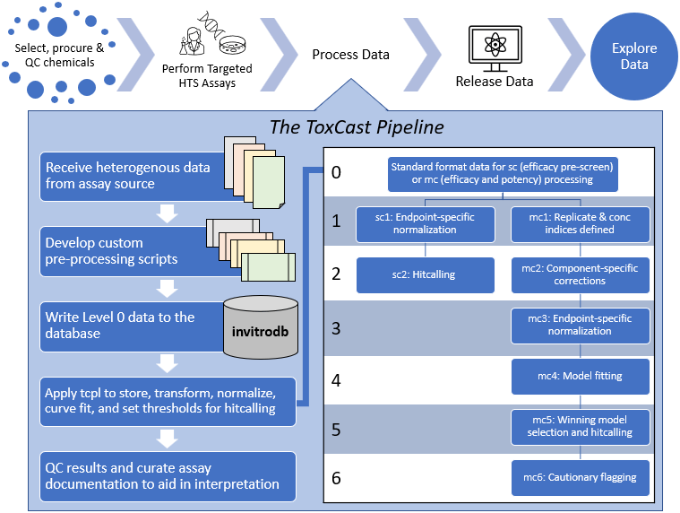
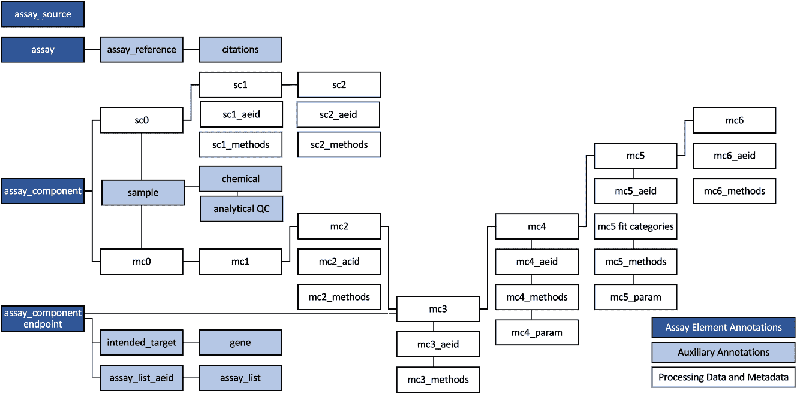
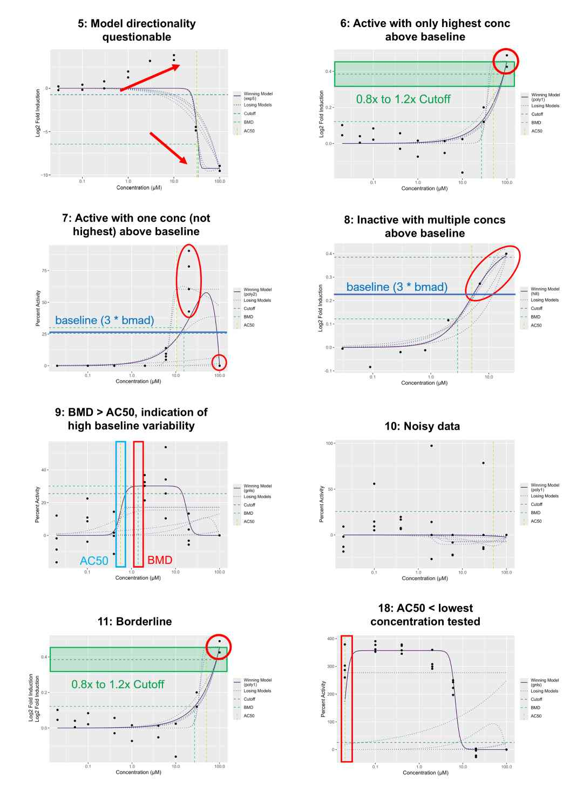

```{css, code = readLines(params$my_css), hide=TRUE, echo = FALSE}
```

```{r setup, include = FALSE}
library(httptest)
start_vignette("api")
```

<a href="https://CRAN.R-project.org/package=tcpl"></a>

# Introduction

This vignette provides an overview of the `tcpl` R package, including set up, [Database Structure](#db), [Pre-processing](#lvl0-preprocessing), [Assay and Chemical Registration](#register), [Data Processing](#data_process), [Data Interpretation](#data_interp), [Data Retrieval with invitrodb](#data_retrieval) and [via API](#data_retrieval_api), and [Plotting](#plotting).

## Suggested packages for use with this vignette

```{r, echo=FALSE, include=FALSE, eval=FALSE}
# devtools::load_all() #use this instead of lbrary(tcpl) when dev versions are installed locally
```

```{r, message = FALSE, warning = FALSE,  class.source="fold-hide"}
# Primary Packages #
library(tcpl)
library(tcplfit2)
# Data Formatting Packages #
library(data.table)
library(dplyr)
library(magrittr)
library(reshape2)
library(knitr)
# Plotting Packages #
library(ggplot2)
library(gridExtra)
library(RColorBrewer)
library(colorspace)
library(viridis)
# Table Packages #
library(htmlTable)
library(kableExtra)
```

# Overview

The ToxCast Data Analysis Pipeline `tcpl` is an R package that manages, models, plots, and stores ToxCast data to populate its linked MySQL database, `invitrodb`. The [U.S. Environmental Protection Agency (EPA)'s Toxicity Forecaster (ToxCast^TM^) program](https://www.epa.gov/comptox-tools/toxicity-forecasting-toxcast) includes *in vitro* medium- and high-throughput screening (HTS) assays for the prioritization and hazard characterization of thousands of chemicals of interest. Targeted and confirmatory assays (like ToxCast assays) comprise Tiers 2-3 of the Computational Toxicology Blueprint ([Thomas et al., 2019](https://pubmed.ncbi.nlm.nih.gov/30835285/)), and employ automated chemical screening technologies to evaluate the effects of chemical exposure on living cells and biological macromolecules, such as proteins.

The `tcpl` package is a flexible analysis pipeline capable of efficiently processing and storing large volumes of data. The diverse data, received in heterogeneous formats from numerous vendors, are transformed to a standard computable format via [Level 0 Pre-processing](#lvl0-preprocessing) then loaded into the database by vendor-specific R scripts. Describing the specific transformations is outside the scope of this package, but can be done for virtually any chemical screening effort, provided the data includes the minimum required information. Once data is loaded into the database, generalized processing functions provided in this package process, normalize, model, qualify, and visualize the data.

<center>

{width=100%}

</center>

The original `tcplFit()` functions performed basic concentration-response curve fitting. Processing with `tcpl` v3.0 and beyond depends on the stand-alone [`tcplfit2`](https://cran.r-project.org/package=tcplfit2) package to allow a wider variety of concentration-response models when using `invitrodb` in the 4.0 schema and beyond. Using `tcpl` v3.0+ with the schema from `invitrodb` v2.0-3.5 will still default to `tcplFit()` modeling with constant, Hill, and gain-loss. The main improvement provided by updating to using [`tcplfit2`](https://cran.r-project.org/package=tcplfit2) is inclusion of [concentration-response models](#models) like those contained in the program [BMDExpress2](https://github.com/auerbachs/BMDExpress-2). This include polynomial, exponential, and power functions in addition to the original Hill, gain-loss, and constant models. Similar to the program [BMDExpress](https://www.sciome.com/bmdexpress/), `tcplFit2` curve fitting uses a defined Benchmark Response ($BMR$) level to estimate a [Benchmark Dose (BMD)](#bmd), which is the concentration where the model intersects with this $BMR$ threshold. One final addition was to derive the [Activity Hit Call](#hitc) as a continuous estimate, which is in contrast to binary hit call value from `tcplFit()`. While developed primarily for ToxCast, the `tcpl` package is written to be generally applicable to the chemical-screening community.

The `tcpl` package includes processing functionality for two screening paradigms: (1) single-concentration (SC) and (2) multiple-concentration (MC) screening. SC screening consists of testing chemicals at one to three concentrations, often for the purpose of identifying potentially active chemicals to test in the multiple-concentration format. MC screening consists of testing chemicals across a concentration range, such that the modeled activity can give an estimate of potency, efficacy, etc. 

In addition to storing the data, the `invitrodb` stores every processing and analysis decision at the assay component or assay endpoint level to facilitate transparency and reproducibility. For illustrative purposes of this vignette, a small subset of actual data from the ToxCast program is featured throughout this vignette. `tcplLite` is no longer supported by `tcpl` because [`tcplfit2`](https://cran.r-project.org/package=tcplfit2) can be used to model data and make hit calls independent of `invitrodb`. `tcplLite` relied on flat files structured like `invitrodb` to produce curve fitting and summary information like hitcalling and AC~50~ values. Functionally [`tcplfit2`](https://cran.r-project.org/package=tcplfit2) replaces `tcplLite` because interested stakeholders can now curve fit data and reproduce curve fitting results independent of the `invitrodb` schema. For the ToxCast program, it is still important to use `invitrodb` when curve fitting as `invitrodb` serves as a data resource for tracking pipelining decisions and providing a dataset for many interested stakeholders. Using `tcpl`, the user can upload, process, and retrieve data by connecting to a MySQL database. Additionally, past versions of the ToxCast database, containing all the publicly available ToxCast data, are available for download at: <https://www.epa.gov/comptox-tools/exploring-toxcast-data>.

# ToxCast Publications
Check out the following publications for additional information on the overall [US EPA's Toxicity Forecaster (ToxCast) Program](https://www.epa.gov/comptox-tools/toxicity-forecasting-toxcast). Assay-specific publications describing assay design or results are available in the `assay_references` and `citations` tables.

* [Feshuk et al., 2023](https://www.frontiersin.org/journals/toxicology/articles/10.3389/ftox.2023.1275980): The ToxCast pipeline: updates to curve-fitting approaches and database structure
* [Filer et al.,2017](https://pubmed.ncbi.nlm.nih.gov/27797781/): tcpl: the ToxCast pipeline for high-throughput screening data
* [Sheffield et al., 2021](https://doi.org/10.1093/bioinformatics/btab779): tcplfit2: an R-language general purpose concentration–response modeling package
* [Judson et al., 2016](https://doi.org/10.1093/toxsci/kfw092):  Analysis of the Effects of Cell Stress and Cytotoxicity on In Vitro Assay Activity Across a Diverse Chemical and Assay Space

# Connection Configuration 

First, it is highly recommended for users to utilize the `data.table` package. The `tcpl` package utilizes the `data.table` package for all data frame-like objects. 

```{r eval=FALSE, message=FALSE}
library(data.table) # recommended for interacting with `tcpl` data frame-like objects
library(tcpl)
```

After loading `tcpl`, the function `tcplConf()` is used to establish connection to a database server or the API. The default connection to the CTX Bioactivity API only allows for data retrieval whereas connection to a database will allow registration and processing actions. While a typical database connection requires 5 parameters to be provided, using an API connection requires the user to only specify password (`pass`) and driver (`drvr`):

```{r setup-api, eval=FALSE}
tcplConf(pass = "API key provided by emailing CTX API support at ccte_api@epa.gov",
         drvr = "API")
```

::: {.noticebox data-latex=""}

**NOTE:** When `tcpl` is loaded, the default configuration sets the options to `tcpl`'s application API key to support new users testing out the package. This default API key is not intended for regular users; instead, it is highly recommended to obtain a personal API key to also access other CTX APIs. For this, send an email request to CTX API support at <ccte_api@epa.gov>.

:::

Every time the package is loaded in a new R session, a message similar to the following will print showing the default package settings:

```{r eval = FALSE}
tcpl (v3.1.0) loaded with the following settings:
  TCPL_DB:    NA
  TCPL_USER:  NA
  TCPL_HOST:  https://api-ccte.epa.gov/bioactivity
  TCPL_DRVR:  API
Default settings stored in tcpl config file. See ?tcplConf for more information.
```

Establishing a database connection utilizes the following settings: 

1. `$TCPL_DB` points to the `tcpl` database (if using "MySQL" drvr),
2. `$TCPL_USER` stores the username for accessing the database (if using "MySQL" drvr),
3. `$TCPL_PASS` stores the password for accessing the database (if using "MySQL" drvr) or API key (if connecting to CTX APIs),
4. `$TCPL_HOST` points to the MySQL server host (if using "MySQL" drvr) or API URL (if connecting to CTX APIs), and 
5. `$TCPL_DRVR` indicates which database driver is used ("MySQL", "API"). `tcplLite` is no longer supported and it is recommended to use the [`tcplfit2`](https://cran.r-project.org/package=tcplfit2) package for stand-alone applications.

Refer to ` ?tcplConf()` for more information. At any time, users can check the settings using `tcplConfList()`. An example of database settings using `tcpl` would be as follows:

```{r eval = FALSE}
tcplConf(db   = "invitrodb",
         user = "username", 
         pass = "password", 
         host = "localhost",
         drvr = "MySQL")
```

`tcplConfList()` will list connection information. Note, `tcplSetOpts()` will only make changes to the parameters given. The package is always loaded with the settings stored in the `TCPL.config` file located within the package directory. The user can edit the file, such that the package loads with the desired settings, rather than having to call the `tcplSetOpts()` function every time. The `TCPL.config` file has to be edited whenever the package is updated or re-installed. With no `TCPL.config` file available, the package defaults to an "API" connection configuration with the [CTX APIs](https://www.epa.gov/comptox-tools/computational-toxicology-and-exposure-apis). 

# Database Structure {#db}

The following contains reference tables that describe the structure and fields found in the `tcpl` populated database. The first sections describe the data-containing tables, followed by sections describing the additional annotation tables.

<center>

{width=100%}

</center>

In general, the single-concentration data and accompanying methods are found in the "sc#" tables, where the number indicates the processing level. Likewise, the multiple-concentration data and accompanying methods are found in the "mc#" tables. Each processing level that has accompanying methods will also have tables with the "_methods" and "_id" naming scheme. For example, the database contains the following tables: `mc5` storing the data from multiple-concentration level 5 processing, `mc5_methods` storing the available level 5 methods, and `mc5_aeid` storing the method assignments for level 5. Note, the table storing the method assignments for level 2 multiple-concentration processing is called `mc2_acid`, because mc2 methods are assigned by assay component ID.

There are two additional tables, `sc2\_agg` and `mc4\_agg`, that link the data in tables `sc2` and `mc4` to the data in tables `sc1` and `mc3`, respectively. This is necessary because each entry in the database before sc2 and mc4 processing represents a single value; subsequent entries represent summary/modeled values that encompass many values. To know what values were used in calculating the summary/modeled values, the user must use the "\_agg" look-up tables.

When using `tcpl` v3.0+ with `invitrodb` schemas v2.0-v3.5, `tcplFit` model data are structured in mc4 and mc5 tables that are in wide format with a fixed number of columns based on 3 curve fitting models (see documentation associated with `tcpl` v2.1). When using `tcpl` v3.0+ with `invitrodb` schemas v4.0+, `mc4` and `mc5` tables have been updated to reflect having `mc4_param` and `mc5_param` tables. Tables should be reviewed together: `mc4` captures summary values calculated for each concentration series, whereas `mc4_param` includes parameters for all models in long format. `mc5` selects the winning model and activity hit call, whereas `mc5_param` includes model parameters from selected winning (hit) model in long format. These schema changes provide a way to continually expand modeling capabilities in `tcpl`.

Each of the methods tables have fields analogous to $mc5\_mthd\_id$, $mc5\_mthd$, and $desc$. These fields represent the unique key for the method, the abbreviated method name (used to call the method from the corresponding method function), and a brief description of the method, respectively. The method assignment tables will have fields analogous to $mc5\_mthd\_id$ matching the method ID from the methods tables, an assay component or assay endpoint ID, and possibly an $exec\_ordr$ field indicating the order in which to execute the methods. The method and method assignment tables will not be listed in the tables below to reduce redundancy. 

Many of the tables also include the $created\_date$, $modified\_date$, and $modified\_by$ fields that store helpful information  for tracking changes to the data. These fields will not be discussed further or included in the tables below.

Many of the tables specific to the assay annotation are populated semi-manually based on expert curation of information on assay design; these tables of assay annotation are not currently utilized by the `tcpl` package, but instead act as meta-data for users. The full complexity of the assay annotation used by the ToxCast program is beyond the scope of this vignette and the `tcpl` package. Additionally, a compiled report of assay description documents are available on the [ToxCast Downloadable Data page.](https://www.epa.gov/comptox-tools/exploring-toxcast-data)

## Level 0 {#lvl0-table}
The `mc0` and `sc0` tables are identical, other than containing $m0id$ rather than $s0id$, respectively. See the [Level 0 Pre-processing](#lvl0-preprocessing) section for more information, such as different well types is available and other processing requirements.

```{r warning = FALSE, echo = FALSE}
Field <- c("s0id ", "acid", "spid", "apid", "rowi", "coli", "wllt", "wllq", "conc", "rval", "srcf")
Description <- c("Level 0 ID",
                 "Assay component ID",
                 "Sample ID",
                 "Assay plate ID",
                 "Assay plate row index",
                 "Assay plate column index",
                 "Well type",
                 "Well quality: 1 was good, else 0",
                 "Concentration is micromolar",
                 "Raw assay component value or readout",
                 "Filename of the source file containing the data")

output <- data.frame(Field, Description)

kable(output)%>% 
  kable_styling("striped") 
```

## SC Data-containing Tables

## - Level 1 (sc1)
```{r warning = FALSE, echo = FALSE}
Field <- c("s1id ", "s0id", "acid", "aeid", "conc", "bval", "pval", "resp")
Description <- c("Level 1 ID",
                 "Level 0 ID",
                 "Assay component ID",
                 "Assay component endpoint ID",
                 "Concentration is micromolar",
                 "Baseline value",
                 "Positive control value",
                 "Normalized response value" )

output <-  data.frame(Field, Description)

kable(output)%>% 
  kable_styling("striped")
```


## - Level 2 (sc1)
```{r warning = FALSE, echo = FALSE}
Field <- c("s2id ", "aeid", "spid", "bmad", "max_med", "coff", "hitc", "tmpi")
Description <- c("Level 2 ID",
                 "Assay component endpoint ID",
                 "Sample ID",
                 "Baseline median absolute deviation",
                 "Maximum median response value",
                 "Efficacy cutoff value",
                 "Binary hit call value, 1 if active, 0 if inactive",
                 "Ignore, temporary index used for uploading purposes" )

output <- data.frame(Field, Description)

kable(output)%>% 
  kable_styling("striped")
```

## - Aggregated IDs (sc2_agg)
```{r warning = FALSE, echo = FALSE}
Field <- c("aeid ", "s0id", "s1id", "s2id")
Description <- c("Assay component endpoint ID",
                 "Level 0 ID",
                 "Level 1 ID",
                 "Level 2 ID" )

output <- 
  data.frame(Field, Description)

kable(output)%>% 
  kable_styling("striped")
```

## - Representative Samples (sc2_chid)
```{r warning = FALSE, echo = FALSE}
Field <- c("s2id", "chid_rep")

Description <- c("Level 2 ID",
                 "Representative sample designation for a tested chemical: 1 if representative sample, else 0")

output <- data.frame(Field, Description)

kable(output)%>% 
  kable_styling("striped")
```

See the [Data Interpretation>Representative Samples section](#chid) for more details.

## MC Data-containing Tables

## - Level 1 (mc1)
```{r warning = FALSE, echo = FALSE}
Field <- c("m1id", "m0id", "acid", "cndx", "repi")
Description <- c("Level 1 ID",
                 "Level 0 ID",
                 "Assay component ID",
                 "Concentration index",
                 "Replicate index" )

output <-  data.frame(Field, Description)

kable(output)%>% 
  kable_styling("striped")
```

## - Level 2 (mc2)
```{r warning = FALSE, echo = FALSE}
Field <- c("m2id", "m0id", "acid", "m1id", "cval")
Description <- c("Level 2 ID",
                 "Level 0 ID",
                 "Assay component ID",
                 "Level 1 ID",
                 "Corrected value"   )

output <- data.frame(Field, Description)

kable(output)%>% 
  kable_styling("striped")
```

## - Level 3 (mc3)
```{r warning = FALSE, echo = FALSE}
Field <- c("m3id", "aeid", "m0id", "acid", "m1id", "m2id", "bval", "pval", "conc", "resp")
Description <- c("Level 3 ID",
                 "Assay endpoint ID",
                 "Level 0 ID",
                 "Assay component ID",
                 "Level 1 ID",
                 "Level 2 ID",
                 "Baseline value",
                 "Positive control value",
                 "Concentration is micromolar",
                 "Normalized response value")

output <- data.frame(Field, Description)

kable(output)%>% 
  kable_styling("striped")
```

## - Aggregated IDs (mc4_agg)
```{r warning = FALSE, echo = FALSE}
Field <- c("aeid", "m0id", "m1id", "m2id", "m3id", "m4id")
Description <- c(
   "Assay endpoint ID","Level 0 ID",
                 "Level 1 ID",
                 "Level 2 ID",
                 "Level 3 ID",
                 "Level 4 ID" )

output <-  data.frame(Field, Description)

kable(output)%>% 
  kable_styling("striped")
```

## - Level 4 (mc4) {#mc4}
```{r warning = FALSE, echo = FALSE}

Field <- c("m4id", "aeid", "spid", "bmad", "resp_max", "resp_min", "max_mean", "max_mean_conc", "min_mean", "min_mean_conc", "max_med", "max_med_conc", "min_med", "min_med_conc", "max_med_diff", "max_med_diff_conc", "conc_max", "conc_min", "nconc", "npts", "nrep", "nmed_gtbl_pos", "nmed_gtbl_neg", "tmpi")


Description <- c("Level 4 ID",
                 "Assay endpoint ID",
                 "Sample ID",
                 "Baseline median absolute deviation",
                 "Maximum response value",
                 "Minimum response value",
                 "Maximal mean response at a given concentration",
                 "Corresponding concentration of *max_mean*",
                 "Minimum mean response value at a given concentration",
                 "Corresponding concentration of *min_mean*",
                 "Maximum median response value at a given concentration",
                 "Corresponding concentration of *max_med*",
                 "Minimum median response value at a given concentration",
                 "Corresponding concentration of *min_med*",
                 "Absolute difference between maximal and minimal median response at a given concentration",
                 "Absolute difference between corresponding concentration of max_med and min_med",
                 "Maximum concentration tested",
                 "Minimum concentration tested",
                 "Number of concentrations tested",
                 "Number of points in the concentration series",
                 "Number of replicates in the concentration series",
                 "Number of median response values greater than baseline of 3 * *BMAD*",
                 "Number of median response values less than baseline of -3 * *BMAD*",
                 "Ignore, temporary index used for uploading purposes"  )

output <- data.frame(Field, Description)

kable(output)%>% 
  kable_styling("striped") %>%
  kableExtra::scroll_box(width="100%", height="400px")
```

## - Level 4 Parameters (mc4_param)
```{r warning = FALSE, echo = FALSE}
Field <- c("m4id", "aeid", "model", "model_param", "model_val")

Description <- c("Level 4 ID",
                 "Assay endpoint ID",
                 "Model that was fit",
                 "Key for the parameter that was fit with the corresponding model",
                 "Value for the associated key in the corresponding model")

output <- data.frame(Field, Description)

kable(output)%>% 
  kable_styling("striped")
```

## - Level 5 (mc5) {#mc5}
```{r warning = FALSE, echo = FALSE}
Field <- c("m5id", "m4id", "aeid", "modl", "hitc", "fitc", "coff", "actp", "model_type")

Description <- c("Level 5 ID",
                 "Level 4 ID",
                 "Assay endpoint ID",
                 "Winning model",
                 "Continuous activity hit call value ranging from -1 to 1" ,
                 "Fit category",
                 "Efficacy cutoff value",
                "Activity probability (1 - *const_prob* not used with *tcplFit2*)",
                "Model type. Options include: </br>
                2: Bidirectional: Data is fit bidirectionally.</br>
                3: Gain: Data is fit bidirectionally, but gain is the intended direction of response. Hit call (hitc) is multiplied by -1 if winning model is fit in the negative analysis direction. </br>
                4: Loss: Data is fit bidirectionally, but loss is the intended direction of response. Hit call (hitc) is multiplied by -1 if winning model is fit in the positive analysis direction." )

output <- data.frame(Field, Description)

htmlTable(output,
          align='l',
          align.header='l',
          rnames=FALSE,
          css.cell=' padding-bottom: 5px;  vertical-align:top; padding-right: 10px;min-width: 5em ')
```

See the [Data Interpretation>Hit Calls](#hitc) section for more details.

## - Level 5 Parameters (mc5_param) {#mc5_param}
```{r warning = FALSE, echo = FALSE}
Field <- c("m5id", "aeid", "hit_param", "hit_val")

Description <- c("Level 5 ID",
                 "Assay endpoint ID",
                 "Key for the parameter that was fit with winning model",
                 "Value for the associated key in the winning model" )

output <-  data.frame(Field, Description)

kable(output)%>% 
  kable_styling("striped")
```

## - Representative Samples (mc5_chid)
```{r warning = FALSE, echo = FALSE}
Field <- c("m5id", "chid_rep")

Description <- c("Level 5 ID",
                 "Representative sample designation for a tested chemical: 1 if representative sample, else 0" )

output <- data.frame(Field, Description)

kable(output)%>% 
  kable_styling("striped")
```

See the [Data Interpretation>Representative Samples section](#chid) for more details.

## - Level 6 (mc6)
```{r warning = FALSE, echo = FALSE}
Field <- c("m6id", "m5id", "m4id", "aeid", "mc6_mthd_id", "flag")

Description <- c("Level 6 ID",
                 "Level 5 ID",
                 "Level 4 ID",
                 "Assay endpoint ID",
                 "Level 6 method ID",
                 "Short flag description to be displayed in data retrieval and plotting. Extended description available in mc6_Methods table." )

output <- data.frame(Field, Description)

kable(output)%>% 
  kable_styling("striped")
```

See the [Data Interpretation>Flags](#flags) section for more details.

## - Level 7 (mc7)
```{r warning = FALSE, echo = FALSE}
Field <- c("m7id", "m4id", "aeid", "potency_val_type", "aed_type", "aed_val", "aed_val_unit", "interindividual_var_perc", "httk_model", "invitrodb_version", "httk_version")

Description <- c("Level 7 ID",
                 "Level 4 ID",
                 "Assay endpoint ID", "Potency value type used in the calc_mc_oral_equiv() calculation", 
                 "Descriptive vector that begins with “aed,” followed by potency metric used, followed by a short name of the httk model used, ending with the percentile from the modeled population with respect to interindividual variability", 
                 "Numeric value of the AED",
                 "Unit associated with AED, mg/kg/day", "Interindividual variability percentile, either 50th or 95th", 
                 "The httk model used; 3-compartment steady state (3compartmentss) or pbtk; note that all models used here were for adult humans.", 
                 "invitrodb version of data",
                 "Version of [httk R package](https://CRAN.R-project.org/package=httk) used" )

output <- data.frame(Field, Description)

kable(output)%>% 
  kable_styling("striped")
```

See the [Data Interpretation>Adminstered Equivalent Doses](#aed) section for more details.

## Assay and Auxiliary Annotation Tables
 
The fields pertinent to the `tcpl` package are listed in the tables below. More specifics on assay and auxiliary annotations will be provided in later sections. 

```{r warning = FALSE, echo = FALSE}
Table <- c("assay_source", "assay", "assay_component", "assay_component_endpoint", "assay_component_map", "assay_descriptions**", "assay_reagent**", "assay_reference**",  "chemical", "chemical_analytical_qc**", "chemical_lists", "citations**", "gene**", "intended_target**", "organism**", "sample")

Description <- c("Assay source-level annotation", "Assay-level annotation",
                 "Assay component-level annotation",
                 "Assay endpoint-level annotation",
                 "Assay component source names and their corresponding assay component ids",
                 "Additional assay descriptions curated per OECD Guidance Document 211 (GD211)",
                 "Assay reagent information",
                 "Map of citations to assay",
                 "List of chemicals and associated identifiers",
                 "Analytical QC information curated at the chemical substance or sample level to inform applicability domain",
                 "Lists of chemicals and their presence in curated chemical lists",
                 "List of citations",
                 "Gene identifiers and descriptions",
                 "Intended assay target at the assay endpoint level",
                 "Organism identifiers and descriptions",
                 "Sample identifiers and chemical provenance information")

output <- data.frame(Table, Description)

kable(output)%>% 
  kable_styling("striped")
```

** indicates tables may have limited `tcpl` functionality, but data is still retrievable via `tcplQuery()`.

## - Assay_Source {#asid}
```{r warning = FALSE, echo = FALSE}
Field <- c("asid", "assay_source_name", "assay_source_long_name", "assay_source_desc")

Description <- c("Assay source ID. Required for registration.",
                 "Assay source name, typically an abbreviation of the assay_source_long_name and abbreviated \"asnm\" within the package. Required for registration",
                 "Full assay source name", 
                 "Assay source description"
                 )

output <- data.frame(Field, Description)

kable(output)%>% 
  kable_styling("striped")
```

## - Assay {#aid}
```{r warning = FALSE, echo = FALSE}
Field <- c("aid", "asid;", "assay_name", "assay_desc", "timepoint_hr", 
            "ncbi_taxon_id", "organism",'tissue',"cell_format",
            'cell_free_component_source',
            'cell_short_name', 
            'cell_growth_mode',
            "assay_footprint", 
            "assay_format_type" ,
            "assay_format_type_sub" ,
            "content_readout_type",  
            "dilution_solvent" , 
            "dilution_solvent_percent_max")

Description <- c("Assay ID",
                 "Assay source ID. Required for registration.",
                 "Assay name, abbreviated \"anm\" within the package. Required for registration.",
                 "Assay description",
                 "Treatment duration in hours",
                 "NCBI taxonomic identifier for organism, available at https://www.ncbi.nlm.nih.gov/taxonomy",
                 "Organism of origin",
                 "Tissue of origin", "Description of cell format",
                 "Description of source for targeted cell-free components",
                 "Abbreviation of cell line",
                 "Cell growth modality", 
                 "Microtiter plate size. Required for registration.",
                 "General description of assay format",
                 "Specific description of assay format" ,
                 "Description of well characteristics being measured", 
                 "Solvent used in sample dilution",
                 "Maximum percent of dilution solvent used, from 0 to 1")

output <- data.frame(Field, Description)

kable(output)%>% 
  kable_styling("striped") %>%
  kableExtra::scroll_box(width="100%", height="400px")
```

## - Assay_Component {#acid}
```{r warning = FALSE, echo = FALSE}
Field <- c("acid", "aid", "assay_component_name", "assay_component_desc", "assay_component_target_desc", "parameter_readout_type","assay_design_type", "assay_design_type_sub", "biological_process_target", "detection_technology_type", "detection_technology_type_sub", "detection_technology", "key_assay_reagent_type", "key_assay_reagent", "technological_target_type", "technological_target_type_sub")

Description <- c("Assay component ID",
                 "Assay ID. Required for registration.",
                 "Assay component name, abbreviated \"acnm\" within the package. Required for registration.",
                 "Assay component description", 
                 "Assay component target description. Generally includes information about mechanism of action with assay target, how disruption is detected, or significance of target disruption.",
                 "Description of parameters measured", 
                "General description of the biological or physical process is translated into a detectable signal by assay mechanism",
                "Specific description of method through which a biological or physical process is translated into a detectable signal measured",
                "General biological process being chemically disrupted",
                "General description of assay platform or detection signals measured",
                "Description of signals measured in assay platform",
                "Specific description of assay platform used",
                "Type of critical reactant being measured",
                "Critical reactant measured",
                "General description of technological target measured in assay platform",
                "Specific description of technological target measured in assay platform")

output <- data.frame(Field, Description)

kable(output)%>% 
  kable_styling("striped") %>%
  kableExtra::scroll_box(width="100%", height="400px")
```

## - Assay_Component_Endpoint {#aeid}
```{r warning = FALSE, echo = FALSE}
Field <- c("aeid", "acid", "assay_component_endpoint_name", "assay_component_endpoint_desc", "assay_function_type", "normalized_data_type", "burst_assay", "key_positive_control", "signal_direction", "intended_target_type", "intended_target_type_sub", "intended_target_family", "intended_target_family_sub", "cell_viability_assay")
           
Description <- c("Assay component endpoint ID",
                 "Assay component ID. Required for registration.",
                 "Assay component endpoint name, abbreviated \"aenm\" within the package. Required for registration.", 
                 "Assay component endpoint description",
                 "Description of targeted mechanism and the purpose of the analyzed readout in relation to others from the same assay",
                 "Normalization approach for which the data is displayed",
                 "Indicator if endpoint is included in the burst distribution (1) or not (0); Burst phenomenon can describe confounding activity, such as cytotoxicity due to non-specific activation of many targets at certain concentrations. Required for registration.", 
                 "Tested chemical sample expected to produce activity; Used to assess assay validity",
                 "Directionality of raw data signals from assay (gain or loss); Defines analysis direction",
                 "General group of intended targets measured",
                 "Specific subgroup of intended targets measured", 
                 "Family of intended target measured; Populated on ToxCast chemical activity plot within CompTox dashboard",
                 "Specific subfamily of intended target measured",
                 "Indicator of the impact of cytotoxicity in confounding (1) or no cytotoxic impact (0)" )

output <- data.frame(Field, Description)

kable(output)%>% 
  kable_styling("striped") %>%
  kableExtra::scroll_box(width="100%", height="400px")
```

See the [Data Interpretation>Cytotoxicity Burst Distribution](#burst) section for more details on "burst_assay".

## - Assay_Component_Map
```{r warning = FALSE, echo = FALSE}
Field <- c("acid", "acsn")

Description <- c("Assay component ID",
                 "Assay component source name" )

output <- data.frame(Field, Description)

kable(output)%>% 
  kable_styling("striped")
```

## - Assay_Descriptions {#gd211}
```{r warning = FALSE, echo = FALSE}
Field <- c("aeid", "assay_title", "assay_objectives", "assay_throughput", "scientific_principles", "biological_responses", "analytical_description", 
           "basic_procedures", "experimental_system", "xenobiotic_biotransformation", "proprietary_elements")
           
Description <- c("Assay component endpoint ID", 
                 "Short and descriptive title for the assay; opposed to assay component endpoint name", 
                 "Purpose of the test method: Inserted after assay_component_target_desc; the claimed purpose and rationale for intended use of the method (e.g. alternative to an existing method, screening, provision of novel information in regulatory decision-making, mechanistic information, adjunct test, replacement, etc.) should be explicitly described and documented. The response measured in the assay should be put in the context of the biology/physiology leading to the in vivo response or effect. If the biological activity or response refers to a key event or molecular initiating event (MIE), provide a short description indicating what key event within an existing or developing AOP, or in relation to a mechanism or mode of action, the assay is aiming to characterize (i.e. which level of biological organization the assay may be attributed (e.g. sub-cellular, cellular, tissue, organ or individual), and where the assay might fit in the context of an existing regulatory hazard (i.e. adverse outcome). In the absence of any AOP, provide an indication of the plausible linkage between the mechanism(s) the assay is measuring and the resulting hazard endpoint.", 
                 "Information about the throughput of the assay: Indicate the throughput of the assay to provide an indication of likely resource intensity e.g. low (manual assay, one chemical tested at a time), lowmoderate, moderate, moderate-high, high throughput (e.g. in 96 well-plate and higher), and qualify with e.g. approximate number of chemicals/concentrations per run. If appropriate indicate whether a manual assay could be run in a higher throughput mode.", 
                 "Scientific principle of the method: Provide the scientific rationale, supported by bibliographic references to articles, for the development of the assay. A summary description of the scientific principle including the biological/physiological basis and relevance (e.g. modeling of a specific organ) and/or mechanistic basis (e.g. modeling a particular mechanism by biochemical parameters) should be described. If possible, indicate what the anchor point is within an AOP.", 
                 "Response and Response Measurement: Response here makes reference to any biological effect, process, or activity that can be measured. Specify precisely and describe the response and its measurement, e.g. corneal opacity measured using an opacitometer; half maximal activity concentration (AC50) derived from a competitive binding assay in human estrogen receptor assay or from the up-regulation of the proinflammatory antiangiogenic chemokine CXCL10.", 
                 "Data analysis: Comment on the response value in terms of a boundary or range to provide a context for interpretation.", 
                 "Description of the experimental system exposure regime: Provide a summary description of the essential information pertaining to the exposure regime (dosage and exposure time including observation frequency) of the test compounds to the experimental system including information on metabolic competence if appropriate; number of doses/concentrations tested or testing range, number of replicates, the use of control(s) and vehicle. Also, describe any specialized equipment needed to perform the assay and measure the response. Indicate whether there might be potential solubility issues with the test system, and solutions proposed to address the issue.", 
                 "Tissue, cells or extracts utilised in the assay and the species source: indicate the experimental system for the activity or response being measured.", "Metabolic competence of the test system: Describe and discuss the extent to which the test system can be considered metabolically competent, either by itself, or with the addition of an enzymatic fraction, if appropriate. Provide reference if available.", 
                 "Status of method development and uses: Compile information for the following sections if appropriate. Considerations could include: i) Development status: Indicate if the assay is still under development, and the estimated timeline for completion as far as possible ii) Known uses: Summarise the current and/or past use of the assay by different laboratories iii) Evaluation study: Summarise the main conclusions or refer to individual protocol if available iv) Validation study: Indicate participation in a formal validation study/studies and summarise the conclusions and their outcomes or refer to the individual protocol if available v) Regulatory use: Provide details of any potential regulatory application and of the toxicological hazard endpoint being addressed by the assay.")

output <- data.frame(Field, Description)

kable(output)%>% 
  kable_styling("striped") %>%
  kableExtra::scroll_box(width="100%", height="400px")
```

See the [Data Interpretation>Assay Description Documents](#add) section for more details.

## - Chemical
```{r warning = FALSE, echo = FALSE}
Field <- c("chid", "casn", "chnm", "dsstox_substance_id")

Description <- c("Chemical ID", "CAS Registry Number", "Chemical name",
                 "Unique identifier from U.S. EPA Distributed Structure-Searchable Toxicity (DSSTox) Database")

output <- data.frame(Field, Description)

kable(output)%>% 
  kable_styling("striped")
```

Chemical ID is the DSSTox GSID within the ToxCast data, but can be any integer and will be auto-generated (if not explicitly defined) for newly registered chemicals.

## - Chemical_Lists
```{r warning = FALSE, echo = FALSE}
Field <- c("chemical_lists_id", "chid", "dsstox_substance_id", "list_acronym", "list_name", "list_desc")

Description <- c("Chemical List ID", "Chemical ID", "Unique identifier from U.S. EPA Distributed Structure-Searchable Toxicity (DSSTox) Database", 
                 "Chemical list acronym", "Chemical list name", "Chemical list description")

output <-  data.frame(Field, Description)

kable(output)%>% 
  kable_styling("striped")
```

## - Sample
```{r warning = FALSE, echo = FALSE}
Field <- c("spid", "chid", "stkc", "stkc_unit", "tested_conc_unit", "bottle_barcode", "source",
           "bottle_type", "lot_number", "purity_percentage", "solubility")

Description <- c("Sample ID",
                 "Chemical ID",
                 "Stock concentration" ,
                 "Stock concentration unit",
                 "The concentration unit for the concentration values in the data-containing tables", 
                 "Bottle barcode of sample", "Source (i.e. manufacturer or supplier) of procured bottle", 
                 "Type of bottle, which can reflect storage condition", "Lot or batch number of bottle", 
                 "Reported purity percentage from bottle Certificate of Analysis (CoA)", "Solubility")

output <- data.frame(Field, Description)

kable(output)%>% 
  kable_styling("striped")
```
The stock concentration fields in the `sample` table allow the user to track the original concentration when the neat sample is solubilized in vehicle before any serial dilutions for testing purposes. The US EPA's internal ChemTrack application and database supports chemical procurement and sample management for ToxCast *in vitro* screening efforts.

# Assay Registration {#register}

This section provides an overview of assay registration process for the `tcpl` package. Before writing and processing any data to the  `tcpl` database, the user has to register the assay and chemical information, i.e. assay identifiers (and minimal assay annotations) and chemical sample identifiers need to be available in the database before any data processing. 

## Assay Nomenclature

The definition of an "assay" is, for the purposes of this package, broken into: <br />
 
* **assay_source**: the vendor/origination of the data  
* **assay**: the procedure to generate the component data 
* **assay_component**: the raw data readout(s)  
* **assay_component_endpoint**: the normalized component data 

Assay source, assay, assay component, and assay endpoint are registered via `tcpl` scripting into a collection of tables. These assay element tables broadly describe who conducted the assay, what platform was used, what was being measured (raw readout), and how the measurement was interpreted (normalized component data). A hierarchical structure of the assay elements is as follows: assay source > assay > assay component > assay component endpoint.

As one moves down the hierarchy, each additional level has a ‘one-to-many’ relationship with the previous level. For example, an assay component can have multiple assay endpoints, but an assay endpoint can derive only from a single assay component. 

## Minimum Required Fields
Throughout the `tcpl` R package, the levels of assay hierarchy are defined and referenced by their auto-incremented primary keys in the `tcpl` database: $asid$ (assay source ID), $aid$ (assay ID), $acid$ (assay component ID), and $aeid$ (assay endpoint ID). These abbreviations mirror the abbreviations for the identifiers (ids) with “nm” in place of “id” in the abbreviations, e.g. assay\_component\_name is abbreviated $acnm$.

All processing occurs by assay component or assay endpoint, depending on the processing type (single-concentration or multiple-concentration) and level. No data is stored at the assay or assay source level. The `assay` and `assay_source` tables store annotations to help in the processing and down-stream understanding of the data. Additional details for registering each assay element and updating annotations are provided below. In addition to each assay element’s id, the minimal registration fields in order to ‘pipeline’ are: 

* $assay\_source\_name$ ($asnm$)
* $assay\_name$ ($anm$)
* $assay\_footprint$
* $assay\_component\_name$ ($acnm$)
* $assay\_component\_endpoint\_name$ ($aenm$)
* $normalized\_data\_type$

## Assay Source
[Assay source](#asid) refers to the vendor or origination of the data. **To register an assay source, an unused $asid$ must be selected to prevent overwriting of existing data.** When adding a new assay source, this should be an abbreviation, as subsequent levels will build on this assay source name.
```{r eval = FALSE, message = FALSE}
tcplLoadAsid()
tcplRegister(what = "asid", flds = list(asid = 1, asnm = "Tox21"))
```
The `tcplRegister()`  function takes the abbreviation for $assay\_source\_name$, but the function will also take the un-abbreviated form. The same is true of the `tcplLoadA-**()` functions, which load the information for the assay annotations stored in the database.

## Assay

[Assay](#aid) refers to the procedure, conducted by some vendor, to generate the component data. **To register an assay, an $asid$ must be provided to map the assay to the correct assay source.** One source may have many assays. To ensure consistency of the naming convention, first check how other registered assays within the assay source were conducted and named. The assay names follow an abbreviated and flexible naming convention of *Source_Assay*. Notable assay design features to describe the assay include:

* Technology (i.e., detection technology),
* Format (e.g., organism, tissue, cell short name, or cell free component source name),
* Target (i.e., intended target, intended target family, gene), or
* Objective aspects (e.g., timepoint or assay footprint). 

The most distinguishing features will be selected to create a succinct assay name. Variation depends on the assay itself as well as other assays provided by the vendor. If multiple features are needed to describe an assay, order will be based on relative importance in describing the assay and the assay’s relation to other assays provided by the vendor to limit confusion. *Source_Technology_Format_Target* is a commonly used naming order. However, if one target is screened on different assay platforms by the vendor, *Source_Target_Technology* is a more appropriate naming convention. This is the case for the Tox21 assays. Additional features may be relevant, including agonist or antagonist mode, or “Follow-up” if the assay is a secondary specificity assay. Conversely, some assays utilize a cell-based format to screen a functional profile of targets. These assays follow a naming convention, *Source_Format*, where specific target information is defined at the component and endpoint level. Bioseek and Attagene are sources that provide cell-based assays. Considering the diversity of the data sources and HTS assays in ToxCast, a flexible naming approach is best used in conjunction with subject matter expert discretion.
```{r eval = FALSE, message = FALSE}
tcplLoadAid(what = "asid", val = 1)
tcplRegister(what = "aid", flds = list(asid = 1, anm = "TOX21_ERa_BLA_Agonist", assay_footprint = "1536 well"))
```
When registering an assay ($aid$), the user must give an $asid$ to map the assay to the correct assay source. Registering an assay, in addition to an assay\_name ($anm$) and $asid$, requires $assay\_footprint$.  The $assay\_footprint$ field is used in the assay plate visualization functions (discussed later) to define the appropriate plate size. The $assay\_footprint$ field can take most string values, but only the numeric value will be extracted, e.g. the text string "hello 384" would indicate to draw a 384-well microtiter plate. Values containing multiple numeric values in $assay\_footprint$ may cause errors in plotting plate diagrams.

## Assay Component

[Assay component](#acid), or “component” for short, describes the raw data readouts. Like the previous level, one assay may have many components. **To register an assay component and create an $acid$, an $aid$ must be provided to map the component to the correct assay.** The assay component name will build on its respective assay name, to describe the specific feature being measured in each component. If there is only one component, the component name can be the same as the assay name. If there are multiple components measured in an assay, understanding the differences, and how one component may relate to another within an assay, are important naming considerations to prevent confusion. Assay component names will usually follow the naming convention of *Source_Assay_Component*, where “Component” is a brief description of what is being measured. 
```{r eval = FALSE, message = FALSE}
tcplLoadAcid(what = "asid", val = 1, add.fld = c("aid", "anm"))
tcplRegister(what = "acid", flds = list(aid = 1, acnm = "TOX21_ERa_BLA_Agonist_ratio"))
```
The final piece of assay information needed is the assay component source name (abbreviated $acsn$), stored in the `assay_component_map` table. The assay component source name is intended to simplify level 0 pre-processing by defining unique character strings (concatenating information if necessary) from the source files that identify the specific assay components. An assay component can have multiple $acsn$ values, but an $acsn$ must be unique to one assay component. Assay components can have multiple $acsn$ values to minimize the amount of data manipulation required (and therefore potential errors) during the [Level 0 Pre-processing](#lvl0-preprocessing) if assay source files change or are inconsistent. The unique character strings ($acsn$) get mapped to $acid$.
```{r eval = FALSE, message = FALSE}
tcplRegister(what = "acsn", flds = list(acid = 1, acsn = "TCPL-mc-Demo"))
```

## Assay Component Endpoint

[Assay component endpoint](#aeid), or “endpoint” for short, represents the normalized component data. **To register an endpoint and create an $aeid$, an $acid$ must be provided to map the endpoint to the correct component.** In past `tcpl` versions, each component could have up to two endpoints therefore endpoint names would express directionality ($\_up$/$\_down$). `tcpl` v3.0+ allows bidirectional fitting to capture both the gain and loss of signal, therefore the endpoint name will usually be the same as the component name.
```{r eval = FALSE, message = FALSE}
tcplLoadAeid(fld = "asid", val = 1, add.fld = c("aid", "anm", "acid", "acnm"))
tcplRegister(what = "aeid", flds = list(acid = 1, aenm = "TOX21_ERa_BLA_Agonist_ratio", normalized_data_type = "percent_activity", export_ready = 1, burst_assay = 0))
```
Registering an assay endpoint also requires the $normalized\_data\_type$ field. The `normalized_data_type` is used when plotting and currently, the package supports the following values: percent_activity, log2_fold_induction, log10_fold_induction, and fold_induction. Any other values will be treated as "percent_activity."

Other required fields to register an assay endpoint do not have to be explicitly defined and will default to 0 if not provided. These fields represent Boolean values (1 or 0, 1 being `TRUE`). The $export\_ready$ field indicates (1) the data is done and ready for export or (0) still in progress. The $burst\_assay$ field is specific to multiple-concentration processing and indicates (1) the assay endpoint is included in the burst distribution calculation or (0) not.

## Naming Revision
There are circumstances where assay, assay component, and assay endpoint names change. The $aid$, $acid$, and $aeid$ are considered more stable in the database, and these auto-incremented keys should not change. To revise naming for assay elements, the correct id must be specified in the `tcplUpdate()` statement to prevent overwriting data.

```{r eval = FALSE, message = FALSE}
tcplUpdate(what = "acid", flds = list(aid = 1, acnm = "TOX21_ERa_BLA_Agonist_ratio"))
```

Reasons for name changes could include:

* Feedback from subject matter experts or assay data generators;
* Clarifications on cell line and cell line drift;
* Addition of new assay data that makes the old naming convention insufficient, such as antagonist assays run with different concentrations of an agonist; or
* Laboratory or Center reorganizations.

Thus, users should be advised that while assay naming is used to infer information about the biology of the assay, assay naming will change over time to reflect progress in building ToxCast as a data resource.

# Chemical Registration

With the minimal assay information registered, the next step is to register the necessary chemical and sample information with `tcplRegister()`. The `tcplLoadChem()` function returns all chemical information or can be filtered for user specified parameters, e.g. the chemical name ($chnm$) and chemical id ($chid$).

## Chemicals

The example below details how sample and chemical information can be loaded. Similar to the order in registering assay information, the user must first register chemicals, then register the samples that map to the corresponding chemical.

The following table of chemical and sample information will be referred to as "chdat":

```{r echo=FALSE}
chdat <- data.table(
  spid = c("Tox21_400088","Tox21_303655","Tox21_110011","Tox21_400081","DMSO","Tox21_400037"),
  casn = c("80-05-7","521-18-6","150-30-1","22224-92-6","67-68-5","95-83-0"),
  chnm = c("Bisphenol A","5alpha-Dihydrotestosterone","Phenylalanine","Fenamiphos","Dimethyl sulfoxide","4-Chloro-1,2-diaminobenzene"),
  dsstox_substance_id = c("DTXSID7020182","DTXSID9022364","DTXSID9023463","DTXSID3024102","DTXSID2021735","DTXSID5020283"),
  code = c("C80057","C521186","C150301","C22224926","C67685","C95830"),
  chid = c("20182","22364","23463","24102","21735","20283")
)

kable(chdat)%>% 
  kable_styling("striped")
```

Registering chemicals requires a chemical's CAS registry number ($casn$) and name ($chnm$). In the above example, only the unique chemicals were loaded. The casn and chnm fields have unique constraints; trying to register multiple chemicals with the same name or CAS registry number is not possible and will result in an error.

```{r eval = FALSE}
# Obtain chemicals already registered in the database.
cmap <- tcplLoadChem()
# Find chemicals in 'chdat' that are not registered yet.
chdat.register <- chdat[!(chdat$code %in% cmap$code)] 
# Register the chemicals not yet in the database.
tcplRegister(what = "chid", flds = chdat.register[,unique(.SD), .SDcols = c("casn", "chnm", "dsstox_substance_id", "code", "chid")])
```

## Samples

Chemical and sample information must be registered separately as there may be multiple samples of the same chemical. With the chemicals registered, the samples can be registered by mapping the sample ID ($spid$) to the chemical ID. Note, the user needs to load the chemical information to get the chemical IDs then merge the new chemical IDs with the sample IDs from the original file by chemical name or CASRN.

```{r eval = FALSE, message = FALSE}
tcplRegister(what = "spid",
             flds = merge(chdat[ , list(spid, casn)],
                          chdat.register[ , list(casn, chid)], by = "casn")[ , list(spid, chid)])
```

## Chemical Lists

Optionally, the user can subdivide the chemical IDs based on presence in different chemical lists using `tcplLoadChemList()`. These chemical lists are curated by the US EPA in the  Distributed Structure-Searchable Toxicity (DSSTox) database. Chemicals can belong to more than one chemical list, and will be listed as separate entries when loading chemical list information.

```{r eval = FALSE}
tcplLoadChemList(field = "chid", val = 1:2)
```

# Level 0 Pre-Processing {#lvl0-preprocessing}

Level 0 pre-processing can be done on virtually any high-throughput screening application to prepare data for ToxCast data processing. In the ToxCast program, level 0 processing is done in R by vendor/dataset-specific scripts. The individual R scripts act as the "laboratory notebook" for the data, with all pre-processing decisions clearly commented and explained. The standard Level 0 format to enter the pipeline is identical between testing paradigms, single concentration ("SC") and multi-concentration ("MC") as described in the [Database Structure>Level 0 section](#lvl0-table).

Level 0 pre-processing reformats the raw, source data into the standard format for the pipeline, and also can make manual transformations to the data as pre-normalization steps. All manual transformations to the data should be very well documented with justification. Common examples of manual transformations include fixing a sample ID typo, or changing well quality value(s) to 0 after finding obvious problems like a plate row/column missing an assay reagent. 

Each row in the level 0 pre-processing data represents one well-assay component combination, containing 11 fields. The only field in level 0 pre-processing not stored at level 0 is the assay component source name ($acsn$). The assay component source name should be some concatenation of data from the assay source file that identifies the unique assay components. When the data are loaded into the database, the assay component source name is mapped to assay component ID through the assay_component_map table in the database. Assay components can have multiple assay component source names, but each assay component source name can only map to a single assay component. 

## Required Fields

```{r warning = FALSE, echo = FALSE}
Field <- c("'acsn' or 'acid'", "spid", "apid", "rowi", "coli", "wllt", "wllq", "conc", "rval", "srcf")

Description <- c("Assay component source name can be used to map to assay component ID, or acid can be directly provided",
                 "Sample ID",
                 "Assay plate ID",
                 "Assay plate row index, as an integer",
                 "Assay plate column index, as an integer",
                 "Well type",
                 "Well quality: 1 was good, else 0",
                 "Concentration in micromolar",
                 "Raw assay component value or readout from vendor",
                 "Filename of the source file containing the data"  )
Required_NULL_allowed <- c("No", "No", "Yes","Yes","Yes", "No", "No", "No", "Yes", "No")

output <- data.frame(Field, Description, Required_NULL_allowed)

kable(output)%>% 
  kable_styling("striped")
```

The Required_NULL_allowed column in the above table indicates whether the field can be **NULL** in the pre-processed data when writing Level 0. In past versions of `tcpl`, there were some exceptions where concentrations could be **NULL**. All $conc$ values must be numeric for processing. For blank and neutral control wells, **NULL** concentrations will automatically be set to zero if not provided. If other concentrations are left **NULL**, user will get a warning and be unable to write Level 0. Additionally, if the raw value is **NULL**, well quality (`wllq`) must be 0.

The well type (`wllt`) field is used to differentiate wells in numerous applications, including normalization and definition of the assay noise level. Package users are encouraged to utilize additional well types (for example, well types "x", "y", "z") or suggest new methods to better accommodate their data. 

## Well Types
```{r warning = FALSE, echo = FALSE}
`Well Type` <- c("t", "c", "p", "n", "m",  "o", "b", "v")

Description <- c("Test compound",
                 "Gain-of-signal control in multiple concentrations",
                 "Gain-of-signal control in single concentration" ,
                 "Neutral/negative control",
                 "Loss-of-signal control in multiple concentrations",
                 "Loss-of-signal control in single concentration",
                 "Blank well",
                 "Viability control" )
output <-  data.frame(`Well Type`, Description)

kable(output)%>% 
  kable_styling("striped")
```

## Writing New Data

Before writing and processing any data to the database, the user must [register the assay and chemical](#register) information, as described above. `tcpl` includes three functions for adding new data:

* `tcplRegister()`: To register a new assay element or chemical
* `tcplUpdate()`: To change or add additional information for existing assay or chemical ids
* `tcplWriteLvl0()`: To load formatted source Level 0 data

The final step in level 0 pre-processing is to load the data into the database. The `tcplWriteLvl0()` function loads data into the database by checking each required field for expected input, such as correct class or registered sample IDs and concentration values for test wells. Assay component source name, if provided, will map to the appropriate $acid$. The `type` argument is used throughout the package to distinguish the screening paradigm (SC or MC) and therefore processing required. See  [Required Fields](#lvl0-preprocessing) section for format of the Level 0 `mcdat` dataframe.

```{r eval = FALSE, message = FALSE}
# Write/load the Level 0 into the database. 
tcplWriteLvl0(dat = mcdat, type = "mc")
```

To confirm data has been written, the `tcplLoadData()` function is used to load data from the database into user's R session. Furthermore, the `tcplPrepOtpt()` function can be used in conjunction with `tcplLoadData()` to prepare the data in a readable format with additional chemical and assay annotation information. See [Data Retrieval](#data_retrieval) sections for further details.

```{r eval = FALSE, message = FALSE}
# Load the level 0 data from the database to R
tcplLoadData(lvl = 0, fld = "acid", val = 1, type = "mc")
tcplPrepOtpt(tcplLoadData(lvl = 0, fld = "acid", val = 1, type = "mc"))
```

In the loaded Level 0 data, $acsn$ is replaced with correct $acid$ and the $m0id$ field is added. These "m#" fields in MC data are primary keys for each level of data and can link the various levels of data. All keys are auto-generated and will change anytime data are reprocessed. Note, the primary keys only change for the levels affected, e.g. if the user reprocesses level 1, the level 0 keys will remain the same. 

# Data Processing {#data_process}

## Overview

All processing in the `tcpl` package occurs at the assay component or assay endpoint level. There is no capability in either SC or MC processing to combine data from multiple assay components or assay endpoints. Any combining of data must occur before or after processing. For example, a ratio of two raw values could be processed if the user calculated the ratio during the custom pre-processing and uploaded values as a single "component".

Once the Level 0 data are loaded, data processing occurs via the `tcplRun()` function for both SC and MC screening. `tcplRun()` can either take a single ID ($acid$ or $aeid$, depending on the processing type and level) or an $asid$. If given an $asid$, the `tcplRun()` function will attempt to process all corresponding components/endpoints. When processing by $acid$ or $aeid$, the user must supply correct [ID for each level](#lvl_ids).

The processing is sequential, and every level of processing requires successful processing at the antecedent level. Any processing changes will trigger a "delete cascade", removing any subsequent data affected by the processing change to ensure complete data fidelity. For example, processing level 3 data will first require data from levels 4 through 6 to be deleted for the corresponding IDs. **Changing method assignments will also trigger a delete cascade for any corresponding data.** 

For `tcplRun()`, the user must supply a starting level ($slvl$) and ending level ($elvl$). There are four phases of processing, as reflected by messages printed in console: (1) data for the given IDs are loaded, (2) the data are processed, (3) data for the same ID in subsequent levels are deleted, and (4) the processed data is written to the database. The `outfile` parameter can give the user the option of printing this output text to a file. If an ID fails while processing multiple levels, the function will not attempt to process the failed ID in subsequent levels. When finished processing, a list indicating the processing success of each ID is returned. For each level processed, the list will contain two elements: (1) "l#" a named Boolean vector where `TRUE` indicates successful processing, and (2) "l#_failed" containing the names of any IDs that failed processing, where "#" is the processing level.

Processing of multiple assay components or endpoints can be executed simultaneously. This is done with the internal utilization of the `mclapply` function from the `parallel` R package. Parallel processing is done by id. Depending on the system environment and memory constraints, the user may wish to use more or less processing power. For processing on a Windows operating system, the default is $mc.cores = 1$, unless otherwise specified. For processing on a Unix-based operating system, the default is $mc.cores = NULL$ i.e. to utilize all cores except for one, which is necessary for 'overhead' processes. The user can specify more or less processing power by setting the `mc.cores` parameter to the desired level. **Note, this specification should meet the following criteria $1 \space \leq \space \mathit{mc.cores} \space \leq \space \mathit{detectCores()}-1$.**

## Level IDs {#lvl_ids}

```{r warning = FALSE, echo = FALSE}
Type <- c('SC', 'SC', 'mc', 'mc', 'mc', 'mc', 'mc', 'mc')
Level <- c('Lvl1', 'Lvl2', 'Lvl1', 'Lvl2', 'Lvl3', 'Lvl4', 'Lvl5', 'Lvl6')
InputID <- c('acid', 'aeid', 'acid', 'acid', 'acid', 'aeid', 'aeid', 'aeid')
MethodID <- c('aeid', 'aeid', 'N/A', 'acid', 'aeid', 'N/A', 'aeid', 'aeid')
output <- data.frame(Type, Level, InputID, MethodID)

kable(output)%>% 
  kable_styling("striped")
```

In this table, the Input ID column indicates the ID used for each processing step where Method ID indicates the ID used for assigning methods for data processing, when necessary. SC1 requires an $acid$ input, but the methods are assigned by $aeid$. The same is true for mc3 processing. SC1 and mc3 are the normalization steps and convert $acid$ to $aeid$. Only mc2 has methods assigned by $acid$.

The processing requirements vary by screening paradigm and level, which later sections cover in detail. However, in general, specific method assignments will be required to accommodate different experimental designs or data processing approaches.

## Methods

To promote reproducibility, all method assignments are saved in the database and utilize methods described in the available list of methods for each processing level. In general, methods data are stored in the "_methods" and "_id" tables for each corresponding level. For example, the `sc1` table is accompanied by the `sc1_methods` table which stores the available list of methods for SC1, and the `sc1_aeid` table which stores the method assignments and execution order.

There are three functions to easily modify and load method assignments:  <br />

* `tcplMthdAssign()`: To assign methods to specified id(s) 
* `tcplMthdClear()`: To clear method assignments to specified id(s)
* `tcplMthdLoad()`: To query the database and return the method assignments for specified id(s) <br />
* `tcplMthdList()`: To query the database and return available methods at specified level(s) <br />  

The following code blocks provides examples of the method-related functions:

```{r eval= FALSE}
## Methods Assignment ##
# For illustrative purposes, assign level 2 mc methods to ACIDs 97, 98, and 99.
# First check for available methods.
mthds <- tcplMthdList(lvl = 2, type = "mc")
mthds[1:2]
# Assign some methods to ACID 97, 98, and 99.
tcplMthdAssign(lvl = 2, 
               id = 97:99, 
               mthd_id = c(3, 4, 2), 
               ordr = 1:3, 
               type = "mc")
# Check the assigned methods for ACID 97, 98, and 99 in the database.
tcplMthdLoad(lvl = 2, id = 97:99, type = "mc")

# Methods can be cleared one at a time for the given id(s)
tcplMthdClear(lvl = 2, id = 99, mthd_id = 2, type = "mc")
# Check the assigned methods for the single id updated, namely ACID 99.
tcplMthdLoad(lvl = 2, id = 99, type = "mc")

# Clear assigned methods for the given id(s)
tcplMthdClear(lvl = 2, id = 97:98, type = "mc")
# Check the assigned methods for the all updated ids, namely ACID 97 and 98.
tcplMthdLoad(lvl = 2, id = 97:98, type = "mc")
```

Later sections of this vignette provide level-specific method assignment examples and more details on the methods themselves. Most examples will reflect commonly-used methods assigned, but one should consider the data at hand and all methods available for the level prior to assigning.

## Data Normalization {#data_norm}

Data normalization occurs in both SC and MC processing paradigms at levels 1 and 3, respectively. While the two paradigms use different methods, the normalization approach is the same for both. Data normalization does not have to occur within the package as pre-normalized data can be loaded into the database at Level 0. **However, data must be zero-centered.** Thus, the data must either be zero-centered in [Level 0 Pre-processing](#lvl0-preprocessing) or the user must pick a methodology from the associated level 1 and 3 methods to zero-center the data before model fitting occurs.

Fold-change and a percent of control are typical approaches to normalization. Given data must be zero-centered, fold-change data in general is log-transformed. Log-scale transformations for fold-change data is typically base 2 ($log_2$), but other bases may be more appropriate in some circumstances.

Normalizing to a percent of control requires three normalization methods: 
1. One to define the baseline value ($bval$), 
2. One to define the control value ($pval$), and 
3. One to calculate percent of control (`resp.pc`). 

Normalizing to fold-change also requires the following normalization methods:
1. One to define the baseline value ($bval$), and
2. One to calculate the fold-change (`resp.fc`), or using log-transformed values (`resp.logfc`).

($cval$) is the corrected response value for a test well defined in mc2. Methods defining a baseline value ($bval$) have the "bval" prefix, methods defining the positive control value ($pval$) have the "pval" prefix. $Pval$ may be set as 0 if no positive control wells are provided and measuring decreases in signal. Finally, methods that calculate the final response value ($resp$) have the "resp" prefix. For example, `resp.log2` does a log-transformation of the response value using a base value of 2. The formulae for calculating the percent of control and fold-change response are listed in equations 1 and 2, respectively.  Note that the fold-change calculation divides by the baseline value and thus must have some non-zero values associated with the baseline to successfully calculate fold-change.

$$  resp.pc = \frac{cval - bval}{pval - bval}*100  $$

$$  resp.fc = \frac{cval}{bval} $$

$$  resp.logfc = cval - bval $$

**Order matters when assigning normalization methods.** The $bval$, and $pval$ if normalizing as a percent of control, need to be calculated prior to calculating the response value. Examples of normalization schemes are presented below:

```{r warning = FALSE, echo = FALSE}
Normalization <- c('', 'Fold Change', '%Control')
Scheme_1 <- c('Scheme 1', '1. bval.apid.nwlls.med</br> 2. resp.fc</br> 3. resp.log2 </br> 4. resp.mult.neg1', 
              '1. bval.apid.lowconc.med</br> 2. bval.apid.pwlls.med</br> 3. resp.pc</br> 4. resp.multneg1')
Scheme_2 <- c('Scheme 2', '1. bval.apid.lowconc.med</br> 2. resp.fc</br> 3. resp.log2', 
              '1. bval.spid.lowconc.med</br> 2. pval.apid.mwlls.med</br> 3. resp.pc')
Scheme_3 <- c('Scheme 3', '1. none</br> 2. resp.log10</br> 3. resp.blineshift.50.spid', 
              '1. none</br> 2. resp.multneg1')

output <- t(data.frame(Normalization, Scheme_1, Scheme_2, Scheme_3))

# Export/print the table to an html rendered table.
htmlTable(output,
          align = 'l',
          align.header = 'l',
          rnames = FALSE  ,
          css.cell =  ' padding-bottom: 5px;  vertical-align:top; padding-right: 10px;min-width: 5em ',
          caption = "Examples of Normalization Schemes"
          )
```

If the data does not require any normalization, the `none` method will be assigned. The `none` method simply copies the input data to the response field. Without assigning `none`, the response field will not get generated and processing will fail.

With `tcpl` v2, responses were only fit in the positive analysis direction. Therefore, a signal in the negative direction needed to be "flipped" to the positive direction during normalization. Multiple endpoints stemming from one component were created to enable multiple normalization approaches when the assay measured gain and loss of signal. Negative direction data was inverted by multiplying the final response values by $-1$ via the `resp.multneg1` methods. For `tcpl` v3.0  onward, the [`tcplfit2`](https://cran.r-project.org/package=tcplfit2) package is utilized which allows for bidirectional fitting, meaning the `resp.multneg1` method is now only required in special cases to support data interpretation.

In addition to the required normalization methods, the user can apply additional methods to transform the normalized values. For example, `resp.blineshift.50.spid` corrects for baseline deviations by $spid$. A complete list of available methods, by processing type and level, can be accessed with `tcplMthdList`. More information is also available in package documentation, `??tcpl::Methods`.

## SC Data Processing
The goal of single-concentration processing is to identify potentially active compounds from a broad screen at a single concentration. SC processing consists of 2 levels:

```{r warning = FALSE, echo = FALSE}
Level <- c(" Lvl 0", "Lvl 1  ", "Lvl 2  ")
Description <- c("Pre-processing: Vendor/dataset-specific pre-processing to organize heterogeneous raw data to the uniform format for processing by the *tcpl* package",
                 "Normalize: Apply assay endpoint-specific normalization listed in the \'sc1_aeid\' table to the raw data to define response",
                 "Activity Call: Collapse replicates by median response, define the response cutoff based on methods in the \'sc2_aeid\' table, and determine activity" )

output <- data.frame(Level, Description)

kable(output)%>% 
  kable_styling("striped")
```

## > Level 1

Level 1 processing converts the assay component to assay endpoint(s), defines the normalized response value ($resp$), and optionally, derives the baseline value ($bval$) and positive control value ($pval$). The purpose of level 1 is to normalize the raw values to either the percentage of a control or fold-change from baseline. 

## - Methods Assignment

The first step in beginning the processing is to identify which assay endpoints stem from the assay component(s) being processed. With the corresponding endpoints identified, the appropriate methods can be assigned.

```{r eval = FALSE}
# Load the 'aeid' values for acid 2
tcplLoadAeid(fld = "acid", val = 2)

# Assign the Level 1 methods to aeid 1 and 2
tcplMthdAssign(lvl = 1,  # processing level
               id = 1:2, # assay endpoint ID's to assign methods
               mthd_id = c(1, 11, 13), # method(s) to be assigned
               ordr = 1:3, # order the method(s) should be applied
               type = "sc") # the data/processing type
```

Above, methods 1, 11, and 13 were assigned for both endpoints. The method assignments instruct the processing to: (1) calculate $bval$ for each assay plate ID by taking the median of all data where the well type equals "n"; (2) calculate a fold-change with respect to the $bval$ (i.e. $\frac{resp}{bval}$); (3) log-transform the fold-change values with base 2. For a complete list of normalization methods see `tcplMthdList(lvl = 1, type = "sc")` or `?SC1_Methods`.

If a user needs to add a method to the end of a normalization sequence, as shown above, then the user can use a second method assignment statement.  For example, if AEID 2 should indicate a change of directionality to be more biologically interpretable, all responses can be multiplied by $-1$. **Reminder, the order of methods assignment matters, particularly in the normalization step.**

```{r eval = FALSE}
# Assign an additional method to invert data for AEID 2 only
tcplMthdAssign(lvl = 1, # processing level
               id = 2, # assay endpoint ID's to assign methods
               mthd_id = 16, # method(s) to be assigned
               ordr = 4, # order the method(s) should be applied
               type = "sc") # the data/processing type
```

With the normalization methods defined, the data are ready for SC1 processing. Before normalization occurs within `tcplRun()`, all wells with poor well quality ($wllq = 0$) are removed.

```{r echo=FALSE, eval = FALSE}
# Run Level 1 processing for acid 1
tcplRun(id = 1, slvl = 1, elvl = 1, type = "sc")
```

## > Level 2

Level 2 processing defines the baseline median absolute deviation ($BMAD$), collapses any replicates by sample ID ($spid$), and determines the activity. 

## - Methods Assignment

Before the data are collapsed by spid, the $BMAD$ is calculated as the median absolute deviation of all treatment wells ($wllt = t$, the default $BMAD$ option for SC) or neutral control wells ($wllt = n$). The calculation defines $BMAD$ for the entire endpoint. **If additional data is added, the $BMAD$ for the associated endpoints will be recalculated.** Note, this $BMAD$ equation is different from MC screening.

$$ BMAD_{sc} = 1.4826*median(\big | y_{i} - \tilde{y} \big |)$$

Where $y_i$ is the $i^{th}$ observation of all wells within a well type in the assay component and $\tilde{y}$ is the median across all $y_i$'s.  The constant value, $1.4826$, is the default adjustment value used in the underlying R function to ensure $BMAD$ is a consistent estimator of the standard deviation ($\sigma$) assuming the sample size ($N$) of the observations is large and they are normally distributed (i.e. Gaussian), see [mad() in R](https://www.rdocumentation.org/packages/stats/versions/3.6.2/topics/mad) and [unbiased mad](https://aakinshin.net/posts/unbiased-mad/#references) for further details.

```{r warning = FALSE, echo = FALSE}
## Create the sc BMAD calculation Table ##
# Specify column 1 in the table - Methods.
Method <- c(1,2)
# Specify column 2 in the table - Description.
Description <- c("Median absolute deviation (MAD) of all treatment wells across the assay component (acid).",
  "Median absolute deviation (MAD) of all blank wells across the assay component (acid).")
# Specify column 3 in the table - Observations.
Observations <- c(
  "$y_{i} = y_{(s,w)}$", # method 1
  "$y_{i} = y_{(s,w)}$" # method 2
  )
# Specify column 4 in the table - Observation ID.
ID <- c(
  "$s \\in \\{1,...,n_{acid}\\}$, \n$w = t$",
  "$s \\in \\{1,...,n_{acid}\\}$, \n$w = n$")
# Specify column 5 in the table - Details about the Observation ID.
Details <- c( "$s$ indicates the sample id within an 'acid' & $w$ indicates the well type",
  "$s$ indicates the sample id within an 'acid' & $w$ indicates the well type")
# Create the output table.
output <- data.frame(Method,Description,Observations,ID,Details)

kable(output)%>% 
  kable_styling("striped")
```

To collapse the data by spid, the median response of replicates at each concentration index is calculated. SC data screening involves testing at 1-3 concentrations, which is insufficient for fitting. Data are then further collapsed by taking the maximum of those median values ($max\_med$). Once collapsed, such that each endpoint-sample has one value, the activity is determined. For an active hit call ($hitc$), the sample's $max\_med$ must be greater than a specified efficacy cutoff ($coff$). 

In the below code, methods are assigned such that the cutoff value is $log_2(1.2)$. Thus, if the maximum median value ($max\_med$) is greater than or equal to the efficacy cutoff ($coff = log_2(1.2)$), then the sample ID is considered active and the hit call ($hitc$) is set to 1. The $coff$ is defined as the maximum of all values given by the assigned level 2 methods. Failing to assign a level 2 method will result in every sample being called active. For a complete list of level 2 methods, see `tcplMthdList(lvl = 2, type = "sc")` or `?SC2_Methods`. With the methods assigned and the cutoff set, the data are ready for SC2 processing.

```{r eval = FALSE}
# Assign a cutoff value of log2(1.2)
tcplMthdAssign(lvl = 2, # processing level
               id = 1,  # assay endpoint ID's to assign methods
               mthd_id = 3, # method(s) to be assigned 
               type = "sc") # the data/processing type

# Run Level 2 processing for acid 1
tcplRun(id = 1, slvl = 2, elvl = 2, type = "sc")
```

## - Overwrite Bidirectionality

Sometimes it is necessary to prevent hitcalling for responses in the biologically irrelevant direction. SC2 contains two methods for overwriting the $max\_med$ value. If applied, negative hitcalling will be given for any $max\_med$ greater or less than cutoff in the biologically unintended direction, by comparing the $max\_med$ to either the positive or negative cutoff instead examining absolute values. 

```{r warning = FALSE, echo = FALSE}
Method <- c(25,27)
Method_Name <- c( "ow_bidirectional_gain", "ow_bidirectional_loss")
Description <- c(
  "Reponses in in the positive direction only are biologically relevant, therefore overwrite the max_med and max_tmp values, which were calculated using absolute value, to a calculation using a true maximum for uni-directional data.",
  "Responses in the negative direction only are biologically relevant, therefore overwrite the max_med and max_tmp values, which were calculated using absolute value, to a calculation using a true minimum for uni-directional data.")

output <- data.frame(Method,Method_Name,Description)

kable(output)%>% 
  kable_styling("striped")
```

## MC Data Processing

The goal of multiple-concentration processing is to estimate the activity, potency, efficacy, and other parameters for sample-assay pairs. 

```{r warning = FALSE, echo = FALSE}
Level <- c("Lvl 0 ", "Lvl 1", "Lvl 2", "Lvl 3", "Lvl 4", "Lvl 5", "Lvl 6", "Lvl 7")
Description <- c("Pre-processing: Vendor/dataset-specific pre-processing to organize heterogeneous raw data to the uniform format for processing by the *tcpl* package",
                 "Index: Define the replicate and concentration indices to facilitate
all subsequent processing",
                 "Transform: Apply assay component (acid) specifc transformations
listed in the \'mc2_acid\' table to the raw data to define the
corrected data",
"Normalize: Apply assay endpoint (aeid) specifc normalization listed in
the \'mc3_aeid\' table to the corrected data to define response",
"Fit: Model the concentration-response data utilizing ten
objective curve fitting functions from tcplfit2: (1) constant, (2) hill, (3) gain-loss, (4) polynomial-linear, (5) polynomial-quadratic, (6) power, (7) exponential-2, (8) exponential-3, (9) exponential-4, (10) exponential-5",
"Model Selection/Activity Call: Select the winning model, define
the response cutoff based on methods in the \'mc5_aeid\' table, and
determine activity",
"Flag: Flag potential false positive and false negative fits", 
"Extrapolate: Convert bioactive concentrations to Adminstered Equivalent Doses"  )
output <- data.frame(Level, Description)

kable(output)%>% 
  kable_styling("striped")
```

## > Level 1

Level 1 processing defines the replicate and concentration index fields to facilitate downstream processing. Because of cost, availability, physicochemical, and technical constraints, screening efforts may utilize different experimental designs. The resulting data may contain an inconsistent number of concentration groups, concentration values, and technical replicates. To enable quick and uniform processing, level 1 processing explicitly defines concentration and replicate indices as $1 \dots N$ for increasing concentrations and technical replicates, where $1$ represents the lowest concentration or first technical replicate.

To assign replicate and concentration indices, we assume one of two experimental designs. The first design assumes samples are plated in multiple concentrations on each assay plate, such that the concentration series all fall on a single assay plate. The second design assumes samples are plated in a single concentration on each assay plate, such that the concentration series falls across many assay plates.

For both experimental designs, data are ordered by source file ($srcf$), assay plate ID ($apid$), column index ($coli$), row index ($rowi$), sample ID ($spid$), and concentration ($conc$). Concentration is rounded to three significant figures to correct for potential rounding errors. After ordering the data, a temporary replicate ID is created for each concentration series. For test compounds in experimental designs with the concentration series on a single plate and all control compounds, the temporary replicate ID consists of the sample ID, well type ($wllt$), source file, assay plate ID, and concentration. The temporary replicate ID for test compounds in experimental designs with concentration series that span multiple assay plates is defined similarly, but does not include the assay plate ID.

Once the data are ordered, and the temporary replicate ID is defined, the data are scanned from top to bottom and the replicate index ($repi$) incremented every time a replicate ID is duplicated. Then, for each replicate, the concentration index ($cndx$) is defined by ranking the unique concentrations, with the lowest concentration starting at 1. No methods need to be applied and the following demonstrates how to carry out the mc1 processing and look at the resulting data:

```{r echo=FALSE, eval = FALSE, message = FALSE}
# Run Level 1 processing for acid 1
tcplRun(id = 1, slvl = 1, elvl = 1, type = "mc")

## Evaluate mc1 Indexing ##
# Load the level 1 data from the database.
m1dat <- tcplLoadData(lvl = 1,
                      fld = "acid",
                      val = 1,
                      type = "mc")
# Prepare the data into a readable format.
m1dat <- tcplPrepOtpt(m1dat)
# Sort the data based on the concentration and replicate inidices.
setkeyv(m1dat, c("repi", "cndx"))
# Display the 'cndx' and 'repi' values.
m1dat[chnm == "Bisphenol A", list(chnm, conc, cndx, repi)]
```

The package also contains a function, `tcplPlotPlate()`, for visualizing the data at the assay plate level. This function can be used to visualize the data at levels 1 to 3.

```{r eval = FALSE, warning = FALSE, message = FALSE, fig.width = 30, fig.height= 20}
tcplPlotPlate(dat = m1dat, apid = "4009721")
``` 


*In the generated figure, the row and column indices are printed along the respective edges of the plate, with the raw observed values in each well represented by color. While the plate does not give sample ID information, the letter/number codes in the wells indicate the well type and concentration index, respectively. Wells with poor well quality ($wllq==0$ in Level 0) will display with an "X." The title of the plate display lists the assay component/assay endpoint and the assay plate ID ($apid$).*

## > Level 2

Level 2 processing removes data where the well quality ($wllq$) equals 0 and defines the corrected value ($cval$) field. mc2 also allows for additional transformation of the raw values at the assay component level. Examples of transformations include basic arithmetic manipulations to complex spatial noise reduction algorithms, such as aggregation across biological replicates.

## - Methods Assignment

Every assay component needs at least one transformation method assigned to complete level 2 processing, even if no transformations are necessary. In the following example, the `none` method will be assigned so mc2 processing can be completed.

```{r eval = FALSE, message = FALSE}
# Assign the level 2 transformation method 'none' to ACID 1.
tcplMthdAssign(lvl = 2, # processing level
               id = 1, # assay component ID's to assign methods
               mthd_id = 1, # method(s) to be assigned
               ordr = 1, # order of the method(s) should be assigned
               type = "mc") # the data/processing type

# Run Level 2 processing for acid 1
tcplRun(id = 1, slvl = 2, elvl = 2, type = "mc")
```

For the complete list of level 2 transformation methods currently available, see  `tcplMthdList(lvl = 2, type = "mc")` or `?mc2_Methods` for more details. The coding methodology used to implement the methods is beyond the scope of this vignette, but, in brief, the method names in the database correspond to a function name in the list of functions returned by `mc2_mthds()`. The `mc2_mthds` function is not exported, and not intended for use by the user. Each of the functions in the list given by  `mc2_mthds` only return expression objects that the processing function called by  `tcplRun()` executes in the local function environment to avoid making additional copies of the data in memory. We encourage suggestions for new methods to more appropriately enable the processing of diverse HTS data.

## > Level 3

Level 3 processing converts the assay component to assay endpoint(s) and defines the normalized response value field ($resp$); and optionally, the baseline value ($bval$) and positive control value ($pval$) fields. mc3 processing normalizes the corrected values to either the percentage of a control or to fold-change from baseline. The normalization process is discussed in greater detail in the [Data Normalization](#data_norm) section. A primary distinction between mc2 and mc3 processing is [ID for each level](#lvl_ids).

## - Methods Assignment

The user first needs to check which assay endpoints stem from the the assay component queued for processing. With the corresponding aeids identified, the normalization methods can be assigned. In the following example, methods 17, 9, and 7 were assigned for both endpoints. These methods involve: (1) calculating $bval$ for each assay plate ID by taking the median of all data where the well type equals "n" or the well type equals "t" and the concentration index is 1 or 2; (2) calculating a fold-change over $bval$; (3) log-transforming the fold-change values with base 2. For a complete list of normalization methods see `tcplMthdList(lvl = 3, type = "mc")` or `?mc3_Methods`. With normalization methods defined, the data are ready for Level 3 processing. 

```{r eval = FALSE}
# Look at the assay endpoints for acid 1
tcplLoadAeid(fld = "acid", val = 1)

## Methods Assignment
# Assign the baseline calculation and normalization methods to aeids 1 and 2.
tcplMthdAssign(lvl = 3, # processing level
               id = 1:2, # assay endpoint ID to assign methods
               mthd_id = c(17, 9, 7), # method(s) to be assigned
               ordr = 1:3, # order the method(s) should be applied
               type = "mc") # the data/processing type

## Run Level 3 processing for acid 1
tcplRun(id = 1, slvl = 3, elvl = 3, type = "mc")
```

Notice that mc3 processing takes an $acid$, not an $aeid$, as the input ID. As mentioned in previous sections, the user must assign mc3 normalization methods by $aeid$ then process by $acid$. The mc3 processing will attempt to process all endpoints for a given component. If one endpoint fails for any reason (e.g., does not have appropriate methods assigned), the processing for the entire component fails.

::: {.noticebox data-latex=""}

**NOTE:**

The user can provide either an assay source id ($asid$) or 'id' within `tcplRun()`. If the starting level ($slvl$) is less than 4, then 'id' is interpreted as an $acid$. When $slvl$ is greater than or equal to 4 the 'id' is interpreted as an $aeid$.   If an 'id' fails, no results are loaded into the database and the 'id' is not included in the cue for subsequent processing levels.

:::

## > Level 4

Level 4 processing models the activity of each concentration-response series. Each series is bidirectionally fit using methods available in the [`tcplfit2`](https://cran.r-project.org/package=tcplfit2) R package ([Sheffield et al., 2021](https://doi.org/10.1093/bioinformatics/btab779)). Bidirectional fitting means curve inversion is not necessary as in past versions (i.e. observed 'negative/decreasing' responses multiplied by $-1$).

## - Pre-Modeling Processes

Level 4 processing establishes a noise-band for the endpoint using the baseline median absolute deviation ($BMAD$).  Here, the  $BMAD$ is calculated by the baseline response values, either untreated control wells (e.g. $wllt = n$; neutral solvent wells like DMSO) *or* test samples from the two lowest concentrations (i.e. $wllt = t$ & cndx %in% 1:2). The $BMAD$ calculation is done across the entire endpoint. **If additional data is added, the $BMAD$ values for all associated assay endpoints is recalculated.**

$$ BMAD_{mc} = 1.4826*median(\big | y_{i} - \tilde{y} \big |)$$
Where $y_{i$ is the $i^{th$ baseline observation as defined by the assigned method and $\tilde{y$ is the median of all the baseline observations. The constant value, $1.4826$, is the default adjustment value used in the underlying R function to ensure $BMAD$ is a consistent estimator of the standard deviation ($\sigma$) assuming the sample size ($N$) of the baseline observations is large and they are normally distributed (i.e. Gaussian), see [mad() in R](https://www.rdocumentation.org/packages/stats/versions/3.6.2/topics/mad) and [unbiased mad](https://aakinshin.net/posts/unbiased-mad/#references) for more details.

One standard deviation of baseline response is also calculated, since it is necessary for the calculation of the benchmark response ($BMR$) in both the curve fitting and hitcalling functions from  [`tcplfit2`](https://cran.r-project.org/package=tcplfit2), `tcplfit_core()` and `tcplhit2_core()`, respectively.  One standard deviation of the baseline response will be estimated using the two lowest concentration groups of test samples or neutral control wells across all chemicals, depending on $BMAD$ method selected. **$BMR$, like $BMAD$, may change if additional data is added. Thus, the BMD estimates may also change.** See the [Data Interpretation>Benchmark Dose](#bmd) section for more details.

```{r warning = FALSE, echo = FALSE}
# First column with the method assignment index.
Method <- c(1,2)

# Second column with the general methods description.
Description <- c(
  "Median absolute deviation (MAD) of all observations in the lowest two concentrations of across samples (spid) in the assay endpoint (aeid). </br>
  Standard deviation (SD) of all observations in the lowest two concentrations of across samples (spid) in the assay endpoint (aeid).",
  "Median absolute deviation (MAD) of all observations in the solvent/untreated control observations across samples (spid) in the assay endpoint (aeid).  </br>
  Standard deviation (SD) of all observations solvent/untreated control observations of across samples (spid) in the assay endpoint (aeid)."
)

# Third column with the observation information.
Observations <- c(
  "$y_{i} = y_{(s,w,d)}$", # method 1
  "$y_{i} = y_{(s,w)}$" # method 2
)

# Fourth column with the observation ID information.
ID <- c(
  "$s \\in \\{1,...,n_{aeid}\\}$, \n$w = t$, \n$d \\in \\{ 1,2 \\}$",
  "$s \\in \\{1,...,n_{aeid}\\}$, \n$w = n$"
)

# Fifth column with the details on the ID's.
Details <- c(
  "$s$ indicates the sample id within an 'aeid', $w$ indicates the well type, & $d$ indicates the concentration group index",
  "$s$ indicates the sample id within an 'aeid', $w$ indicates the well type")

# Compile all of the information for the table.
output <- data.frame(Method,Description,Observations,ID,Details)

# Export/print the table to an html rendered table.
htmlTable(output,
          align = 'l',
          align.header = 'l',
          rnames = FALSE  ,
          css.cell =  ' padding-bottom: 5px;  vertical-align:top; padding-right: 10px;min-width: 5em ' )
```

Before the model parameters are estimated, a set of summary values are calculated for each concentration-response series:

* Minimum and maximum observed responses ($resp\_min$ & $resp\_max$, respectively).
* Minimum and maximum concentrations ($conc\_min$ & $conc\_max$, respectively).
* The total number of concentration groups ($nconc$).
* Total number of observed responses (i.e. data points in the concentration series) ($npts$).
* Number of replicates in concentration groups ($nrep$).
* The maximum mean and median responses along with the concentration at which
they occur ($max\_mean$, $max\_med$, $max\_mean\_conc$, & $max\_med\_conc$, respectively).
* The minimum mean and median responses along with the concentration at which
they occur ($min\_mean$, $min\_med$, $min\_mean\_conc$, & $min\_med\_conc$, respectively).
* The maximum median difference response -- the greater distance to 0 of $max\_med$ 
and $min\_med$ -- along with the concentration at which it occurs ($max\_med\_diff$ &
$max\_med\_diff\_conc$, respectively)
* The number of median responses greater than $3*BMAD$ or less than $-3*BMAD$ (nmed_gtbl_pos & nmed_gtbl_neg, respectively).

The "mean" and "median" response values are defined as the mean or median of all observed response values at each concentration. In other words, the maximum median is the maximum of all median response values across all concentrations in the series. Similarly, the minimum median is the true minimum (or max in the negative direction) of all median response values across the concentrations in the series.

The following code demonstrates how to load the mc3 data for a single aeid.

```{r eval=FALSE}
## Evaluate the mc3 Data ##
# Load the mc3 data from the database
mc3 <- tcplLoadData(lvl = 3,
                    type = 'mc',
                    fld = 'aeid',
                    val = 80)
# Prepare the data into a readable format
mc3 <- tcplPrepOtpt(mc3)
```

For demonstration purposes, the ` mc_vignette ` R data object is provided in the package since the vignette is not directly connected to such a database.  The `mc_vignette` object contains a subset of data from levels 3 through 5 from `invitrodb`  v4.2.  The following code loads the example mc3 data object, then plots the concentration-response series for an example $spid$ with the summary estimates indicated.

```{r class.source="fold-hide", fig.align='center',message=FALSE,message=FALSE,fig.dim=c(8,10),eval = TRUE}
# Load the example data from the `tcpl` package.
data(mc_vignette, package = 'tcpl')
# Allocate the level 3 example data to `mc3`.
mc3_example <- mc_vignette[['mc3']]
# level 3 does not store logc anymore, create it for plotting purposes
mc3_example[, logc := log10(conc)]
# Obtain the mc4 example data.
mc4_example <- mc_vignette[["mc4"]]
# Obtain the minimum response observed and the 'logc' group - 'resp_min'.

level3_min <- mc3_example %>%
  group_by(spid, chnm) %>% 
  filter(resp == min(resp)) %>% 
  filter(spid == "01504209")
# Obtain the maximum response observed and the 'logc' group - 'resp_max'.
level3_max <- mc3_example %>% 
  group_by(spid, chnm) %>% 
  filter(resp == max(resp)) %>% 
  filter(spid == "01504209")
# Obtain the level 3 data and 'center' estimates for responses per 'logc' group.
level3_summary <- mc3_example %>%
  filter(spid == "01504209") %>% 
  select(., c(spid, chnm, logc, resp)) %>%
  group_by(spid, chnm, logc) %>% 
  summarise(mean_resp = mean(resp), med_resp = median(resp))

## Generate Individual Summary Plots ##
# Plot the mean responses for each log-concentration group.
A <- mc3_example %>%
  filter(spid == "01504209") %>% 
  ggplot(data = ., aes(logc, resp)) +
  geom_point(pch = 1, size = 2) +
  geom_point(data = level3_summary,
             aes(x = logc, y = mean_resp,
                 col = 'mean responses'),
             alpha = 0.75,size = 2) +
  scale_color_manual(values = 'paleturquoise3',
                     aesthetics = 'col') +
  labs(lty = "", colour = "")+
  xlab(expression(paste(log[10],"(Concentration) ", mu, "M"))) +
  ylab(expression(paste(log[2], "(Fold Induction)"))) +
  ggtitle("Mean Responses") +
  theme_bw() +
  theme(legend.position = 'bottom')
# Plot the median responses for each log-concentration group.
B <- mc3_example %>%
  filter(spid == "01504209") %>% 
  ggplot(data = .,aes(logc,resp)) +
  geom_point(pch = 1, size = 2) +
  geom_point(data = level3_summary,
             aes(x = logc, y = med_resp,
                 col = 'median response'),
             alpha = 0.75, size = 2) +
  scale_color_manual(values = 'hotpink',
                     aesthetics = 'col') +
  labs(lty = "", colour = "")+
  xlab(expression(paste(log[10], "(Concentration) ", mu, "M"))) +
  ylab(expression(paste(log[2], "(Fold Induction)"))) +
  ggtitle("Median Responses") +
  theme_bw() +
  theme(legend.position = 'bottom')
# Plot the maximum mean & median responses at the related log-concentration -
#   'max_mean' & 'max_mean_conc'.

C <- mc3_example %>%
  filter(spid == "01504209") %>% 
  ggplot(data = .,aes(logc, resp)) +
  geom_point(pch = 1, size = 2) +
  geom_point(data = filter(mc4_example, spid == "01504209"),
             aes(x = log10(max_mean_conc), y = max_mean,
                 col = 'maximum mean response'),
             alpha = 0.75, size = 2)+
  scale_color_manual(values = 'paleturquoise3',
                     aesthetics = 'col') +
  labs(lty = "", colour = "")+
  xlab(expression(paste(log[10], "(Concentration) ", mu, "M"))) +
  ylab(expression(paste(log[2], "(Fold Induction)"))) +
  ggtitle(label = "Maximum Mean Response") +
  theme_bw() +
  theme(legend.position = 'bottom')
# Plot the maximum mean & median responses at the related log-concentration -
#   'max_med' & 'max_med_conc'.
D <- mc3_example %>%
  filter(spid == "01504209") %>% 
  ggplot(data = ., aes(logc, resp)) +
  geom_point(pch = 1, size = 2) +
  geom_point(data = filter(mc4_example, spid == "01504209"),
             aes(x = log10(max_med_conc), y = max_med,
                 col = "maximum median response"),
             alpha = 0.75, size = 2)+
  scale_color_manual(values = 'hotpink',
                     aesthetics = 'col') +
  labs(lty = "", colour = "") +
  xlab(expression(paste(log[10], "(Concentration) ", mu, "M"))) +
  ylab(expression(paste(log[2], "(Fold Induction)"))) +
  ggtitle(label = "Maximum Median Response") +
  theme_bw() +
  theme(legend.position = 'bottom')
# Plot the minimum & maximum observed responses.
E <- mc3_example %>%
  filter(spid == "01504209") %>% 
  ggplot(data = ., aes(logc, resp)) +
  geom_point(pch = 1, size = 2) +
  geom_point(data = level3_min,
             aes(x = logc, y = resp,
                 col = "minimum response"),
             alpha = 0.75, size = 2) +
  geom_point(data = level3_max,
             aes(x = logc, y = resp,
                 col = "maximum response"),
             alpha = 0.75, size = 2) +
  scale_color_manual(values = c('red', 'blue'),
                     aesthetics = 'col') +
  labs(lty = "", colour = "") +
  xlab(expression(paste(log[10], "(Concentration) ", mu,"M"))) +
  ylab(expression(paste(log[2], "(Fold Induction)"))) +
  ggtitle(label = "Minimum & Maximum\nResponses") +
  theme_bw() +
  theme(legend.position = 'bottom')
# Plot the minimum & maximum experimental log-concentration groups -
#   'logc_min' & 'logc_max'.
G <- mc3_example %>%
  filter(spid == "01504209") %>% 
  ggplot(data = ., aes(logc, resp)) +
  geom_point(pch = 1, size = 2) +
  geom_vline(data = filter(mc4_example, spid == "01504209"),
             aes(xintercept = log10(conc_min),
                 col = 'minimum concentration'),
             lty = "dashed") +
  geom_vline(data = filter(mc4_example, spid == "01504209"),
             aes(xintercept = log10(conc_max),
                 col = 'maximum concentration'),
             lty = "dashed") +
  scale_color_manual(values = c('red', 'blue'),
                     aesthetics = 'col') +
  labs(lty = "", colour = "") +
  xlab(expression(paste(log[10], "(Concentration) ", mu, "M"))) +
  ylab(expression(paste(log[2], "(Fold Induction)"))) +
  ggtitle(label = "Minimum & Maximum\nConcentrations") +
  theme_bw() +
  theme(legend.position = 'bottom')
## Compile Summary Plots in One Figure ##

aenm = "TOX21_ERa_BLA_Agonist_ratio"
spid = "01504209"
gridExtra::grid.arrange(
  A,B,C,D,E,G,
  nrow = 3, ncol = 2,
  top = mc3_example[which(mc4_example[,spid] == "01504209"), aenm]
)
```

*These plots illustrate summary estimates calculated as part of the level 4 processing, which occurs prior to concentration-response modeling. Each plot depicts the observed concentration-response data as white circles, where the x-axis is base 10 log-transformed concentration values. In the upper plots, the mean response values for each concentration group is depicted as turquoise circles (left) where as  median response values for each concentration group are hot-pink circles (right). The middle plots depict mean and median responses, but only shows the maximum mean ($max\_mean$) and median ($max\_med$) response estimates (left and right, respectively). The minimum observed response ($min\_resp$) is depicted with a blue circle and the maximum observed response value ($max\_resp$) with a red circle (left lower).  Finally, the minimum ($min\_logc$) and maximum $max\_logc$ log10-scale concentrations are depicted, respectively, with blue and red vertical dashed lines (right lower).*

## - Concentration-Response Modeling Details {#models}

After summary values are obtained for each concentration-response series, all parametric models in [`tcplfit2`](https://cran.r-project.org/package=tcplfit2) are fit to each series. Available model details are provided below:

```{r warning = FALSE, echo = FALSE}
# First column - tcplfit2 available models.
Model <- c(
  "Constant", "Linear", "Quadratic","Quadratic","Power", "Hill", "Gain-Loss",
  "Exponential 2", "Exponential 3","Exponential 4", "Exponential 5"
)
# Second column - model abbreviations used in invitrodb & tcplfit2.
Abbreviation <- c(
  "cnst", "poly1", "poly2-monotonic only","poly2-biphasic","pow", "hill", "gnls",
  "exp2", "exp3", "exp4", "exp5"
)
# Third column - model equations.
Equations <- c(
  "$f(x) = 0$", # constant
  "$f(x) = ax$", # linear
  "$f(x) = a(\\frac{x}{b}+(\\frac{x}{b})^{2})$", # quadratic
  "$f(x) = b1*x + b2*x^{2}$", # biphasic poly2
  "$f(x) = ax^p$", # power
  "$f(x) = \\frac{tp}{1 + (\\frac{ga}{x})^{p}}$", # hill
  "$f(x) = \\frac{tp}{(1 + (\\frac{ga}{x})^{p} )(1 + (\\frac{x}{la})^{q} )}$", # gain-loss
  "$f(x) = a*(exp(\\frac{x}{b}) - 1)$", # exp 2
  "$f(x) = a*(exp((\\frac{x}{b})^{p}) - 1)$", # exp 3
  "$f(x) = tp*(1-2^{\\frac{-x}{ga}})$", # exp 4
  "$f(x) = tp*(1-2^{-(\\frac{x}{ga})^{p}})$" # exp 5
)
# Fourth column - model parameter descriptions.
OutputParameters <- c(
  "", # constant
  "a (y-scale)", # linear,
  "a (y-scale) </br> b (x-scale)", # quadratic
  "a (y-scale) </br> b (x-scale)", # quadratic
  "a (y-scale) </br> p (power)", # power
  "tp (top parameter) </br> ga (gain AC50) </br> p (gain-power)", # hill
  "tp (top parameter) </br> ga (gain AC50) </br> p (gain power) </br> la (loss AC50) </br> q (loss power)", # gain-loss
  "a (y-scale) </br> b (x-scale)", # exp2
  "a (y-scale) </br> b (x-scale) </br> p (power)", # exp3
  "tp (top parameter) </br> ga (AC50)", # exp4
  "tp (top parameter) </br> ga (AC50) </br> p (power)" # exp5
)
# Fifth column - additional model details.
Details <- c(
  "Parameters always equals 'er'.", # constant
  "", # linear 
  "", # quadratic
  "", # biphasic poly2
  "", # power
  "Concentrations are converted internally to log10 units and optimized with f(x) = tp/(1 + 10^(p*(gax))), then ga and ga_sd are converted back to regular units before returning.", # hill
  "Concentrations are converted internally to log10 units and optimized with f(x) = tp/[(1 + 10^(p*(gax)))(1 + 10^(q*(x-la)))], then ga, la, ga_sd, and la_sd are converted back to regular units before returning." , # gain-loss
  "", # exp2
  "", # exp3
  "", # exp4
  "") # exp5
# Consolidate all columns into a table.
output <- 
  data.frame(Model, Abbreviation, Equations,
             OutputParameters, Details)
# Export/print the table into an html rendered table.
htmlTable(output,
        align = 'l',
        align.header = 'l',
        rnames = FALSE  ,
        css.cell =  ' padding-bottom: 5px;  vertical-align:top; padding-right: 10px;min-width: 5em '
)

```

Most models in [`tcplfit2`](https://cran.r-project.org/package=tcplfit2) assume the background response is zero and the absolute response (or initial response) is increasing. In other words, these models fit a monotonic curve in either direction. The polynomial 2 ($poly2$) model is an exception with two parameterization options. The biphasic parameterization is what is used in `tcpl`. A biphasic poly2 model fits responses that are increasing first and then decreasing, and vice versa (assuming the background response is zero). *If biphasic responses are not reasonable, data can be fit using the monotonic-only parameterization in a standalone application of `tcplfit2_core` with the parameter ` biphasic=FALSE` assigned. This argument is not available in `tcpl`.* All data is fit bidirectionally then responses in unintended direction may be indicated with negative hit calls if ["overwrite" mc5 methods](#mc5) are applied.

Upon completion of model fitting, each model gets a $success$ designation: 1 if the model optimization converges, 0 if the optimization fails, and NA if 'nofit' was set to TRUE within `tcplFit2::tcplfit2_core()` function.  Similarly, if the Hessian matrix was successfully inverted then 1 indicates a successful covariance calculation ($cov$); otherwise 0 is returned.  Finally, in cases where 'nofit' was set to TRUE (within `tcplFit2::tcplfit2_core()`) or the model fit failed the Akaike information criterion ($aic$), root mean squared error ($rme$), model estimated responses ($modl$), model parameters, and the standard deviation of model parameters ($sds$) are set to **NA**.  A complete list of model output parameters is provided below:

```{r warning = FALSE, echo = FALSE}
# First column - tcplfit2 additional fit parameters.
FitParameters <- c("er", "success", "cov", "aic", "rme", "modl",
  "parameters", "parameters sds", "pars", "sds")
# Second column - description of additional fit parameters.
Description <- c(
  "Error term","Success of Fit/Model Convergenece","Success of Covariance",
  "Akaike Information Criteria", "Root Mean Squared Error",
  "Vector of Model Estimated Values at Given Concentrations",
  "Model Parameter Values", "Standard deviation of Model Parameter Values",
  "Vector of Parameter Names","Vectors of Parameter Standard Deviation Names")
# Consolidate all columns into a table.
output <- data.frame(FitParameters, Description)
# Export/print the table into an html rendered table.
kable(output)%>% 
  kable_styling("striped")
```

Maximum likelihood estimation is utilized in the model fitting algorithm to estimate model parameters for all models. Even though [`tcplfit2`](https://cran.r-project.org/package=tcplfit2) allows the maximum likelihood estimation to assume the error follows a normal or Student's t-distribution, `tcpl` assumes the error always follows a t-distribution with four degrees of freedom. Heavier (i.e., wider) tails in the t-distribution diminish the influence of outlier values, and produce more robust estimates than the more commonly used normal distribution. Robust model fitting removes the need to eliminate potential outliers prior to fitting. 

Let $t(z,\nu)$ be the Student's t-distribution with $\nu$ degrees of freedom,
$y_{i}$ be the observed response at the $i^{th}$ observation, and $\mu_{i}$ be
the estimated response at the $i^{th}$ observation. We calculate $z_{i}$ as:

 $$ z_{i} = \frac{y_{i} - \mu_{i}}{exp(\sigma)}, $$ 

where $\sigma$ is the scale term. Then the log-likelihood is <br />

$$ \sum_{i=1}^{n} [\ln\left(t(z_{i}, 4)\right) - \sigma]\mathrm{,} $$

where $n$ is the number of observations.

The following plots provide simulated concentration-response curves to illustrate the general curve shapes captured by [`tcplfit2`](https://cran.r-project.org/package=tcplfit2) models. When fitting 'real-world' experimental data, the resulting curve shapes will minimize the error between the observed data and the concentration-response curve.  Thus, the shape for each model fit may or may not reflect what is illustrated below:

```{r class.source="fold-hide", fig.align='center'}
## Example Data ##
# example fit concentration series
ex_conc <- seq(0.03, 100, length.out = 100)

## Obtain the Continuous Fit of Level 4 Model Estimates ##
fits <- data.frame(
  # log-scale concentrations
  logc = log10(ex_conc),
  # illustrate example parametric model fits from `tcplfit2`
   constant = cnst(ps = c(er = 0.1), ex_conc),
   poly1    = poly1(ps = c(a = 3.5, er = 0.1),x = ex_conc),
   poly2.mono.only = poly2(ps = c(a = 0.13, b = 2, er = 0.1), x = ex_conc),
   poly2.biphasic  = poly2bmds(ps = c(b1 = 14, b2 = -0.1, er = 0.1), x = ex_conc),
   power = pow(ps = c(a = 1.23, p = 1.45, er = 0.1), x = ex_conc),
   hill = hillfn(ps = c(tp = 750, ga = 5, p = 1.76, er = 0.1), x = ex_conc),
   gnls = gnls(ps = c(tp = 750, ga = 15, p = 1.45, la = 50, q = 1.34, er = 0.1),
                        x = ex_conc),
   exp2 = exp2(ps = c(a = 0.45, b = 13.5, er = 0.1), x = ex_conc),
   exp3 = exp3(ps = c(a = 1.67, b = 12.5, p = 0.87, er = 0.1), x = ex_conc),
   exp4 = exp4(ps = c(tp = 895, ga = 15, er = 0.1), x = ex_conc),
   exp5 = exp5(ps = c(tp = 793, ga = 6.25, p = 1.25, er = 0.1), x = ex_conc)
) %>% 
  melt(data = .,measure.vars = c("constant","poly1","poly2.mono.only","poly2.biphasic",
    "power", "hill","gnls","exp2","exp3","exp4","exp5"))

## Updated Colors ##
fit_cols <-
  # Choose 10 distinct colors
  magma(n = 11, direction = 1) %>% 
  # Darken the original colors to make them more visible
  darken(., amount = 0.2)

## Plot ##
fits %>%
  ggplot() +
  geom_line(aes(x = logc, y = value, lty = variable, colour = variable)) +
  facet_wrap(facets = "variable") +
  theme_bw() +
  labs(lty = "Models", colour = "Models") +
  scale_colour_manual(values = fit_cols) +
  ggtitle("General Shape of Models Included in `tcplfit2`") +
  xlab(expression(paste(log[10], "(Concentration) ", mu, "M"))) +
  ylab("Response")
```

*This figure contains simulated concentration-response curves to illustrate the general underlying curve shape covered by each of the models included in the `tcplfit2` package and used on the back-end of the level 4 data processing in `tcpl`.  Each sub-plot in the figure corresponds to a single parametric model included in the model fitting process and has a corresponding color and line type to accompany it.  All sub-plots are plotted such that the x-axis represents the log-transformed concentration ($base=10$) and the y-axis represents the response values.*

## - Methods Assignment

For demonstrating the assignment of mc4 methods, method '1' will be specified to calculate that the $BMAD$ and estimate one standard deviation of baseline using the two lowest concentration groups of treatment wells ($wllt = "t"$). 

Two examples of mc4 method assignments are provided below: (1) for a single assay endpoint and (2) all assay endpoints in containing string using `tcplGetAeid()`. The assignment in the second approach can adapted for any subset of $aeid$s.

```{r eval=FALSE}
## Methods Assignment Option 1 ##
# Assign the mc4 processing methods to aeid 80
tcplMthdAssign(
    lvl = 4, # processing level
    id = 80, # assay endpoint ID(s) to assign method(s)
    mthd_id = c(1), # method(s) to be assigned
    ordr = 1, # order the method(s) should be applied
    type = "mc") # the data/processing type

## Methods Assignment Option 2 ##
# Obtain the 'aeid' Values for all endpoints containing "ATG" string, where "ATG" is the abbreviated assay source name of Attagene
atg.aeid <- tcplGetAeid(name = "ATG") 
# Assign the mc4 processing methods for subset of aeids 
tcplMthdAssign( lvl = 4,
    id = atg.aeid[, aeid],
    mthd_id = c(1),  ordr = 1, type = "mc")
```

## - Curve Fitting

With the methods assigned, the mc4 processing can be completed for the desired set of $aeid$s. After mc4 is processed, the user can load the model fit information from database. The subset of mc4 data used is available within the `mc_vignette` object.

```{r echo=FALSE, eval=FALSE}
# mc4 Processing for subset of aeids
tcplRun( id = atg.aeid[, aeid], slvl = 4L, elvl = 4L, type = 'mc' )

# Load the mc4 data
mc4 <- tcplLoadData(lvl = 4, type = 'mc', fld = 'aeid', val = 80,  add.fld = TRUE)
# Prepare the data into a readable format
mc4 <- tcplPrepOtpt(mc4)
```

The level 4 data includes fields for each of the ten model fits as well as the ID fields, as defined [here](#mc4). Model fit information are prefaced by the model abbreviations (e.g. $cnst$, $hill$, $gnls$, $poly1$, etc.). The fields ending in $success$ indicate the convergence status of the model, where 1 means the model converged, 0 otherwise. NA values indicate the fitting algorithm did not attempt to fit the model. Smoothed model fits of the concentration-response data from the mc4 data object are displayed below:

```{r class.source="fold-hide", fig.align='center',fig.dim=c(8,5.5), warnings=FALSE, message=FALSE}
# Load the example data from the `tcpl` package.
data(mc_vignette, package = 'tcpl')
# Allocate the Level 3 example data
mc3_example <- mc_vignette[['mc3']]
# Level 3 does not store logc anymore, but it can be created for plotting purposes
mc3_example[, logc := log10(conc)]
# Obtain the mc4 example data.
mc4_example <- mc_vignette[["mc4"]]

## Create a Sequence of Concentration Values within Observed Range ##
X <- seq(
 mc4_example[which(mc4_example[, spid] == "01504209"), conc_min],
 mc4_example[which(mc4_example[, spid] == "01504209"), conc_max],
 length.out = 100
)
## Obtain the Continuous Fit of Level 4 Model Estimates ##
# Apply each model fit to continous concentration values (X) and estimated
# concentration-response (estCR) parameters from 'tcplfit2'.
estCR <- mc4_example %>% 
  filter(spid == "01504209") %>% 
  reframe(
    cnst  = cnst(.[, c(cnst_er)], x = X),
    poly1 = poly1(.[, c(poly1_a, poly1_er)], x =  X),
    poly2 = poly2(.[, c(poly2_a, poly2_b, poly2_er)], x = X),
    power = pow(.[, c(pow_a, pow_p, pow_er)], x = X),
    hill  = hillfn(.[, c(hill_tp, hill_ga, hill_p)], x = X),
    gnls  = gnls(.[, c(gnls_tp, gnls_ga, gnls_p, gnls_la, gnls_q, gnls_er)], x = X),
    exp2  = exp2(.[,c(exp2_a, exp2_b, exp2_er)], x = X),
    exp3  = exp3(.[,c(exp3_a, exp3_b, exp3_p, exp3_er)], x = X),
    exp4  = exp4(.[,c(exp4_tp, exp4_ga, exp4_er)], x = X),
    exp5  = exp5(.[,c(exp5_tp, exp5_ga, exp5_p, exp5_er)], x = X) )
# Format data into a data.frame for ease of plotting.
estCR <- cbind.data.frame(X, estCR) %>%
  melt(data = .,measure.vars = c(
    "cnst", "poly1", "poly2", "power", "hill", "gnls", "exp2", "exp3", "exp4", "exp5"))

## Updated Colors ##
fit_cols <-
  # Choose 10 distinct colors
  magma(n = 10,direction = 1) %>% 
  # Darken the original colors to make them more visible
  darken(., amount = 0.2)

## Plot the Model Fits from Level 4 ##
mc3_example %>% 
  filter(spid == "01504209") %>% 
  ggplot(.,aes(x = logc, y = resp))+
  geom_point(pch = 1, size = 2)+
  geom_line(data = estCR,
            aes(x = log10(X), y = value, colour = variable, lty = variable)) +
  labs(colour = "Models", lty = "Models") +
  scale_colour_manual(values = fit_cols) +
  xlab(expression(paste(log[10], "(Concentration) ", mu, "M"))) +
  ylab(expression(paste(log[2], "(Fold Induction)"))) +# )+
  ggtitle(
    label = paste("Level 4 Model Fits",
                  mc4_example[which(mc4_example[,spid] == "01504209"), dsstox_substance_id],
                  sep = "\n"),
    subtitle = paste("Assay Endpoint: ",
                  mc4_example[which(mc4_example[, spid] == "01504209"), aenm])) +
  theme_bw()
```

*The plot depicts the observed concentration-response data with white circles, where the x-axis is base 10 log-transformed concentration values. All the ten model fits are displayed and distinguished by color and line-type.*

How well the model is fitting the data (i.e. goodness of fit) can be approximated by the Akaike Information Criterion (AIC) and the root mean square error (RMSE or RME). For the AIC, let $log(\mathcal{L}(\hat{\theta}, y))$ be the log-likelihood of the model $\hat{\theta}$ given the observed values $y$, and $K$ be the number of parameters in $\hat{\theta}$, then,

$$\mathrm{AIC} = -2\log(\mathcal{L}(\hat{\theta}, y)) + 2K\mathrm{.} $$

The RMSE is given by

$$\mathrm{RMSE} = \sqrt{\frac{\sum_{i=1}^{N} (y_{i} - \mu_{i})^2}{N}}\mathrm{,$$

where $N$ is the number of observations, and $\mu_{i}$ and $y_{i}$ are the estimated and observed values at the $i^{th}$ observation, respectively. 

## > Level 5

Level 5 processing determines the winning model and activity for the concentration series, bins all of the concentration series into fit categories ($fitc$), and calculates various potency estimates.

## - Methods Assignment

**The model with the lowest AIC value is selected as the winning model** ($modl$), and is used to determine the activity (or hit call) for the concentration series. If two models have equal AIC values, then the simpler model (i.e. model with fewer parameters) wins. Additionally, if the constant model describes the response best out of all the models fit then $modl$ is reported as 'none'. An example of side-by-side comparison of AIC values from each of the ten model fits for the example dataset `mc_vignette` is provided.

```{r echo=FALSE}
# Obtain the mc4 example data
mc4_example <- mc_vignette[["mc4"]]
# Obtain the AIC values from each of the model fits from the level 4 data
mc4_aic <- mc4_example %>% 
  select(., grep(colnames(.),pattern = "aic")) %>% 
  round(.,3) %>% 
  apply(.,MARGIN = 1, FUN = function(x){
    cell_spec(x,color = ifelse(x == min(x),
                               yes = "blue",
                               no = "black"))
  }) %>% t() %>% 
  data.frame() %>% 
  cbind.data.frame(mc4_example[,dsstox_substance_id],.)
# Rename the columns
colnames(mc4_aic) <-
  colnames(mc4_example)[grep(colnames(mc4_example),pattern = "aic")] %>%
  stringr::str_remove(.,pattern = "_aic") %>% c("dsstox_id",.)
# Export/display the table in an HTML format
mc4_aic %>%
  kbl(
    escape = FALSE,
    format = 'html',
    centering = TRUE) %>%
  kable_styling(
    font_size = 14,
    c("striped", "hover"),
    full_width = FALSE
  )
```

The summary values and estimated parameters from the winning model are stored in the respective [mc5](#mc5) and [mc5_param](#mc5_param) tables.  The activity of each concentration-response series is determined by calculating a continuous hit call that may be further binarized into active or inactive, depending on the level of stringency required by the user; herein,  $hitc < 0.9$ are considered inactive. The efficacy cutoff value ($coff$) is defined as the maximum of all values given by the methods assigned at level 5.  When two or more methods (i.e. cutoff values) are applied for processing, the largest cutoff value is always selected as the cutoff for the endpoint. In the event only one method is applied, then that will serve as the efficacy cutoff for the endpoint. Failing to assign a level 5 method will result in every concentration series being called active. For a complete list of level 5 methods, see `tcplMthdList(lvl = 5)` or `?mc5_Methods`. See the [Data Interpretation](#hitc) section for more details on hitcalling and cutoff.

## -- Overwrite Bidirectionality Methods

While the ToxCast pipeline supports bidirectional fitting, sometimes it is necessary to censor the hitcalling for curves fit with responses occurring in a biologically irrelevant direction. There are two methods for overwriting the $hitc$ value, and if applied, these will overwrite the $hitc$ value for any biologically irrelevant curve by flipping the $hitc$ to a negative value. 

```{r warning = FALSE, echo = FALSE}
Method <- c(27,28)
Method_Name <- c("ow_bidirectional_loss", "ow_bidirectional_gain")
Description <- c(
  "Multiply winning model hit call ($hitc$) by -1 for models fit in the positive analysis direction. Typically used for endpoints where only negative responses are biologically relevant.",
  "Multiply winning model hit call ($hitc$) by -1 for models fit in the negative analysis direction. Typically used for endpoints where only positive responses are biologically relevant."
)
# Compile all of the information for the table.
output <- data.frame(Method,Method_Name,Description)
# Export/print the table to an html rendered table.
htmlTable(output,
          align = 'l',
          align.header = 'l',
          rnames = FALSE  ,
          css.cell =  ' padding-bottom: 5px;  vertical-align:top; padding-right: 10px;min-width: 5em ' )
```
## -- LOEC Methods {#loec}
          
In addition, there may be situations where traditional modeling under [`tcplfit2`](https://cran.r-project.org/package=tcplfit2) is not totally appropriate. For example, data which have limited efficacy, do not have continuous response values, or have a limited number of experimental concentrations tested may be candidates for $LOEC$, or the Lowest Observed Effective Concentration, potency and hitcalling determinations. A $LOEC$ in `tcpl` is defined as the lowest experimental dose where all responses surpass the cutoff.

There are two methods for including a $LOEC$ within the output of level 5 processing and stored within the `mc5_param` table. The "include" method stores the $LOEC$ alongside regular `tcplfit2` winning model fitting, whereas the "ow" (overwrite) method does the same while also overwriting key values, i.e. $model\_type$, $fitc$ (fit category), $modl$ (winning model), and $hitc$ (1 or 0 based on whether a $LOEC$ occurs). See [Plotting](#additional-examples) for how $LOEC$-fit data are plot.

```{r warning = FALSE, echo = FALSE}
Method <- c(15,34)
Method_Name <- c("ow_loec.coff", "include_loec.coff")
Description <- c(
  "Identify the lowest observed effective concentration (LOEC) where the values of all responses are outside the cutoff band (i.e. abs(resp) > cutoff). LOEC is stored alongside winning model and potency estimates. Assume <br/>- modl = 'loec'<br/>- fitc = 100<br/>- model_type = 1<br/>- hit call = 1 if LOEC exists, 0 if not.",
  "Identify the lowest observed effective concentration (LOEC) where the values of all responses are outside the cutoff band (i.e. abs(resp) > cutoff). LOEC is stored alongside winning model and potency estimates."
)
# Compile all of the information for the table.
output <- data.frame(Method,Method_Name,Description)
# Export/print the table to an html rendered table.
htmlTable(output,
          align = 'l',
          align.header = 'l',
          rnames = FALSE  ,
          css.cell =  ' padding-bottom: 5px;  vertical-align:top; padding-right: 10px;min-width: 5em ')
```

The example we include in this vignette for demonstrating the assignment of level 5 methods specifies three different efficacy cutoff estimates for consideration.  These efficacy cutoff estimates include $3*bmad$, $log_2(1.2)$, and $5*bmad$, which correspond to $mthd\_id$ assignments 1, 3, and 5 respectively, and the largest of these three values will be selected as the cutoff for the endpoint. With the methods assigned, the data are ready for MC5 processing.

```{r eval=FALSE}
# Assign the Level 5 Processing Methods to aeid 80
tcplMthdAssign(
  lvl = 5, # processing level
  id = 80, # assay endpoint ID(s) to assign method(s)
  mthd_id = c(1, 3, 5), # method(s) to be assigned
  ordr = 1:3, # order the method(s) should be assigned
  type = "mc") # the data/processing type

# Level 5 processing for aeid 80
tcplRun(
  id = atg.aeid[, aeid], # assay endpoint id to pipeline
  slvl = 5L, # level to start pipelining on
  elvl = 5L, # level to end pipelining on
  type = 'mc') # endpoint processing type - 'mc' = "multiple concentrations"

# Load Level 5 data for aeid 80
mc5 <- tcplLoadData(lvl = 5, type = 'mc', fld = 'aeid',val = 80, add.fld = TRUE)
# Prepare the data into a readable format.
mc5 <- tcplPrepOtpt(mc5)
```

A subset of mc5 data is available in the `mc_vignette` object, and includes fields for the best model fit, the potency estimates, other estimates from the best model fit, as well as the ID fields. The user can visualize the model fitting results using the `tcplPlot()` function. See the [Data Retrieval with invitrodb and via API](#data_retrieval) sections for more information. 
```{r}
# Allocate the level 5 data in `mc_vignette` to the `mc5` object.
mc5_example <- mc_vignette[["mc5"]]
```

## - Winning Model Selection

For demonstrative purposes, an alternative visual of the model fits from mc4 and the best model as well as the potency estimates from mc5 data is produced below. {#mc5_plot}

```{r class.source="fold-hide", fig.align='center',fig.dim=c(8,5.5)}
## Obtain Data ##
# Load the example data from the `tcpl` package
data(mc_vignette,package = 'tcpl')
# Obtain the Level 3 example data
mc3_example <- mc_vignette[['mc3']]
# Level 3 does not store logc anymore, but can be created for plotting purposes
mc3_example[, logc := log10(conc)]
# Obtain the Level 4 example data
mc4_example <- mc_vignette[["mc4"]]
# Obtain the Level 5 example data
mc5_example <- mc_vignette[["mc5"]]

# Subset data related to spid = "01504209"
mc3_ss <- mc3_example %>% dplyr::filter(spid == "01504209") # Level 3 - conc-resp series
mc4_ss <- mc4_example %>% dplyr::filter(spid == "01504209") # Level 4 - model fits
mc5_ss <- mc5_example %>% dplyr::filter(spid == "01504209") # Level 5 - best fit & est.

# Obtain the best model found after curve fitting. See Level 4 for estCR derivation
estCR <- estCR %>%
  mutate(., best_modl = ifelse(variable == mc5_ss[, modl],
                                     yes = "best model", no = NA))

## Generate a Base Concentration-Response Plot ##
basePlot <- mc3_ss %>% 
  # Observed Concentration-Response Data
  ggplot()+
  geom_point(aes(x = logc,y = resp),pch = 1,size = 2) +
  # Cutoff Band
  geom_rect(data = mc5_ss,
            aes(xmin = log10(conc_min), xmax = log10(conc_max), ymin = -coff, ymax = coff),
            alpha = 0.15, fill = "skyblue") +
  # Best Model Fit
  geom_line(data = dplyr::filter(estCR, variable == mc5_ss[,modl]),
            aes(x = log10(X), y = value,color = mc5_ss[,modl])) +
  scale_colour_manual(values = c("royalblue3"), aesthetics = "color") +
  # Other Model Fits
  geom_line(data = dplyr::filter(estCR,variable != mc5_ss[, modl]),
            aes(x = log10(X), y = value, lty = variable),
            alpha = 0.3, show.legend = TRUE) +
  # Legend Information
  labs(lty = "Other Models", color = "Best Fit") +
  # Titles and Labels
  xlab(expression(paste(log[10], "(Concentration) ", mu, "M"))) +
  ylab(expression(paste(log[2], "(Fold Induction)"))) +# )+
  ggtitle(
    label = paste("Level 5 Best Model Fit",
                  mc4_ss[which(mc4_ss[, spid] == "01504209"), dsstox_substance_id],
                  sep = "\n"),
    subtitle = paste("Assay Endpoint: ",
                     mc4_ss[which(mc4_ss[,spid] == "01504209"), aenm])) +
  # Background Plot Theme
  theme_bw()

## Potency Estimate Layers ##
# Obtain and assign colors for the potency estimates to be displayed.
potency_cols <-
  # Choose 5 distinct colors
  viridis::plasma(n = 5, direction = -1) %>% 
  # Darken the original colors to make them more visible
  colorspace::darken(., amount = 0.1)
  
## Compile the Full Level 5 Plot ##
linePlot <-
  # Start with the `basePlot` object
  basePlot +
  # Add the various potency layers
  geom_hline(data = mc5_ss,aes(yintercept = bmr),col = potency_cols[1]) +
  geom_segment(data = mc5_ss,aes(x = log10(bmd), xend = log10(bmd), 
      y = -0.5, yend = bmr), col = potency_cols[1]) +
  geom_hline(data = mc5_ss,aes(yintercept = coff),col = potency_cols[2]) +
  geom_segment(data = mc5_ss, aes(x = log10(acc), xend = log10(acc), 
      y = -0.5, yend = coff), col = potency_cols[2]) +
  geom_hline(data = mc5_ss, aes(yintercept = max_med * 0.5), col = potency_cols[3]) +
  geom_segment(data = mc5_ss,aes(x = log10(ac50), xend = log10(ac50),
      y = -0.5, yend = max_med * 0.5), col = potency_cols[3]) +
  geom_hline(data = mc5_ss, aes(yintercept = max_med * 0.1), col = potency_cols[4]) +
  geom_segment(data = mc5_ss, aes(x = log10(ac10), xend = log10(ac10),
      y = -0.5, yend = max_med * 0.1), col = potency_cols[4]) +
  geom_hline(data = mc5_ss, aes(yintercept = max_med * 0.05), col = potency_cols[5]) +
  geom_segment(data = mc5_ss, aes(x = log10(ac5), xend = log10(ac5),
      y = -0.5, yend = max_med * 0.05), col = potency_cols[5])

# Create data table for potency estimate points
mc5_points <- mc5_ss %>%
  select(bmd, acc, ac50, ac10, ac5) %>%
  tidyr::pivot_longer(everything(), names_to = "Potency Estimates") %>%
  mutate(x = log10(value)) %>%
  mutate(mc_color = potency_cols) %>%
  mutate(`Potency Estimates` = toupper(`Potency Estimates`))
yvals <- mc5_ss %>%
  select(bmr, coff, max_med) %>%
  tidyr::pivot_longer(everything()) %>%
  select(value) %>%
  mutate(reps = c(1, 1, 3)) %>%
  tidyr::uncount(reps) %>%
  mutate(y = value * c(1, 1, .5, .1, .05)) %>%
  select(y)
mc5_points <- mc5_points %>% cbind(yvals)

# Add Potency Estimate Points and set colors
fullPlot <- linePlot + geom_point(data = mc5_points,
  aes(x = x, y = y, fill = `Potency Estimates`), shape = 21, cex = 2.5) +
  scale_fill_manual(values = mc5_points %>% arrange(`Potency Estimates`) %>% pull(mc_color))

## Display the Compiled Plot ##
fullPlot
```

* Each of the concentration-response models fit in mc4 are included in the plot, where the blue curve indicates the best model fit for the observed data (white circles) and the rest are depicted by the gray curves.  The light-blue shaded region represents the estimated efficacy cutoff ($coff$). The horizontal lines show the activity response levels from which potency estimates of interest are defined, and the vertical lines show the corresponding potency estimates.  The black point shows the AC~5~ (concentration producing $5 \%$ of the maximal response), the purple point shows the AC~10~ (concentration producing $10 \%$ of the maximal response), the yellow point shows the BMD (benchmark dose), the orange point shows the $ACC$ (concentration producing a response at the efficacy cutoff, or $coff$), and the pink point shows the AC~50~ (concentration producing $50 \%$ of the maximal response).*

Additional information on derivations on potency estimates is found in [Data Interpretation>Potency Estimates](#potency). `Top_over_cutoff`, also referred to as the scaled top, is calculated as a ratio of the top of the winning model and the $coff$. After curve fitting, all concentration series are also assigned a fit category ($fitc$) based on similar characteristics and shape. See the [Data Interpretation>Fit Category](#fitc) section for more details.

## - Level 6

In addition to the continuous $hitc$ and the $fitc$, cautionary flags on curve fitting can provide context to interpret potential false positives (or negatives) in ToxCast data, enabling the user to decide the stringency with which to filter these targeted *in vitro* screening data. These flags are programmatically generated and indicate characteristics of a curve that need extra attention or potential anomalies in the curve or data. See the [Data Interpretation>Flags](#flags) section for more details.

## - Level 7
For `invitrodb` v4.2 onward, a new `mc7` table contains pre-generated Administered Equivalent Dose ($AED$) values using several potency metrics from `invitrodb` and a subset of models from the High-throughput Toxicokinetics R package, [`httk`](https://CRAN.R-project.org/package=httk). $AED$s are generated in a separate script due to the resource-intensive nature of running the Monte Carlo simulations to get estimates of plasma concentration for the median (50th %-ile) and most sensitive (95th %-ile) toxicokinetic individuals.  Moreover, this is applied to both the 3-compartment steady state (3compartments) model and the physiologically-based toxicokinetic (pbtk) model for all chemicals included in `invitrodb` v4.2 (generation of the table as configured in the current code took 24h using 40 cores). See the [Administered Equivalent Dose](#aed) section.

## Compiled Processing Examples

This section includes a practical applications for single- and multiple-concentration data, from methods assignment through data processing.

## - SC Data

After SC0 is loaded into the database, SC1 and SC2 methods can be assigned. Once assigned, data can be processed.

```{r eval=FALSE, class.source = "scroll-300"}
## Methods Assignment ##
tcplMthdAssign(lvl = 1, id = 1:2, mthd_id = c(1, 11, 13), ordr = 1:3, type = "sc")
tcplMthdAssign(lvl = 2, id = 1, mthd_id = 3, type = "sc")
## SC Levels 0-2 Processing by acid ##
tcplRun(id = 1, type = "sc", slvl = 0, elvl = 2)
```

## - MC Data

After mc0 is loaded into the database, methods can be assigned. Once assigned, data can be processed. This can be done in two ways: (A) from start to finish (i.e. Level 0 to 5) with the assay component ID ($acid$) or (B) Level 0 to 3 with the assay component ID ($acid$) and Level 4 to 5 with the assay endpoint ID ($aeid$). Option A may be helpful if data needs to be processed completely, whereas Option B or derivatives of Option B may be helpful when adjusting methods.

```{r eval=FALSE}
## Methods Assignment ##
# No mc1 methods needed
tcplMthdAssign(lvl = 2, id = 1, mthd_id = c(3,4,2), ordr = 1:3, type = "mc")
tcplMthdAssign(lvl = 3, id = 2, mthd_id = 1, ordr = 1, type = "mc")
tcplMthdAssign(lvl = 4, id = 2, mthd_id = 1, ordr = 1:2, type = "mc")
tcplMthdAssign(lvl = 5, id = 2, mthd_id = c(1,3,5), ordr = 1:3, type = "mc") 
tcplMthdAssign(lvl = 5, id = 2, mthd_id = c(1,3,5), ordr = 1:3, type = "mc") 

## Assign the Number of Processing Cores to utilize ##
mycores <- 1 # If users do NOT want to leverage parallel computing. 
# Users that want to leverage parallel computing set to > 1, but less than the total number of cores
# (i.e. need at least 1 core open for overhead). If not provided, this will be assumed. 
# "parallel::detectCores()" can be run to understand the maximum allowed number of cores.

## Option A: MC Levels 0-5 Processing by acid ##
tcplRun(id = 80, type = "mc",  slvl = 0L,   elvl = 5L,  mc.cores = 20)

##Option B: MC Levels 0-3 Processing by acid, followed by Levels 4-6 by aeid ##
tcplRun(id = list$acid, type = "mc", slvl = 0L, elvl = 3L)
tcplRun(id = list$aeid, type = "mc", slvl = 4L, elvl = 5L)
```

# Data Interpretation {#data_interp}
After fitting, a continuous hit call ($hitc$) is calculated as the product of three proportional weights. Several potency estimates are also calculated for the winning model, including activity concentrations at specified levels of response, such as concentration at 50% of maximal activity (AC~50~) and concentration at activity observed at the cutoff ($ACC$), and a benchmark dose ($BMD$) at a specified benchmark response ($BMR$). This section will review the statistics behind the activity and potency estimates available for each concentration-response series and how the user may interpret these values alongside other available information, such as fit categories, representative samples, and cytotoxicity burst thresholds. Overall, this Data Interpretation section seeks to enhance user confidence in reviewing and using ToxCast data for different tasks.

## Hit Calls {#hitc}
In `tcpl` v2, activity hit calls ($hitc$) were binary, where 0 was negative, 1 was positive, and −1 corresponded to concentration-response series that `tcpl` was “unable to fit” (e.g., <4 concentrations). In `tcpl` v3 onwards, the $hitc$ is the product of three proportional weights, and the resulting continuous value is between 0 and 1, though the values are not normally distributed and tend to approach 0 or 1. Hit calls that approach 1 indicate concentration-response series with biological activity in the measured response (i.e. 'active' hit). $Hitc$ is typically binarized into active or inactive designations, depending on the level of stringency required by the user. For current ToxCast work, a $hitc$ greater than or equal to 0.90 is labeled active, whereas anything less was considered inactive. This threshold of 0.90 was based on other [`tcplfit2`](https://cran.r-project.org/package=tcplfit2) implementations with in vitro screening data [(Nyffeler et al., 2023)](https://doi.org/10.1016/j.taap.2023.116513) and reflects the apparent bimodal nature of the $hitc$ distribution, where a preponderance of the $hitc$ fall between 0 and 0.1 and 0.9 and 1.0. Users may interpret the continuous $hitc$ into active or inactive designations based on different thresholds. Further testing through implementation of this new functionality may reveal appropriate thresholds for different applications or assays. The “unable to fit” series now appear as model “none” with a $hitc$ of 0 (inactive). Negative $hitc$ in `tcpl` v3.2+ correspond to curves that suggest biological activity in an unintended response direction, as further described below.

Continuous $hitc$ as defined in [tcplfit2 R package](https://CRAN.R-project.org/package=tcplfit2) is calculated as the product of three proportional weights representing the confidence that: 

* $p_1$: “The winning $AIC$ value is less than that of the constant model” 
  * Determine whether the constant model – if it were allowed to win – is a better fit to the observed data than the winning model – i.e., is the winning model essentially flat or not. The constant model can never be selected as the winning model, but if the constant model has the lowest $AIC$ compared to other models, the calculated continuous $hitc$ will be zero.
* $p_2$: “At least one median response is outside the cutoff band” 
  * At least one dose group has a median response value (central tendency of observed responses within the does group) "outside" the cutoff band (when considering bidirectional fitting). Responses greater than the cutoff in the positive (“+”) direction and less than the cutoff in the negative (“–”) direction.
* $p_3$: “The $top$ of the fitted curve is outside the cutoff band”
  * Determine whether the predicted maximal response from baseline ($top$) exceeds the cutoff, i.e. the response corresponding to the effect size of interest is outside the cutoff band (less than cutoff in the negative direction and greater than cutoff in the positive direction). 
  
See the Hitcalling section of the [tcplfit2 R package](https://CRAN.R-project.org/package=tcplfit2) vignette for more information on how the weights are calculated, as well as [(Sheffield et al., 2021)](https://doi.org/10.1093/bioinformatics/btab779).

## Cutoff
The cutoff is a user-defined level of efficacy that corresponds to statistical and/or biological relevant change from baseline for each assay endpoint. All versions of `tcpl` provide methods for estimation of the baseline sampling variability, or noise around the assay controls, including calculation of the median absolute deviation over all response values given by wells that may represent baseline response (the $BMAD$), such as the neutral or vehicle control or the first two concentrations in the concentration series for all chemicals screened as defined by Level 4 methods. Users define mc5 methods depending on assay and data type, with some common cutoff thresholds used to establish a cutoff including $3*BMAD$, 20% percent change, or 1.2*log10 fold-change.  Operationally in `tcpl`, the efficacy cutoff value ($coff$) is defined as the maximum of all values given by the methods assigned at level 5. When two or more methods (i.e. cutoff values) are applied for processing, the largest cutoff value is always selected as the cutoff for the endpoint. In the event only one method is applied, then that will serve as the efficacy cutoff for the endpoint. Failing to assign a level 5 method will result in every concentration series being called active. For a complete list of level 5 methods, see `tcplMthdList(lvl = 5)` or `?MC5_Methods`.

## Potency Estimates {#potency}
Curve fitting enables determination of various metrics of potency, i.e., concentrations at which some amount of *in vitro* bioactivity is expected to occur, as illustrated [above](#mc5_plot). This includes Activity Concentrations at Specified Response and Benchmark Dose ($BMD$), which vary in the mathematical approach for computing these values, noting that logic for computation of the $BMD$ is controlled in the R package [`tcplfit2`](https://cran.r-project.org/package=tcplfit2).

## - Activity Concentrations at Specified Response

An activity concentration is the estimated concentration inducing a specified level of response (activity). A common potency metric used from `tcpl` is the activity concentration at 50% of maximal activity, or **AC~50~**. The default baseline region is defined as ± $3*BMAD$⁠, and the $ACB$ is the concentration at which the model first reaches a default of $3*BMAD$⁠, whereas $ACC$ is defined as the concentration at which the model reaches the user-defined cutoff, or $coff$. Note that potency metrics such as **AC~50~** are reported even if the hit call is inactive if a non-constant model could be fit to the data.

All versions of `tcpl` output the activity concentrations as described in Table 2. 

```{r warning = FALSE, echo = FALSE}
Activity_Concentration_uM <- c("AC5", "AC10", "AC20", "AC50", "ACB", "ACC", "AC1SD")
Specified_Level_of_Response <- c("Concentration at 5% of the maximal response",
                 "Concentration at 10% of the maximal response",
                 "Concentration at 20% of the maximal response",
                 "Concentration at 50% of the maximal response",
                 "Concentration at baseline of 3*BMAD", 
                 "Concentration at the user-defined cutoff",
                 "Concentration at 1 standard deviation from baseline")

output <- data.frame(Activity_Concentration_uM, Specified_Level_of_Response)

kable(output)%>% 
  kable_styling("striped")
```

## - Benchmark Dose {#bmd}

A Benchmark Dose ($BMD$) is the activity concentration observed at the Benchmark Response ($BMR$) level. In the current implementation of `tcpl` and [`tcplfit2`](https://cran.r-project.org/package=tcplfit2), $BMR$ is only defined as 1.349 standard deviations of baseline response in the two lowest concentrations of treatment wells or neutral controls wells, as defined by Level 4 methods. `tcpl` uses the following definitions and assumptions for setting the $BMR$:

$BMR$ is a change from the mean response at baseline $(𝜇(b))$ by $bmr_scale$ of the standard deviation of the baseline $(𝑠𝑑(𝑏))$.

<center>

$𝜇(𝑏)+ {\text{onesd}}\times{\text{bmr_scale}} ∗𝑠𝑑(𝑏)=𝐵𝑀𝑅=𝜇(𝐵𝑀𝐷)$

</center>

The baseline $(𝑏)$ will be consistently defined for $BMR$ and $BMD$. The ${\text{onesd}}\times{\text{bmr_scale}}$ defaults to 1.349 [(Yang et al., 2007)](https://doi.org/10.1186/1471-2164-8-387).

A 90% confidence interval around the $BMD$, bounded by the benchmark dose lower bound ($BMDL$) and the benchmark dose upper bound $BMDU$, is also computed and provided to reflect the uncertainty in the $BMD$ estimate. The calculation of these confidence intervals will occasionally fail due to a singular matrix inverse, and in these cases, $BMDU$ and $BMDL$ will not be reported. This case occurs when the data are especially noisy and the confidence interval around the $BMD$ approaches infinity. The winning model may return a $BMD$ estimate that falls outside of the tested concentration range, so bounds are placed to censor the estimate values. The lower and upper bounds for $BMD$ estimates are $0.1*\text{the lowest test concentration}$ and $10*\text{the highest test concentration}$, respectively. If the calculated $BMD$ estimate is below or above the lower or the upper bounds, the value at the bound will be returned as the bounded $BMD$ estimate instead.

## - LOEC

There may be situations where traditional modeling under [`tcplfit2`](https://cran.r-project.org/package=tcplfit2) is not totally appropriate. For example, data which have limited efficacy, do not have continuous response values, or have a limited number of experimental concentrations tested may be candidates for $LOEC$, or the Lowest Observed Effective Concentration, potency and hitcalling determinations. A $LOEC$ in `tcpl` is defined as the lowest experimental dose where all responses surpass the cutoff.

## Fit Categories {#fitc}

<center></center>

A hierarchical fit category ($fitc$) decision tree is used to bin each fit as shown in Figure 2. Each fit falls into one leaf of the tree using the described logic with the final $fitc$ indicated with gray boxes. Abbreviations are defined as: $conc$ = concentration; $hitc$ = hit call; $|top|$ = absolute value of the maximal predicted change in response from baseline (i.e. $y=0$); $coff$ = cutoff; $log_c(min)$ = minimum log~10~ concentration tested; $log_c(max)$ = maximum log~10~ concentration tested; AC~50~ = $50 \%$ activity concentration; AC~95~ = $95 \%$ activity concentration.

After curve fitting, all concentration series are assigned a fit category ($fitc$) based on similar characteristics and shape. Logic is based on relative activity, efficacy, and potency comparisons. For continuity purposes, $fitc$ numbering has been conserved from past `tcpl` versions. Grouping all series into $fitc$ enables quality control and can be useful in data cleaning applications, especially when considered with Level 6 flags. In `invitrodb` v3-3.5, a common filtering approach removed the least reproducible curve fits, i.e. those with very low AC~50~ (below the screened $conc$ range) and low efficacy (within 1.2-fold of the cutoff) as well as 3+ flags. However, preliminary investigation into `invitrodb` v4.1-4.2 has suggested that removing curve fits with 4 or more flags, or possibly filtering based on specific flags in combination with $fitc$, such as $fitc$ 36, may be a more appropriate filtering approach due to changes in curve fitting and flags in `invitrodb` v4.0 and beyond. The stringency of filtering for flags should be explored in a fit-for-purpose way.

Fit category is largely based upon the relative efficacy and, in the case of actives, the location of the AC~50~ and concentration at $95 \%$ activity (an estimate of maximum activity concentration, AC~95~) compared to the tested concentration range. All concentration-response curves are first split into active, inactive, or cannot determine. “Cannot determine” is indicative of exceptions that cannot be modeled, e.g. a concentration series with fewer than 4 concentrations. Active designations are determined for $fitc$ based on whether the $hitc$ surpasses the 0.90 threshold. For those series that are designated inactive with a $hitc$ less than 0.90, $fitc$ can be used to indicate to what extent the curve represents borderline inactivity via comparison of top modeled efficacy to the cutoff (i.e, the absolute value of the maximal predicted change from baseline is less than 0.8 times the cutoff).

For active curves, efficacy, as represented by the modeled top, is compared to 1.2 times the cutoff (less than or equal to, or greater than), thereby differentiating curves that may represent borderline activity from moderate activity. Active curves also have potency metrics estimated, e.g., AC~50~ and AC~95~ values, that can be compared to the range of concentrations screened to indicate curves for which potency estimates are more quantitatively informative. Curves for which the AC~50~ is less than or equal to the minimum concentration tested ($fitc$ = 36, 40) may indicate AC~50~ values that are less quantitatively informative than AC~50~ values within the concentration range screened. When the AC~50~ is greater than the minimum concentration tested but the AC~95~ is greater than or equal to the maximum concentration tested ($fitc$ = 38, 42), it is possible the maximum activity was not fully observed in the concentration range screened. $Fitc$ for curves where the AC~50~ and AC~95~ are both within the concentration range screened ($fitc$ = 37, 41) represent the most quantitatively informative AC~50~ values.

$Fitc $ 36 describes a curve that is of low efficacy and with a low AC~50~, below the concentration range screened. These are more likely to be noise or less reproducible fits. $Fitc$ 41 and 42 are the ideal $fitc$ for reproducible curves, as demonstrated by these two $fitc$ comprising the majority of positive ($hitc > 0.9$) curves in `invitrodb` v4.1. $Fitc$ 40 indicates a curve with at least moderate efficacy, but an AC~50~ below the concentration range screened. These chemicals may be positive or reference chemicals screened in the incorrect concentration window to observe their minimum activity. These curves may also represent high-confidence positives for which we have limited understanding of the slope of the concentration-response curve, and as such, the AC~50~ may be associated with more uncertainty.

## Flags (Level 6) {#flags}

In addition to the continuous $hitc$ and the $fitc$, cautionary flags on curve fitting can provide context to interpret potential false positives (or negatives) in ToxCast data, enabling the user to decide the stringency with which to filter these targeted *in vitro* screening data. Cautionary flags on fitting were developed in previous versions of `tcpl` and have been stored at Level 6. These flags are programmatically generated and indicate characteristics of a curve that need extra attention or potential anomalies in the curve or data.

For example, a curve may be considered a single point hit with activity not at the highest concentration tested, but re-inspection of the flagged curve could indicate a potential false positive. Other flags may suggest borderline activity, over-fitting, or cell viability assays that are fit with gain-loss as the winning model. It is important to note that flags have no effect on the $hitc$ or potency estimates, but they may indicate that a curve requires further examination to aid in data interpretation. A full list of flags implemented and descriptions is presented below:

```{r lvl-6-flag-table, warning = FALSE, echo = FALSE}
# First column - Level 6 Method ID
Method <- c(5:11, 13:15, 17:20)

# Second column - Level 6 Flag Names
FlagNames <- c("Model directionality questionable", "Active with only highest conc above baseline (3*BMAD)", "Active with one conc (not highest) above baseline (3*BMAD)",
               "Inactive with multiple concs above baseline (3*BMAD)", "Bmd > AC50, indication of high baseline bariability", "Noisy data", "Borderline", "Average number of replicates per conc < 2", 
               "Number of concentrations tested < 4", "Gain AC50 < lowest concn & loss AC50 < mean conc", "Efficacy < 50%", "AC50 < lowest concentration tested", 
               "Cell viability assay fit with gnls winning model", "No median responses above baseline")
# Third column - Level 6 Flag Descriptions
FlagDescription <- c("Flag series if model directionality is questionable, i.e. if the winning model
                     direction was opposite, more responses $(resp)$ would have exceeded the cutoff 
                     $(coff)$. If loss was winning directionality $(top < 0)$,
                     flag if $count(resp < -1 * coff) < 2 * count(resp > coff)$. 
                     If gain was winning directionality
                     $(top > 0)$, flag if $count(resp > coff) < 2 * count(resp < -1 * coff)$.",
                     "Flag single-point hit that's only at the highest conc tested, where series is 
                     an active hit call $(hitc >= 0.9)$ with the median response observed above 
                     baseline occurring only at the highest tested concentration tested.",
                     "Flag single-point hit that's not at the highest conc tested, where series is 
                     an active hit call $(hitc >= 0.9)$ with the median response observed above 
                     baseline occurring only at one concentration and not the highest concentration
                     tested.", 
                     "Flag multi-point miss, where series is an inactive hit call $(hitc < 0.9)$ 
                     with multiple median responses observed above baseline.",
                     "Flag series if modeled benchmark dose $(BMD)$ is greater than AC~50~ 
                     (concentration at 50% maximal response). This is indicates high 
                     variability in baseline response in excess of more than half of the maximal 
                     response.", 
                     "Flag series as noisy if the quality of fit as calculated by the root mean 
                     square error $(rmse)$ for the series is greater than the cutoff $(coff)$; 
                     $rmse > coff$",
                     "Flag series if borderline activity is suspected based on modeled top 
                      $(top)$ relative to cutoff $(coff)$; $0.8 * coff <= |top| <= 1.2 * coff$",
                     "Flag series if the average number of replicates per concentration is less than
                     2; $nrep < 2$.",
                     "Flag series if 4 concentrations or less were tested; $nconc <= 4$.",
                     "Flag series where winning model is gain-loss $(gnls)$ and the gain AC~50~ is less 
                     than the minimum tested concentration, and the loss AC~50~ is less than the mean 
                     tested concentration.",
                     "Flag low efficacy hits if series has an active hit call $(hitc >= 0.9)$ and 
                     efficacy values (e.g. top and maximum median response) less than 50%; 
                     intended for biochemical assays. If $hitc >= 0.9$ and $coff >= 5$, then flag when 
                     $top < 50$ or $max\\_med < 50$. If $hitc >= 0.9$ and $coff < 5$, then flag when 
                     $top < \\log_{2}(1.5)$ or $max\\_med < \\log_{2}(1.5)$.",
                     "Flag series with an active hit call $(hitc >= 0.9)$ if AC~50~ (concentration 
                     at 50% maximal response) is less than the lowest concentration tested; if 
                     $hitc >= 0.9$ and $AC_{50} < 10^{\\log_c(min)}$, then flag.", 
                     "Flag series with an active hit call $(hitc >= 0.9)$ if denoted as cell 
                     viability assay with winning model is gain-loss $(gnls)$; if $hitc >= 0.9$, 
                     $modl = gnls$ and $cell\\_viability\\_assay = 1$, then flag.",
                     "Flag series where no median response values are greater than baseline as 
                     defined by 3 times the baseline median absolute deviation $(BMAD)$ or less than baseline as defined by -3 times $BMAD$; both $nmed\\_gtbl\\_pos$ and $nmed\\_gtbl\\_neg = 0$, where $nmed\\_gtbl\\_pos$ is the number of median response values $> 3 * BMAD$ and $nmed\\_gtbl\\_neg$ is the number of median response values $< -3 * BMAD$.")


# Consolidate all columns into a table.
output <- data.frame(Method, FlagNames, FlagDescription) 
colnames(output)<- c("Method", "Flag Name", "Flag Description")

htmlTable(output,
          align = 'l',
          align.header = 'l',
          rnames = FALSE  ,
          css.cell =  ' padding-bottom: 5px;  vertical-align:top; padding-right: 10px;min-width: 5em ')


```
### Example of Flags

Pictured below are plots for some of the above flags. The annotations highlight the part(s) of the graph that are concerning and caused that specific flag to be assigned to the data. 
<center>

{width=650px}

## Representative Samples {#chid}

Multiple samples of the same chemical (many $spid$s per $chid$) may be tested for a given assay endpoint. The  `tcplSubsetChid()` function subsets multiple-concentration Level 5 (MC5) or single-concentration Level 2 (SC2) data to select the "best" single tested sample to represent that chemical for a given endpoint. The function uses a series of logic to select the "representative sample" in MC and SC. Representative sample designation for a tested chemical are stored in the `mc5_chid` and `sc2_chid` tables, where 1 indicates if ID (M5ID or S2ID, respectively) is a representative sample, else 0.

### MC Representative Samples
To select a representative sample in MC, a "consensus $hitc$" is made by taking the mean of all binarized sample $hitc$, with ties defaulting to active. After the chemical-wise $hitc$ is made, the samples corresponding to chemical-wise hit call are logically ordered using the fit category, the number of the flags, and AC~50~, then the first sample for every chemical is selected. This logic prioritizes active over inactive hit calls when there is a disagreement among samples, but then attempts to pick the representative sample with the highest quality curve, with the goal of minimizing false negatives. Logic encompasses the following:

1. $Hitc$ are first binarized to active (1) or inactive (0), where $hitc >= 0.9$ is deemed active. Mean of the binarized $hitc$ across samples is calculated for the chemical. Representative sample must match mean activity call (active or inactive), where a mean activity hit call >= 0.5 is considered active.
2. Samples are prioritized first by [Fit Categories](#fitc). Generally AC~50~ values within concentration range ($fitc$ = 37, 41) are prioritized over AC~50~ values above concentration range ($fitc$ = 38, 42) then AC~50~ values below concentration range ($fitc$ = 36, 40)
4. Samples are then sorted based on number of flags. Curve fits for samples with fewer flags are prioritized.
5. Finally, if all things are equal, the sample with a lower AC~50~ is selected over higher AC~50~.

### SC Representative Samples
To select a representative sample in SC, a "consensus $hitc$" is made by taking the mean of all sample $hitc$, with ties defaulting to active. After the chemical-wise $hitc$ is made, the samples in the consensus $hitc$ are ordered based on lowest concentration tested and the sample with the maximum median response is selected.

## Variable Matrices

The  `tcplVarMat()` function creates chemical-by-endpoint matrices, combining summary information for single-concentration and/or multiple-concentration screening. Such a matrix can be useful for understanding which chemicals were tested, and what hit calls and potency values resulted from this screening. For example, one might ask, *"Which chemicals were screened in either single-concentration or multi-concentration for some assay endpoint, and if mc screening was performed, what potency was estimated for any observed activity?"*

For variable matrices from `tcplVarMat()`, a representative sample is selected using the `tcplSubsetChid()` function in cases where a chemical-by-endpoint was tested in multiple samples (performed separately for multiple-concentration or single-concentration screening). When multiple sample-assay series exist for one chemical, a single series is selected by the `tcplSubsetChid()` function. See the [Representative Samples section](#chid) for more information. <br/>

 1. "ac50" -- The active concentration at 50% maximal response (AC~50~) for the winning model. <br/>
 2. "ac50_verbose" -- The AC~50~ for the winning model, with text inserted in place for some situations touched on below. <br/>
 3. "acc" -- The active concentration at user-defined cutoff ($ACC$) for the winning model. <br/>
 4. "acc_verbose" -- The $ACC$ for the winning model, with text inserted in place for some situations touched on below. <br/>
 5. "mc_hitc" -- The hit call for the winning model in multiple-concentration (MC) screening. <br/>
 6. "sc_hitc" -- The hit call in single concentration (SC) screening. <br/>

`tcplVarMat()` produces matrices considering all available SC and MC data. For the AC~50~ and $ACC$ matrices specifically, values are inserted in place to show complete views of what was tested and what the results. Further, "ac50_verbose" and "acc_verbose" replace such values with text. $AC_{50}$ and $ACC$ are:

- Value as reported when the chemical is tested in MC and positive
- Set to 1e6 when the chemical is tested but negative in MC. In _verbose matrices, these are indicated as "MC neg".
- Set to 1e7 when the chemical is not tested in MC but was screened in SC with a positive hit call for the same $aeid$. In _verbose matrices, these are indicated as "SC pos, No MC".
- Set to 1e8 when the chemical is not tested in MC but was screened in SC with a negative hit call for the same $aeid$. In _verbose matrices, these are indicated as "SC neg, No MC".
- Left as NULL if chemical is not tested in either MC or SC.

Both SC and MC data are required for `tcplVarMat()`. As a result, the "API" driver is not currently supported for `invitrodb` v4.1 since it does not return SC data.

In addition, additional matrices can be defined by the 'add.vars' parameter. The `add.vars` parameter will take any Level 4 or 5 field and create the respective matrix.

```{r varmat_use, eval = FALSE}
# create matrices with all chemicals and assays; the entire database
varmat <- tcplVarMat()
# create matrices using a subset of chemicals and/or aeids
aeids <- c(80)
dtxsid <- c("DTXSID80379721", "DTXSID10379991", "DTXSID7021106", "DTXSID1026081")
varmat <- tcplVarMat(aeid = aeids, dsstox_substance_id = dtxsid)
# create extra matrices by adding vars
varmat <- tcplVarMat(aeid = aeids, add.vars = c("m4id", "resp_max", "max_med"))
```

`tcplVarMat()` returns a list of chemical by assay matrices (data.tables) where the rows are given by the $dsstox_substance_id$ and corresponding chemical name ($chnm$) columns and the column names are given by assay endpoint name ($aenm$). To export this list, save to an Excel file with each matrix as its own sheet.

```{r varmat_save, eval = FALSE}
library(writexl)
write_xlsx(varmat, path = "varmat_output.xlsx")
```

## Cytotoxicity Burst Distribution{#burst}
Estimates of chemical concentrations that elicit cytotoxicity and/or cell stress have been informative for contextualizing bioactivity screening data in ToxCast by providing information on the likelihood that these data may be confounded by assay interference resulting from cytotoxicity and/or cell stress, particularly when a parallel or in-well estimate of cell viability is unavailable. As such, general estimates of the median and lower bound concentrations that might elicit cytotoxicity and/or cell stress *in vitro* have previously been calculated using the `tcplCytoPt()` function, which considers activity across a suite of cell-based assays based on updates to previous work [(Judson et al., 2016)](https://pubmed.ncbi.nlm.nih.gov/27605417/).

The burst threshold can be used to infer activity above or below an estimated threshold of generalized cell stress and/or cytotoxicity, where users can define the degree of difference between some observed bioactivity and estimates of cell stress and/or cytotoxicity needed in order to discern "selective" activity (i.e., bioactivity thought to occur independently of cell stress and/or cytotoxicity) vs. "non-selective" activity (i.e., bioactivity that appears to occur concomitantly with estimates of the concentration needed for cell stress and/or cytotoxicity).

These estimated concentration threshold values have been released in the “cytotox” table of `invitrodb` and are also provided on the CompTox Chemicals Dashboard (CCD) Bioactivity Summary Plot, as shown in the BPA example below. 

<center>


</center

### Burst Endpoints
Recognizing the substantial impact of cytotoxicity in confounding screening results, assays will often include parallel screens to try to capture non-specific activation of many targets as cells approach death. 

The `tcplCytoPt()` function uses the assay endpoints listed in the $burst\_assay$ field of the `assay\_component\_endpoint` table, where 1 indicates including the assay endpoint in the calculation. The "burst" assay endpoints can be identified by running  ` tcplLoadAeid(fld = "burst\_assay", val = 1) `. 

### Implementation
The cytotoxicity point is the median AC~50~ for a set of assay endpoints defined within the `tcpl`  database. `tcplCytoPt()` outputs estimates in logged and unlogged concentration units. In addition to the cytotoxicity point ($cytotox_median$), a lower bound estimate ($cytotox_lower_bnd$) is defined by the cytotoxicity point minus 3 times the calculated global median absolute deviation ($cytotox\_median\_um - 3 * globalMAD$). This global MAD represents the typical amount of variance observed in AC~50~ values for chemicals screened in many cell stress and cytotoxicity assays, giving us a means of estimating a lower bound on the concentration window that may result in cell stress and cytotoxicity across a number of cell lines and assay technologies.

A $cytotox_median$ is computed for any chemical in the database screened with at least two active hit calls and an active hit in at least 5% of burst assay endpoints screened from the set of assay endpoints defined as "burst" related (90 assay endpoints in `invitrodb` v4.2). If a chemical is a hit in fewer than 5% of burst assay endpoints screened or is a hit in only 1 assay endpoint, the default cytotox_median (3 on the log10 scale or 1000 micromolar on the arithmetic scale) will be assigned because we lack enough data to compute a median and assume some estimate of variance in cell stress and cytotoxicity data. $10^3 = 1000$, therefore, when using micromolar units, $3$ is equivalent to $1$ millimolar. $1$ millimolar was chosen as an arbitrary high concentration given it's outside the typical testing range for ToxCast data and based on the principle that all compounds are toxic if given in high enough concentration.

In contrast, for a chemical to be included in a computation of the global median absolute deviation ($global_MAD$), the chemical must be screened in a higher number of burst assays. The $global\_MAD$ is an estimate of the variance expected for a chemical tested in many cytotoxicity and cell stress assays, currently defined as greater than or equal to 60 assay endpoints annotated as “burst” endpoints and with an active hit call in at least 5% of "burst" assay endpoints tested. This typically includes chemicals that were highly screened in a multitude of assays, based on inclusion in initial ToxCast Phase I and II chemical screening. Additional filtering of burst assay data was also required to ensure only losses in cell viability were included and any cell proliferation responses were excluded (for a subset of bidirectional endpoints in the set of burst assay endpoints). 

## Assay Description Documents {#add}
Given ToxCast includes a heterogeneous set of assays across a diverse biological space, annotations in the database help flexibly aggregate and differentiate processed data whereas assay documentation aligned with international standardization efforts can make ToxCast data more useful and interpretable for use in decision-making. The [OECD Guidance Document 211 (GD211)](https://ntp.niehs.nih.gov/sites/default/files/iccvam/suppdocs/feddocs/oecd/oecd-gd211-2014-508.pdf) is a standard for comprehensive assay documentation describing non-guideline in vitro test methods and their interpretation. This template is intended to harmonize non-guideline, *in vitro* method descriptions to allow assessment of the relevance of the test method for biological responses of interest and the quality of the data produced. Unlike the assay element annotations which are often short in a standardized format or use a controlled term list, the `assay_descriptions` fields have no character limit for text. A compiled report of these assay description documents are available on the [ToxCast Downloadable Data page](https://www.epa.gov/comptox-tools/exploring-toxcast-data).

## Administered Equivalent Doses (Level 7) {#aed}
The highest level assumption in the *in vitro* to *in vivo* extrapolation (IVIVE) approach employed here is that the *in vitro* bioactive concentration in a ToxCast assay endpoint is roughly equivalent to a human plasma concentration *in vivo*. For a review of IVIVE, please see: [Breen et al., 2021](https://pubmed.ncbi.nlm.nih.gov/34056988/)

For `invitrodb` v4.2 onward, a new `mc7` table contains pre-generated administered equivalent dose ($AED$) values using several potency metrics from `invitrodb` and a subset of models from the High-throughput Toxicokinetics R package, [`httk`](https://CRAN.R-project.org/package=httk). As implemented, this `mc7` table provides users with pre-calculated estimates of the *in vivo* human $AED$ (mg/kg/day) based on the *in vitro* bioactive concentrations as seen in ToxCast screening data.

### Implementation
AEDs are generated in a separate .R script using the [httk R package](https://CRAN.R-project.org/package=httk) because of the resource-intensive nature of running the Monte Carlo simulations to get estimates of plasma concentration for the median (50th %-ile) and most sensitive (95th %-ile) toxicokinetic individuals for both the 3-compartment steady state ($3compartmentss$) model and the physiologically-based toxicokinetic ($pbtk$) model. Given the large number of chemicals and endpoints included in `invitrodb` v4.2, generation of the `mc7` table as configured with the options below took 24 hours using 40 cores.

Using the ToxCast endpoint-sample-specific potency estimates (i.e. $BMD$, $ACC$, AC~50~), human administered equivalent doses are extrapolated using the simplified derivation below:

<center>
$$\text{AED prediction = AC50 or LEC } (micromolar) * \frac{1 mg/kg/day}{Css(micromolar)} $$
</center>

This estimation assumes steady-state kinetics in human plasma. The parameters applied by default for the `invitrodb` implementation is described below, however users may optionally adjust [`httk`](https://CRAN.R-project.org/package=httk) parameters in their own derivations if desired. 

### Options Applied

```{r aed_table, warning = FALSE, echo = FALSE}
Parameter <- c("Library(httk)", "httk::calc_mc_oral_equiv()", "httk models used", "httk and QSPRs", "Potency metrics used for httk::calc_mc_oral_equiv()", "Filters on m4id")
Options_Applied <- c("Version 2.3.1", 
                     "species = ‘Human’ </br> 
                      restrictive.clearance=T</br>
                      output.units=’mgpkgpday’</br> 
                      Caco2.options, which revise the fraction bioavailable using estimates of absorption and gut permeability, were kept as default (Caco2.options = list(Caco2.Pab.default = 1.6, Caco2.Fabs=TRUE, Caco2.Fgut=TRUE, overwrite.invivo=FALSE, keepit100=FALSE))",
                      "*3compartmentss*: employs 3 compartments and steady-state assumption with 1 mg/kg/day dosing, assumes clearance = 1/plasma concentration at steady state. When fraction unbound is unavailable, model assumes it is just a very small number </br> 
                      *pbtk*: multi-compartment model that does not assume steady-state kinetics. Requires estimates of intrinsic clearance and fraction unbound; not available for quite as many chemicals as 3compartmentss",
"Quantitative structure property relationships is loaded via load_sipes2017(), load_pradeep2020(), and load_dawson2021() to be able to make AED estimates for as many chemicals as possible.", 
  "ac50, acc, bmd",
  "Hitc >= 0.9 </br>
Number of mc6 flags is < 4 </br>
Fit category is not 36. This removes borderline responses resulting in AC50 below the concentration range screened, which is not considered to be quantitatively informative.
.")

# Compile all of the information for the table.
output <-  data.frame(Parameter, Options_Applied)

# Export/print the table to an html rendered table.
htmlTable(output,
          align = 'l',
          align.header = 'l',
          rnames = FALSE  ,
          css.cell =  ' padding-bottom: 5px;  vertical-align:top; padding-right: 10px;min-width: 5em ',
          caption = "Options Applied when extrapolating Adminstered Equivalent Doses."
          )
```

## Analytical QC and Applicability Domain 

There is high value in understanding the outcomes of solubilization and chemical stability in the vehicle chosen to solubilize the chemical, i.e. a chemical's applicability domain for *in vitro* screening. This informs what chemicals and samples should screened in future experiments. It also helps inform future structural models to understand which chemicals will be stable and detectable in solubilization, and further provide insight into possible degradation products that could be synthesized or purchased. Most critically, this information promotes understanding of uncertainty in estimates of initial experimental concentration of chemicals. 

To establish a resource of applicability domain information at the substance and sample level, a retrospective analysis of the analytical QC data for the ToxCast/Tox21 chemical library was conducted. For details regarding the measurement of data, please see: [Richard et al., 2024](https://pubs.acs.org/doi/10.1021/acs.chemrestox.4c00330). The retrospective analysis involved reviewing legacy reports from gas chromatography-mass spectrometry (GCMS), liquid chromatography-mass spectrometry (LCMS), and Nuclear Magnetic Resonance (NMR) experiments. The analytical QC results from original NCATS sample ids have been connected to ToxCast sample ids through source bottle lineage. Visit the [Analytical QC list on AMOS](https://ccte-cced-amos.epa.gov/amos/analytical_qc_list) (Analytical Methods & Open Spectra) for access to the complete repository of source documents. Additional Analytical QC experiments, such as for the PFAS chemical library, and integration efforts are ongoing. 

### Descriptions of Fields and Possible Options

```{r warning = FALSE, echo = FALSE}
Field <- c("dtxsid", "chnm", "spid", "qc_level", "pass_or_caution", "t0", "t4", 
"call", "annotation", "flags", "average_mass", "log10_vapor_pressure_OPERA_pred", "logKow_octanol_water_OPERA_pred")

Description <- c("Unique identifier from U.S. EPA Distributed Structure-Searchable Toxicity (DSSTox) Database", 
                 "Chemical name", "Sample ID or ToxCast bioactivity data, connected by bottle lineage", "Level of analytical QC: substance or sample", 
                 "Indication of analytical QC pass or caution: </br> 
                 **Pass** = No issues in detection observed </br> 
                 **Caution** = See additional information. Considered caution unless T0 or T4 in (A, B), or T0 and T4 are I with S call", 
                 "Grade at T0 (Time zero). Measurements were taken when compound was freshly taken out of freezer. Grade options include: </br>
                 **A**: Molecular Weight (MW) Confirmed, Purity >90% </br> 
                 **B**: MW Confirmed, Purity 75-90% </br> 
                 **C**: MW Confirmed, Purity 50-75% </br> 
                 **D**: CAUTION Purity <50% </br> 
                 **Ac**: Purity > 90% CAUTION Low Conc. 5-30% of expected value </br> 
                 **Bc**: Purity 75-90% CAUTION, Low Conc. 5-30% of expected value </br>
                 **Cc**: Purity 50-75% CAUTION, Low Conc. 5-30% of expected value</br>
                 **Fc**: CAUTION Very Low Conc. <5% of expected value. Biological Activity Unreliable</br>
                 **Z**: MW Confirmed, No Purity Info </br> 
                 **I**: ISOMERS Two or more isomers detected </br>
                 **M**: DEFINED MIXTURE Two or more components </br> 
                 **F**: CAUTION Incorrect MW. Biological Activity Unreliable</br>
                 **Fns**: CAUTION No Sample Detected. Biological Activity Unreliable</br>
                 **U**: Unknown/Inconclusive</br>
                 **ND**: Not Determined</br>
                 **W**: Sample Withdrawn",
                 "Grade at T4 (Time 4 months). Measurements were taken after compound was kept at room temperature for 4 months). Same options at T0.", 
                 "Stability in DMSO over time. Call options include:</br> 
                 **S**: Stable</br>
                 **T**: CAUTION Chemical transformation </br>
                 **L**: CAUTION Physical loss</br>
                 **X**: CAUTION Unstable, reason undetermined", 
"Annotation note from analytical QC manual curation",
"Interpretative flags set based on observed substance or sample level QC (T0, T4, calls) or physicochemical properties. Flag options incude: </br>
**Room temperature stability decreases over time**: T0 in (A, B, C) *AND* call is in (T,L,X)) </br>
**Low concentration possible**: T0 *OR* T4 in (Ac,Bc,Cc). Call may be pass or caution depending on T0</br>
**Extreme loss at room temperature over time**: T0 in (A, B, C) *AND* t4 in (Fc, Fns)</br>
**Missing data for room temperature stability**: T4 in (U,ND,NA,Z,W)</br>
**Initial purity between 75-90%**: T0 in (B, Bc)</br>
**Initial purity between 50-75%**: T0 in (C,Cc)</br>
**Likely fail**: t0 in (D, F, Fns, W) OR T0 in (Z) & T4 in (D, F,Fc,Fns)</br>
**Examine physicochemical properties**: Predicted log10-VP >= 1 *OR* logKow >= 6.5</br>
**Confirmed isomer or mixture**: T0 in (M,I) *AND* T4 in (M,ND,I)</br>
**Missing purity information**: T0 in (Z) *AND* T4 in (A,Ac,B,C)", 
"Average mass of chemical substance",
"OPERA predicted log10 vapor pressure", 
"OPERA predicted Octanol-water partition coefficient")

output <- data.frame(Field, Description)

htmlTable(output,
        align = 'l',
        align.header = 'l',
        rnames = FALSE  ,
        css.cell =  ' padding-bottom: 5px;  vertical-align:top; padding-right: 10px;min-width: 5em ')

```

# Data Retrieval in invitrodb {#data_retrieval}

## Retrieving Assay Element IDs

The `tcplLoadAsid()`, `tcplLoadAid()`, `tcplLoadAcid()`, and `tcplLoadAeid()` functions load relevant assay ids and names for the respective assay elements based on the user specified parameters. 

```{r tcplLoad, eval = FALSE}
# List all assay source IDs
tcplLoadAsid() 
# Create table of all assay endpoint ids (aeids) per assay source
aeids <- tcplLoadAeid(fld = "asid", # field to query on
                      val = 14, # value for each field
                      add.fld = c("aid", "anm", "acid", "acnm")) # additional fields to return
```

## Retrieving Assay Annotations

Assay source, assay, assay component, and assay endpoint are registered via `tcpl` scripting into a collection of tables. The database structure takes the annotations and organizes them as attributes of the assay conductors, the assays (i.e., experiments), the assay components (i.e., raw readouts), or the assay endpoints (i.e., normalized component data) enabling aggregation and differentiation of the data generated through ToxCast and Tox21 (or other relevant partners). The annotations capture four types of information:

i. Identification information
ii. Design information such as the technology, format, and objective aspects that decompress the assay’s innovations,
iii. Target information, such as the target of technological measurement,
biological intended target, and biological process, and
iv. Analysis information about how the data were processed and analyzed.

```{r annotation_query_ex, eval = FALSE}
# Select annotation and subset by ids or name, ex.
assay <- tcplQuery("SELECT * FROM invitrodb.assay where aid=1;")
component <- tcplQuery("SELECT * FROM invitrodb.assay_component;")
component <- subset(component, acid %in% source$acid)
endpoint <- tcplQuery("SELECT * FROM invitrodb.assay_component_endpoint;")
endpoint <- endpoint[grepl("ATG", endpoint$assay_component_endpoint_name),]

# Or select all annotations by joining multiple tables
annotations <- tcplQuery("SELECT * FROM invitrodb.assay
                  INNER JOIN invitrodb.assay_source on assay.asid=assay_source.asid
                  INNER JOIN invitrodb.assay_component on  assay_component.aid=assay.aid
                  INNER JOIN invitrodb.assay_component_endpoint on assay_component_endpoint.acid=assay_component.acid;")
```

## Retrieving Chemical Information

The `tcplLoadChem()` function returns all chemical information or can be filtered for user specified parameters, e.g. the chemical name ($chnm$) and chemical id ($chid$). The `tcplLoadChemList()` function allows the user to subdivide the chemical IDs based on presence in different chemical lists. These chemical lists are curated by the US EPA in the  Distributed Structure-Searchable Toxicity (DSSTox) database. Chemicals can belong to more than one chemical list, and will be listed as separate entries when loading chemical list information. 

```{r eval = FALSE}
tcplLoadChem()
tcplLoadChemList(field = "chid", val = 1:2)
```

## Retrieving Methods

The `tcplMthdList()` function returns methods available for processing at a specified level (i.e. step in the `tcpl` pipeline). The user defined function in the following code chunk retrieves and outputs all available methods for both the SC and MC data levels.

```{r mthd_list, fig.align='center',message=FALSE, eval=FALSE}
# Create a function to list all available methods function (SC & mc).
method_list <- function() {
  # Single Concentration
  ## Level 1
  sc1 <- tcplMthdList(1, 'sc')
  sc1[, lvl := "sc1"]
  setnames(sc1, c("sc1_mthd", "sc1_mthd_id"), c("mthd", "mthd_id"))
  ## Level 2
  sc2 <- tcplMthdList(2, 'sc')
  sc2[, lvl := "sc2"]
  setnames(sc2, c("sc2_mthd", "sc2_mthd_id"), c("mthd", "mthd_id"))
  
  # Multiple Concentration
  ## Level 2
  mc2 <- tcplMthdList(2, 'mc')
  mc2[, lvl := "mc2"]
  setnames(mc2, c("mc2_mthd", "mc2_mthd_id"), c("mthd", "mthd_id"))
  ## Level 3
  mc3 <- tcplMthdList(3, 'mc')
  mc3[, lvl := "mc3"]
  setnames(mc3, c("mc3_mthd", "mc3_mthd_id"), c("mthd", "mthd_id"))
  ## Level 4
  mc4 <- tcplMthdList(4, 'mc')
  mc4[, lvl := "mc4"]
  setnames(mc4, c("mc4_mthd", "mc4_mthd_id"), c("mthd", "mthd_id"))
  ## Level 5
  mc5 <- tcplMthdList(5, 'mc')
  mc5[, lvl := "mc5"]
  setnames(mc5, c("mc5_mthd", "mc5_mthd_id"), c("mthd", "mthd_id"))
  # Compile the Output
  mthd.list <- rbind(sc1, sc2, mc2, mc3, mc4, mc5)
  mthd.list <- mthd.list[, c("lvl", "mthd_id", "mthd", "desc")]
  # Return the Results
  return(mthd.list)
}

# Run the 'method_list' functions and store output.
amthds <- method_list()
# Print the available methods list.
amthds
```

The `tcplMthdLoad()` function returns the method assignments for specified id(s). Later sections provide more detailed examples for utilizing the `tcplMthdLoad()` function for individuals ids.

## Retrieving Data 

The `tcplQuery()` function allows a user to provide an SQL query to load data from the MySQL database into the R session. In the following chunk we provide an example, but any valid SQL query can replace the one provided. Please review [Database Structure](#db) section to help construct these queries.

```{r tcplquery, eval = FALSE}
# Load sample table using a MySQL query.
samples <- tcplQuery("SELECT * FROM sample;")
```

The `tcplLoadData()` function can be used to load the data from the MySQL database into the R session. Further, the `tcplPrepOtpt()` function can be used in combination with `tcplLoadData()` to add useful chemical and assay annotation information, mapped to the retrieved data.

When loading data, the user must indicate the applicable fields and ids for the corresponding data level of interest. Loading level 0 (sc0 and mc0), mc1, and mc2 data the assay component id ($acid$) will always be used. As described in [Data Processing](#data_process) sections, SC1 and mc3 processing levels perform data normalization where assay component ids ($acid$) are converted to assay endpoint ids ($aeid$). Thus, the sc1 and mc3 data tables contain both $acid$ and ($aeid$) ID's.  Data can be loaded using either id as long as it is properly specified. Loading sc2, mc4, mc5, and mc6 always use ($aeid$). Selected id(s) are based on the primary key within each table containing data.

::: {.noticebox data-latex=""}

**NOTE:** There is no need to use earlier versions of `tcpl` to load data from an earlier version of `invitrodb`. In `tcpl` v3.2 onwards, `tcplLoadData()` is fully backwards compatible with any version of `invitrodb`. 

:::

## Retrieving Level 0 Data

Prior to the pipeline processing provided in this package, all the data must go through pre-processing, i.e. raw data to database level 0 data. The standard level 0 format is identical for both testing paradigms, SC or MC, as described in the [Level 0 Pre-processing section](#lvl0-preprocessing). Users can inspect the level 0 data and calculate assay quality metrics prior to running the processing pipeline.

## - Load SC0 Data

```{r sc0, eval = FALSE}
# Load Level 0 single concentration (SC0) data for a single acid to R.
sc0 <- tcplLoadData(lvl = 0, fld = "acid", val = 1, type = "sc") # data type - single concentration
# Alternatively, load data in and format with tcplPrepOtpt.
sc0 <- tcplPrepOtpt(tcplLoadData(lvl = 0, fld = "acid", val = 1, type = "sc"))
```

## - Load MC0 Data

```{r mc0, eval = FALSE}
# Load Level 0 multiple concentration (mc0) data.
mc0 <- tcplPrepOtpt(tcplLoadData(lvl = 0, fld = "acid", val = 1, type = "mc"))
```

## - Review MC assay quality

The goal of this section is to provide example quantitative metrics, such as $z-prime$ and coefficient of variance ($cv$), to evaluate assay performance relative to controls.

```{r mc0_aq, fig.align='center',  message=FALSE, eval=FALSE}
# Create a function to review assay quality metrics using indexed Level 0 data

aq <- function(ac){
  # obtain level 1 multiple concentration data for specified acids
  dat <- tcplPrepOtpt(tcplLoadData(1L, "acid", aeids$acid, type = "mc"))
  
  # keep only observations with good well quality (wllq = 1)
  dat <- dat[wllq == 1]
  
  # obtain summary values for data and remove missing data (i.e. NA's)
  agg <- dat[ ,
              list(
                # median response values (rval) of neutral wells (wllt = n)
                nmed = median(rval[wllt == "n"], na.rm = TRUE), 
                # median absolute deviation (mad) of neutral wells (wllt = n)
                nmad = mad(rval[wllt == "n"], na.rm = TRUE), 
                # median response values of positive control wells (wllt = p)
                pmed = median(rval[wllt == "p"], na.rm = TRUE),
                # median absolute deviation of positive control wells (wllt = p)
                pmad = mad(rval[wllt == "p"], na.rm = TRUE),
                # median response values of negative control wells (wllt = m)
                mmed = median(rval[wllt == "m"], na.rm = TRUE),
                # median absolute deviation of negative control wells (wllt = m)
                mmad = mad(rval[wllt == "m"], na.rm = TRUE)
                ),
              # aggregate on assay component id, assay component name,
              # and assay plate id
              by = list(acid, acnm, apid)]
  
  # Z prime factor: separation between positive and negative controls,
  # indicative of likelihood of false positives or negatives. 
  # - Between 0.5 - 1 are excellent,
  # - Between 0 and 0.5 may be acceptable,
  # - Less than 0 not good
  # obtain the z-prime factor for positive controls and neutral
  agg[ , zprm.p := 1 - ((3 * (pmad + nmad)) / abs(pmed - nmed))]  
  # obtain the z-prime factor for negative controls and neutral
  agg[ , zprm.m := 1 - ((3 * (mmad + nmad)) / abs(mmed - nmed))]
  
  agg[ , ssmd.p := (pmed - nmed) / sqrt(pmad^2 + nmad^2)]
  agg[ , ssmd.m := (mmed - nmed) / sqrt(mmad^2 + nmad^2)]
  
  # Coefficient of Variation (cv) of neutral control
  # - Ideally should be under 25%
  agg[ , cv     := nmad / nmed] 
  
  agg[ , sn.p :=  (pmed - nmed) / nmad]
  agg[ , sn.m :=  (mmed - nmed) / nmad]
  agg[ , sb.p :=  pmed / nmed]
  agg[ , sb.m :=  mmed / nmed]
  
  agg[zprm.p<0, zprm.p := 0]
  agg[zprm.m<0, zprm.m := 0]
  
  acqu <- agg[ , list( nmed   = signif(median(nmed, na.rm = TRUE)),
                       nmad   = signif(median(nmad, na.rm = TRUE)),
                       pmed   = signif(median(pmed, na.rm = TRUE)),
                       pmad   = signif(median(pmad, na.rm = TRUE)),
                       mmed   = signif(median(mmed, na.rm = TRUE)),
                       mmad   = signif(median(mmad, na.rm = TRUE)),
                       zprm.p = round(median(zprm.p, na.rm = TRUE), 2),
                       zprm.m = round(median(zprm.m, na.rm = TRUE), 2),
                       ssmd.p = round(median(ssmd.p, na.rm = TRUE), 0),
                       ssmd.m = round(median(ssmd.m, na.rm = TRUE), 0),
                       cv = round(median(cv, na.rm = TRUE), 2),
                       sn.p = round(median(sn.p, na.rm = TRUE), 2),
                       sn.m = round(median(sn.m, na.rm = TRUE), 2),
                       sb.p = round(median(sb.p, na.rm = TRUE), 2),
                       sb.m = round(median(sb.m, na.rm = TRUE), 2)
  ), by = list(acid, acnm)]
  # Return the Results.
  return(acqu)
} #per acid 

# Run the 'aq' function & store the output. 
assayq <- aq(ac)
```

## Retrieving SC Data and Methods

The goal of SC processing is to identify potentially active compounds from a large screen at a single concentration. After processing, users can inspect SC activity hit calls and the applied methods.

## - Load SC2 Data

```{r sc2, eval = FALSE}
# Load sc2 data for a single aeid
sc2 <- tcplPrepOtpt(tcplLoadData(lvl = 2, fld = "aeid", val = 3, type = "sc"))
# Alternatively, sc2 data for a set of aeids can be loaded with a vector of ids
sc2 <- tcplPrepOtpt(tcplLoadData(lvl = 2, fld = "aeid", val = aeids$aeid, type = "sc"))
```

## - Load SC Methods

```{r sc2_mthd, fig.align='center',message=FALSE, eval=FALSE}
# Create a function to load methods for sc data processing for select aeids
sc_methods <- function(aeids) {
  # load the level 1 methods assigned for the single concentration aeid's
  sc1_mthds <- tcplMthdLoad(lvl = 1, type = "sc", id = aeids$aeid)
  # aggregate the method id's by aeid
  sc1_mthds<- aggregate(mthd_id ~ aeid, sc1_mthds, toString)
  # reset the names of the sc1_mthds object
  setnames(sc1_mthds, "mthd_id", "sc1_mthd_id")
  
  # load the level 2 methods assigned for the single concentration aeid's
  sc2_mthds <- tcplMthdLoad(lvl = 2, type = "sc", id = aeids$aeid)
  # aggregate the method id's by aeid
  sc2_mthds<- aggregate(mthd_id ~ aeid, sc2_mthds, toString)
  # reset the names of the sc2_mthds object
  setnames(sc2_mthds, "mthd_id", "sc2_mthd_id")
  
  # Compile the Output 
  methods <- merge( merge(aeids, sc1_mthds,  by = "aeid", all = TRUE), 
                  sc2_mthds, by = "aeid", all = TRUE )
  # Return the Results
  return(methods)
}

# Run the 'sc_methods' function and store the output.
smthds <- sc_methods(aeids)
```

## Retrieving MC Data and Methods

The goal of MC processing is to estimate the hit call, potency, efficacy, and other curve fitting parameters for sample-assay endpoint pairs. After processing, users can inspect the activity hit calls, model parameters, concentration-response plots, and the applied methods for the MC data. 

## - Load MC5 Data

```{r mc5_data, eval = FALSE}
# Load mc5 data for a set of aeids
# Note: to output mc5_param information with the mc5 results, 'add.fld' is set to TRUE by default.
mc5 <- tcplPrepOtpt(tcplLoadData(lvl = 5, fld = "aeid", val = aeids$aeid, type = "mc"))
```

## - Load MC Methods

```{r mc5_methods, fig.align='center',message=FALSE, eval=FALSE}
# Create a function to load methods for mc data processing for select aeids
mc_methods <- function(aeids) {
  # acid
  ## load the methods assigned to level 2 for given acids
  mc2_mthds <- tcplMthdLoad(2, aeids$acid)
  ## aggregate the assigned methods by acid
  mc2_mthds<- aggregate(mthd_id ~ acid, mc2_mthds, toString)
  ## rename the columns for the 'mc2_mthds' object
  setnames(mc2_mthds, "mthd_id", "mc2_mthd_id")
  
  # aeid
  ## load the methods assigned to level 3 for given aeids
  mc3_mthds <- tcplMthdLoad(3, aeids$aeid)
  ## aggregate the assigned methods by aeid
  mc3_mthds<- aggregate(mthd_id ~ aeid, mc3_mthds, toString)
  ## rename the columns for the 'mc3_mthds' object
  setnames(mc3_mthds, "mthd_id", "mc3_mthd_id")
  ## load the methods assigned to level 4 for given aeids
  mc4_mthds <- tcplMthdLoad(4, aeids$aeid)
  ## aggregate the assigned methods by aeid
  mc4_mthds<- aggregate(mthd_id ~ aeid, mc4_mthds, toString) 
  ## rename the columns for 'mc4_mthds' object
  setnames(mc4_mthds, "mthd_id", "mc4_mthd_id")
  ## load the methods assigned to level 5 for given aeids
  mc5_mthds <- tcplMthdLoad(5, aeids$aeid)
  ## aggregate the assigned methods by aeid
  mc5_mthds<- aggregate(mthd_id ~ aeid, mc5_mthds, toString)
  ## rename the columns for 'mc5_mthds' object
  setnames(mc5_mthds, "mthd_id", "mc5_mthd_id")

  # Compile the Results.
  ## merge the aeid information with the level 2 methods by acid
  acid.methods <- merge(aeids, mc2_mthds, by.x = "acid", by.y = "acid")
  ## merge the level 3, 4, and 5 methods by aeid
  mthd35 <- merge(
    merge(mc3_mthds, mc4_mthds, by = "aeid", all = TRUE),
      mc5_mthds, by = "aeid", all = TRUE)
  ## merge all methods information by aeid
  methods <- merge(acid.methods, mthd35, by.x = "aeid", by.y = "aeid")
  # Print the Results.
  print(methods)
  # Return the Results.
  return(methods)
}

# Run the 'methods' function and store the output.
mmthds <- mc_methods(aeids)
```

# Data Retrieval via API {#data_retrieval_api}

To support different ToxCast data retrieval needs, there are a number of `tcpl` functions that can be used to query the API and return information to a local R environment. Abbreviations may be used to refer to processing steps or data. **Single-concentration "SC" assay data is not currently available via API.** "mc" describes multiple-concentration assay data. A particular data or processing level is indicated by appending the level id/number to the end of the SC or MC designation. For example, multiple concentration data from level 3 processing uses the abbreviation mc3.

## Assay Elements

The `tcplLoadAsid()`, `tcplLoadAid()`, `tcplLoadAcid()`, and `tcplLoadAeid()` functions load relevant ids and names for the respective assay elements based on the user specified parameters whether user has database or API connection. 

## Data

`tcplQueryAPI()` is a general querying function which is flexible enough to handle most kinds of queries users may have for the API. Unlike `tcplQuery()`, `tcplQueryAPI()` does not accept a MySQL query but instead has a few arguments which can be set to mimic a request to the various API endpoints. `tcplQueryAPI()` is used mostly as a helper function to other `tcplLoad****()` functions, but is available to users for more specific and/or personalized requests.

```{r tcplQueryAPI, eval = FALSE}
# Request and load all assays+annotations for specified asid
data <- tcplQueryAPI(resource = "data", # resource to query from API, either 'data' or 'assay'
                     fld = "aeid", val = 891, # field and val to query on
                     return_fld = c("spid", "chnm", "hitcall")) # specify the return fields, leave NULL for all fields
```

The `tcplLoadData()` function can be used to load data from the CTX Bioactivity API into the R environment. **Only mc levels 3, 4, 5, 6, and 'agg' are currently available via the API**. To add chemical and assay annotation information, and data from every level mapped to the retrieved data, set `add.fld = TRUE` (this is the default). The output with `add.fld = FALSE` will look as similar to the tcplLoadData output by level from a database connection, though some less known columns may not be available and the column order may differ.

When loading data, the user must indicate the applicable fields and ids which are query-able via the CTX Bioactivity API. These such fields are limited to "aeid", "m4id", "spid", and "dtxsid", and any other fields will result in error. While supplying multiple ids (through `val`) are valid, multiple fields are not. Combinations of fields are currently not supported with `tcplLoadData()` using an API connection. `tcplLoadData()` will return whatever data is found, and list in output if any val(s) were not found or contain no data to be returned. Examples of loading data are detailed in later sections.

## Assay Annotations

Assay source, assay, assay component, and assay endpoint are registered via `tcpl` scripting into a collection of database tables within `invitrodb`. For the API, these tables were joined to create a singular "assay" annotations view, which can be returned using `tcplQueryAPI()`.

```{r annotation_query_api_ex, eval = FALSE}
# Load all assays and their annotations
assays <- tcplQueryAPI(resource = "assay")
```

## Retrieving Processed MC Data and Annotations

As described in greater detail within the Data Processing sections, a goal of MC processing is to derive the efficacy and potency estimates for each modeled endpoint-sample concentration-response. API data is available for levels 3 through 6, herein users can inspect the MC data including efficacy and potency estimates, model parameters, raw concentration-response values, cautionary flags, and applied methods.

## Data

Loading data is completed for a given endpoint ($aeid$), sample ($spid$), chemical ($dtxsid$), or endpoint-sample ($m4id$) by specifying `fld`. Set `add.fld = FALSE` is the option used to limit fields to those which are defaults for each level when loading from `invitrodb` directly. Leaving $add.fld = TRUE$ (default) will return all available fields, i.e. all information from levels 3 through 6.

## - By id 
```{r data_by_aeid}
# Load mc5 data by aeid
mc5 <- tcplLoadData(lvl = 5,         # data level
                    fld = "aeid",    # fields to query on
                    val = 704,       # values should match their corresponding 'fld'
                    type = "mc",     # default. Note: sc data is not available on APIs yet
                    add.fld = FALSE) # restrict to just level 5 parameters 
```

```{r, echo=FALSE}
knitr::kable(head(mc5))%>% 
 kableExtra::kable_styling("striped") %>% 
 kableExtra::scroll_box(width = "100%")
```

```{r data_by_id, eval=FALSE}
## Load mc5 data by spid
mc5 <- tcplLoadData(lvl=5, fld = "spid", val = "TP0000904H05", type = "mc", add.fld = FALSE) 

## Load mc5 data by m4id
mc5 <- tcplLoadData(lvl=5, fld = "m4id", val = 1842443, type = "mc", add.fld = FALSE) 

## Load mc data by dtxsid
mc5 <- tcplLoadData(lvl=5, fld = "dtxsid", val = "DTXSID30944145", type = "mc", add.fld = FALSE)  
```

## - By level

In addition to level 5 data, levels 3, 4, 6, and 'agg' are available to pull from the API.

```{r data_level_3, eval=FALSE}
## Load mc3. This returns m4id, spid, conc, aeid, logc, resp
mc3 <- tcplLoadData(lvl = 3, fld = "m4id", val = 1842443, type = "mc", add.fld = FALSE) 

## Load mc4. This returns m4id, spid, bmad, resp_max, resp_min, max_mean,	max_mean_conc,	
# max_med,	max_med_conc,	logc_max,	logc_min,	nconc,	npts,	nrep,	nmed_gtbl
mc4 <- tcplLoadData(lvl = 4, fld = "m4id", val= 1842443, type = "mc", add.fld = FALSE)

## Load mc6. This returns mc5 parameters plus flags
mc6 <- tcplLoadData(lvl = 6, fld = "m4id", val = 1842443, type = "mc", add.fld = FALSE)

## Load mc4 agg. This returns mc3 and mc4 parameters
agg <- tcplLoadData(lvl = "agg", fld = "m4id", val = 1842443, type = "mc", add.fld = FALSE)  

## Load data with add.fld = TRUE to return all available processed data fields
all_fields <- tcplLoadData(lvl = 3,  fld = "m4id", val = 1842443, type = "mc", add.fld = TRUE)
```

## Assay Annotations

The `tcplLoadAsid()`, `tcplLoadAid()`, `tcplLoadAcid()`, and `tcplLoadAeid()` functions load relevant assay ids and names for the respective assay elements based on the user specified parameters.

### Load aeid

`tcplLoadAeid()` is used to load endpoint id ($aeid$) and endpoint name ($aenm$) as well any mapped annotations. Any annotations field can be used in the `fld` and `val` parameters to produce an annotations subset. Users may consider reviewing all annotations via `tcplQueryAPI(resource = "assay")` if unsure which values to supply.

```{r load_aeid}
# Load aeid and aenm for given acid
aeid <- tcplLoadAeid(fld = "acid", val = 400)
print(aeid)
```

Users may subset on as many fields as desired. `tcplLoadAeid()` joins the criteria with multiple `fld` and `val` as an “AND” rather than “OR”, meaning the subset returns rows where all are TRUE. `val` has the same length that `fld`. To combine fields of different types (i.e. numeric and string), or of different element lengths, ensure all values are provided in appropriate length lists.

```{r load_aeid_plus}
# Subset all aeids by using multiple fields -- NOTE: val must be same length in list form!
aeids <- tcplLoadAeid(fld = c("intended_target_type", "detection_technology_type"), 
                      val = list("protein", c("Colorimetric", "Fluorescence"))) # list length == 2!
```
The above example subsets to endpoints where `intended\_target\_type` is "protein" and  `detection_technology_type` is "colorimetric" or "fluorescence".

### Load acid

Similar to `tcplLoadAeid()`, `tcplLoadAcid()` loads assay component id ($acid$) and assay component name ($acnm$) as well as any specified annotation fields. Like `tcplLoadAeid()`, output can be subset with as many `fld` and `val` as desired.

```{r load_acid}
# Load acid and acnm for given aeid
acid <- tcplLoadAcid(fld = "aeid", val = c(663,891))

# Subset all acids by using multiple fields -- val must be same length in list form!
acids <- tcplLoadAcid(fld = c("organism", "tissue"), 
                      val = list("rat", "liver"),
                      add.fld = c("aeid", "aid", "asid", "signal_direction")) 
```

### Load aid

Similar to `tcplLoadAeid()`, `tcplLoadAid()` loads assay id ($aid$) and assay name ($anm$) as well as any specified annotation fields. Like `tcplLoadAeid()`, output can be subset with as many `fld` and `val` as desired.

```{r load_aid, eval=FALSE}
# Load aid and anm for given aeid
aid <- tcplLoadAid(fld = "aeid", val = 663)

# Subset all aids by using multiple fields -- val must be same length in list form!
aids <- tcplLoadAid(fld = c("organism", "tissue"), 
                      val = list("rat", "liver"),
                      add.fld = c("aeid", "acid", "asid", "signal_direction")) 
```

### Load asid

Similar to `tcplLoadAeid()`, `tcplLoadAsid()` loads assay source id ($asid$) and assay source name ($asnm$) as well as any specified annotation fields. Like `tcplLoadAsid()`, output can be subset with as many `fld` and `val` as desired.

```{r load_asid, eval=FALSE}
# Load asid and asnm for given aeid
asid <- tcplLoadAsid(fld = "aeid", val = 663)

# Subset all asids by using multiple fields -- val must be same length in list form!
asids <- tcplLoadAsid(fld = c("organism", "tissue"), 
                      val = list("rat", "liver"),
                      add.fld = c("aeid", "acid", "asid", "signal_direction")) 
```

### Load unit

To load the normalized data type, or response unit, use `tcplLoadUnit()`. This function does not require `fld` and `val` parameters, but uses `aeid` as input. `tcplLoadUnit()` is typically used as an internal function for plotting.

```{r load_unit}
# Load resp_unit for given aeid
unit <- tcplLoadUnit(aeid = c(663, 891))
```

## Sample and Chemical information

### Load concentration unit

`tcplLoadConcUnit()` is used to load the concentration unit for a specific $spid$ or multiple $spid$s. This is typically used as an internal function for plotting.

```{r load_conc_unit}
# Load conc_unit for given spid
conc_unit <- tcplLoadConcUnit(spid = "TP0000904H05")
print(conc_unit)
```

### Load chemical info

`tcplLoadChem()` is used to load the chemical information for a specific $spid$ or multiple $spid$s. Notice `tcplLoadChem()` uses `field` instead of `fld`.

```{r load_chem}
# Load chem_info for given spid
chem_info <- tcplLoadChem(field = "spid", val = "TP0000904H05")
print(chem_info)
```

# Plotting {#plotting}

`tcplPlot()` is `tcpl`’s single flexible plotting function, allowing for interactive yet consistent visualization of concentration-response curves via customizable parameters. The standalone plotting utility is built with the R libraries `plotly` and `ggplot2` to display the [`tcplfit2`](https://cran.r-project.org/package=tcplfit2)'s ten curve fitting models. The `tcplPlot()` function requires either pre-loaded data (typically using `tcplPlotLoadData()`) supplied to $dat$ or the selection of a field ($fld$) and value ($val$) to load the necessary data and display the associated plots. Level $lvl$ selection is no longer required and is replaced by $type$. Customization of output is possible by specifying the following parameters:  

```{r warning = FALSE, echo = FALSE}
Field <- c("type", "dat", "fld", "val", "compare", "output", "verbose", "multi", "by",
           "fileprefix", "'nrow' and 'ncol'", "dpi", "flags", "yuniform", "yrange", 
           "group.fld","group.threshold","hide_losing_models")
Description <- c("'mc' assumed as default. `type = 'mc'` plots available mc data fit by all models and highlights the winning model with activity hit call presented whereas `type = 'sc'` plots available SC data including response values, maximum median, and cutoff with activity hit call presented.",
                 "Parameter permits the user to supply plot-ready data rather than automatically loading it within tcplPlot. Use cases include plotting across multiple database connections or using tcplPlot to plot other tcplfit2-fit data. See the advanced comparison plotting section and ?tcplPlotLoadData for more information.",
                 "Required parameter for field to query on",
                 "Required parameter for values to query on that must be listed for each corresponding 'fld'",
                 "Parameter is used to generate comparison plots joining endpoint-samples by the provided field name contained in the loaded plot data. The default, being $m4id$ or $s2id$ for `type = 'mc'` and `type = 'sc'` respectively, will not generate comparison plots since such ids are unique in nature. To create comparison plots, such as across the same chemicals, use a chemical identifier like $dsstox\\_substance\\_id$. Likewise, to create a comparison plot across the same sample ids, use $spid$. Use $aeid$ to create a comparison plot across the same assay component endpoints, which will likely trigger a simpler plot style for large comparison groups; for more info, see the `group.threshold` parameter. To use a custom field to create comparisons, `dat` should be supplied as a data.table generated from `tcplPlotLoadData` with the custom column included. If `dat` is instead a list of data.tables (for manual control of the comparison groups), the `compare` parameter will be ignored in favor of the list groups.",
                 "Parameter indicates how the plots will be presented. In addition to outputs viewable with the R `console`, tcplPlot supports a variety of publication-quality file type options, including raster graphics (`PNG`, `JPG`, and `TIFF`) to retain color quality when printing to photograph and vector graphics (`SVG` and `PDF`) to retain image resolution when scaled to large formats. For a more customizable option, an indivdiual plot can be output in environment as a `ggplot`",
                 "Parameter results in a plot that includes a table containing potency and model performance metrics, and a table of endpoint-sample information for comparison plots; `verbose = TRUE` is default but is `FALSE` when using console output.  When `verbose = TRUE` the model aic values are listed in descending order and generally the winning model will be listed first. It is recommended to leave this toggle on for comparison plots, as endpoint-sample information is made available in table format above the plots.",
                 "Parameter allows for single or multiple plots per page. `multi = TRUE` is the default option for PDF outputs when there is more than one plot, and `FALSE` if there is just one, whereas `multi = FALSE` is the only option for other outputs. If using the parameter option `multi = TRUE`, the default number of plots per page is set by the `type` parameter. The default number of plots per page is 4 plots per page if `type = 'mc'` and 6 plots per page if `type = 'sc'`. Comparison plots are typically printed 2 plots per page, but large comparisons might take up entire pages individually.",
                 "Parameter indicates how files should be divided, typically by $aeid$ or $spid$", 
                 "Parameter allows the user to set a custom filename prefix. The standard filename is tcplPlot_sysDate().output (example: tcplPlot_2023_08_02.jpg) or, if `by` parameter is set, tcplPlot_sysDate()_by.output (example: tcplPlot_2023_08_02_aeid_80.pdf). When a `fileprefix` is assigned the default _tcplPlot_ prefix is replaced with the new filename.", 
                 "The 'nrow' parameter specifies the number of rows for the multiple plots per page; this is 2 by default. The `ncol` parameter specifies the number of columns for the multiple plots per page; this is 3 by default. If `verbose = FALSE`, `ncol` is 2. `nrow` and `ncol` can customize the number of plots included per page. Both `nrow` and `ncol` must be greater than 0. While there is no hard coded upper limit to the number of rows and columns, the underlying technology has a dimension limitation of `nrow = 9` and `ncol = 7`.", 
                 "Parameter specifies image print resolution for image file output types (PNG, JPG, TIFF, SVG); this is 600 by default.", 
                 "Parameter toggles the output of Level 6 flags. The default option is `flag = FALSE`. If `type = 'sc`, setting `flag = TRUE` will result in warning, since `invitrodb` does not store flags for single-concentration data.", 
                 "Parameter toggles automatic uniform y-axis scaling. The default option is `yuniform = FALSE`. If set to `TRUE`, tcplPlot will set each plot's y-axis range to be the minimum and maximum of response values and cutoffs across every requested plot. For example, when plotting a percent activity endpoint if the maximal response was 100% and minimal was -50%, while the cutoff was 20%, the y-axis range for every plot will be set to be from -50% to 100%. This is most useful for across-plot interpretation.", 
                 "Parameter toggles user-specified uniform y-axis scaling. `yrange` is required to be an integer of length 2: c(min,max). By default, c(NA,NA) will not set any uniform range. For example, when plotting a percent activity endpoint, the user may wish to set the range to c(-100,100) so every plot is contained to -100% and 100%.",
                 "Parameter groups curve color by a plot-data field when the number of curves on any given comparison plot equals or exceeds `group.threshold`. Any column provided within tcplPlotLoadData can be used, but discretized values, like binarized 'hitc', 'modl', or 'fitc' are suggested. By default, `group.fld` is 'modl' or 'hitc' for `type = 'mc'` and `type = 'sc'` respectively. Use `dat` as a data.table to set `group.fld` to a custom column.",
                 "Parameter sets the minimum number of curves which any given comparison plot should delineate curve color by `group.fld`, instead of by endpoint-sample ($m4id$). By default, this number of curves is 9. To effectively disable this behavior (not recommended), set `group.threshold` to a value higher than the number of curves in largest comparison group you expect in the output of `tcplPlot()`.",
                 "Parameter toggles whether individual mc plot output should hide the losing models, only printing the winning model. By default, this parameter is `FALSE`.")

output <- data.frame(Field, Description)

knitr::kable(output) |> kable_styling("striped")  |>
  kableExtra::scroll_box(width="100%", height="400px")
```

## Individual Plotting

The following examples demonstrate `tcplPlot()` functionality through the available variety of customization options. **Given differences in data versions, examples may need to be updated depending on your data connection, e.g. specific endpoint-sample combinations may not be available.**

### - Output PDF of Verbose, Multiple Plots per Page, by aeid and/or spid

The following two examples produce plots of MC data for the selected $aeid$s within the `mc_vignette` R data object. A new pdf is generated for each endpoint. Filtering can also be applied if only plots for a subset of samples ($spid$s) are desired.

```{r mc_plot_pdf_aeid, eval = FALSE}
# Plot mc data for aeids 3157-3159 and outputs plots separate pdfs by aeid.
tcplPlot(type = "mc",     # not required; "mc" is default
         fld = "aeid",    # field to query on
         val = 3157:3159, # values should match their corresponding 'fld'
         by = "aeid",     # parameter to divide files
         multi = TRUE,    # multiple plots per page - output 4 per page
         output = "pdf")  # output as pdf

# Load required mc_vignette data for example below
data(mc_vignette, package = 'tcpl')
mc5 <- mc_vignette[["mc5"]]

# Plot mc data from the mc_vignette R data object for a single aeid 80 and
# spids "TP0001652B01", "01504209", "TP0001652D01", "TP0001652A01", and "1210314466" 
tcplPlot(fld = c("aeid", "spid"),        # field to query on
         val = list(mc5$aeid, mc5$spid), # values must be listed for each corresponding 'fld'
         by = "aeid", multi = TRUE, flags = TRUE,  yrange = c(-0.5, 1.5), 
         output = "pdf", fileprefix = "output_pdf") 
```
<center>{width=80%}</center>

### - Output Image File (JPG) of Single Verbose Plot, by aeid and spid

This example illustrates an MC verbose plot for a single endpoint-sample of output type “jpg”. 

```{r mc_plot_jpg, eval = FALSE}
# Plot a verbose plot of mc data for single aeid 80 and spid 01504209 and 
# output as jpg.
tcplPlot(type = "mc", fld = c('aeid','spid'), val = list(80,'01504209'), multi = FALSE, 
         flags = TRUE, output = "jpg", fileprefix = "output_jpg")
```

<center>{width=80%}</center>

### - Output to Console, by m4id or by aeid and spid

Due to the dynamic nature of _m#_ ids, the first example code chunk does not include a corresponding plot. Here, the $m4id$ value (482273) corresponds with the `mc_vignette` R data object. To run this code, a valid $m4id$ value must be supplied. 

The second example includes a Level 5 plot for one endpoint and one sample of output type “console”. Only 1 concentration series can be output in console at a time. 
```{r mc_plot_console, eval = FALSE}
# Create MC plot for a single m4id from 'mc_vignette' data
tcplPlot(type = "mc", fld = "m4id", val = 482273, 
         multi = FALSE, verbose = FALSE, output = "console") 

# Plot of MC data for single aeid (80) and spid (01504209) and output to console
tcplPlot(type = "mc", fld = c('aeid','spid'), val = list(80, '01504209'), 
         multi = FALSE, verbose = FALSE, output = "console") 
```
<center>{width=80%}</center>

### - Output PDF of Single Concentration Plots, Multiple Plots per Page, by aeid

Single concentration plotting is enabled by setting $type = "sc"$. The example below plots all samples for one endpoint. Though not shown here, $fld = "s2id"$ can also be used for single concentration plotting just like $fld = "m4id"$.

```{r sc_plot_pdf_aeid, eval = FALSE}
# Plot SC data for aeid 704 and outputs plots separate pdfs by aeid
tcplPlot(type = "sc", fld = "aeid", val = 704, multi = TRUE,  
         output = "pdf", fileprefix = "sc_output")
```

<center><a target="_blank" rel="noopener noreferrer" href="https://github.com/user-attachments/assets/da8a4fd7-d2bf-40d2-b84a-afbed3cd3ad2">View Example Output</a></center>

## Comparison Plotting

### - Output PDF of Multiple Comparison Plots per Page, by aeid and Compared by spid

Plots can also be generated to compare responses across endpoint-samples. In the example below, 4 samples appear across two different endpoints. The activity for 4 tested samples are compared by sample id, `compare = "spid"`, across two endpoints.

```{r plot_compare, eval = FALSE}
spids <- c("EPAPLT0108M13", "EPAPLT0108H01", "EPAPLT0108C17", "EPAPLT0106J20")
# default parameters used here: type = "mc", verbose = TRUE
tcplPlot(fld = c("spid", "aeid"),         # field(s) to query on
         val = list(spids, c(3074,3076)),         # values must be listed for each corresponding `fld`
         compare = "spid",
         output = "pdf", multi = TRUE, flags = TRUE,          
         yuniform = TRUE, fileprefix = "plot_compare") 
```

<center>{width=80%}</center>

### - Output PDF of Multiple Single Concentration Comparison Plots per Page, by aeid and Compared by spid

Comparison plots can also be made for single concentration data. In the example below, plots are generated for 6 samples that appear in two different endpoints compared by $spid$.

```{r sc_plot_compare, eval = FALSE}
spids <- c("MLS", "DMSO", "Tox21_400088", "Tox21_200265", "Tox21_200001", "Tox21_200266")
# Plot comparison across two different endpoints with same samples
tcplPlot(type = "sc", fld = c("spid","aeid"), val = list(spids, c(3017,3018)),
          compare = "spid", output = "pdf", multi = TRUE, fileprefix = "sc_plot_compare")
```

<center><a target="_blank" rel="noopener noreferrer" href="https://github.com/user-attachments/assets/9680ad18-ebf8-44f2-8439-fa2730058538">View Example Output</a></center>

### - Output PDF of Multiple Comparison Plots per Page, By aeid and Compared by Chemical

By default, the *standard* comparison plot style reasonably accommodates up to 8 curves in one plot. More than 8 endpoint-samples may make interpretation more challenging given legend restraints, e.g. color scaling. This is established via the default `group.threshold=9` parameter, i.e. if 9 or more curves are compared, output will switch to an *expanded* comparison plot style. In the example below, plots are generated across 5 endpoints and grouped for comparison by chemical, specifically $dsstox\_substance\_id$.

```{r medium_plot_compare, eval = FALSE}
# default parameters used here: type = "mc", verbose = TRUE
tcplPlot(fld = "aeid",
         val = 2642:2646,
         compare = "dsstox_substance_id",
         output = "pdf", multi = TRUE, flags = TRUE,          
         fileprefix = "medium_plot_compare") 
```

<center>{width=80%}</center>

### - Output Image File (JPG) of Single Expanded Comparison Plot by aeid

An *expanded* comparison plot style is used when the number of curves in any one plot greater than least 9 by default. *Expanded* comparison plotting can enable users to understand global trends across data, but as a trade-off, will display less verbose information about the individual curves in the output to keep the plot clean. For example, a data can be plotted by $aeid$ and compared by $aeid$ to examine how the samples performed relative to one another within a selected endpoint. This plot shows 24 curves (distinct samples tested within the endpoint) with their cutoff. By default, the color grouping field is $modl$ ($group.fld = "model"$).

```{r large_plot_compare, eval = FALSE}
# default parameters used here: type = "mc", verbose = TRUE, group.fld = "modl", group.threshold = 9
tcplPlot(fld = "aeid",
         val = 3168,
         compare = "aeid",
         output = "jpg", flags = TRUE, dpi = 100,         
         fileprefix = "large_plot_compare") 
```

<center>{width=80%}</center>

## Advanced Comparison Plotting

`tcplPlot()` supports *advanced* comparison plotting across data connections. If working on a local `invitrodb` instance, additional concentration-response data may be available, data reprocessed, methods adjusted, etc. Users may wish to compare data released in different versions, such as comparing CTX Bioactivity API data or versioned database (`invitrodb` v4.1 and later) to one's local `invitrodb` database.

Using the utility function `tcplPlotLoadData()` while connected to one data source, users can switch to a new data configuration, load more data, and pass along combined data via `tcplPlot`’s `dat` parameter.

```{r plot_standalone, eval = FALSE}
# tcplConf() configured with some connection like database or CTX APIs
plot_data1 <- tcplPlotLoadData(fld = "aeid", val = 704, type = "mc", flags = TRUE) 

# Fill with different database connection information
tcplConf(user = "", pass = "", db = "invitrodb", drvr = "MySQL", host = "")

# Load more data
plot_data2 <- tcplPlotLoadData(fld = "aeid", val = 704, type = "mc", flags = TRUE) 

# Combine the data.tables together
plot_data <- rbind(plot_data1, plot_data2, fill = TRUE)

# Plot comparisons of aeid 704 from one database version to another and output to pdf
tcplPlot(dat = plot_data, compare = c("aeid", "spid"),
         output = "pdf", multi = TRUE, flags = TRUE, fileprefix = "version_compare")
```

<center>{width=80%}</center>

## API Configuration

Most functionality contained in `tcplPlot()` is still available under an API data connection. Due to the limitations of communicating with the CTX Bioactivity API, the user must indicate the applicable fields and ids which are query-able via the API. These such fields are limited to $aeid$, $m4id$, $spid$, and $dtxsid$, and any other fields input will result in error. $type$ must always be "mc".

While supplying multiple ids (through $val$) is valid, supplying multiple fields is not. For example, if $fld = “spid”$, no $aeid$ can be specified, meaning every matching $spid$ will be plotted. If $fld = “aeid”$, every sample within the given endpoint(s) will be plotted. If $fld = “m4id”$, only one plot will output for every each $m4id$ input. Combinations of fields are currently unsupported in `tcplPlot` using API connections. Therefore, if looking for a specific $aeid$ and $spid$ combination (endpoint-sample pair), one should determine the corresponding $m4id$ or subset the data, like so:

### - Output Image File (JPG) of Single Verbose Plot, by M4ID

```{r plot_aeid_spid, eval = FALSE}
# Load all matching spids
plot_data <- tcplPlotLoadData(fld = "spid", val = "01504209", flags = TRUE) # 81 rows of data

# Subset using the aeid desired to find m4id
m4id <- plot_data[aeid == 80]$m4id # subset to 1 aeid extract m4id
# Default parameters used here: fld = "m4id", verbose = TRUE, type = "mc" 
# (type can never be "sc" when connected to API)
tcplPlot(val = m4id, flags = TRUE, output = "jpg", fileprefix = "output_jpg")

# Alternatively, subset the plot_data object and use it in 'dat'
plot_data <- plot_data[aeid == 80]
# Default parameters used here: verbose = TRUE, type = "mc" 
tcplPlot(dat = plot_data, flags = TRUE, output = "jpg", fileprefix = "output_jpg")
```

<center><a target="_blank" rel="noopener noreferrer" href="https://github.com/user-attachments/assets/dee1be8c-5f55-4510-b6b0-7dcd039565c1">View Example Output</a></center>

### - Output PDF of Multiple Comparison Plots per Page, By AEID and Compared by Chemical

Comparison plots are still valid under an API configuration, as long as data is only loaded by one of the four valid fields. In the example below, plots are generated across 5 endpoints and grouped for comparison by chemical id ($chnm$). The `compare` parameter here is not required to be one of the four API supported fields -- it can be any field that is present after loading from API -- which is why we use $chnm$ here instead of $dsstox\_substance\_id$.

```{r api_compare, eval = FALSE}
# default parameters used here: type = "mc", verbose = TRUE
tcplPlot(fld = "aeid", val = 2642:2646, compare = "chnm", output = "pdf", 
         multi = TRUE, flags = TRUE, fileprefix = "api_compare") 
```

<center><a target="_blank" rel="noopener noreferrer" href="https://github.com/user-attachments/assets/e99e23b6-4953-4214-8377-0110a7f65789">View Example Output</a></center>

## Additional Examples

Below are some additional example code chunks for retrieving various bits of information from the database.

### - Load Data for a Specific Chemical

In this example, steps for extracting information about the compound *Bisphenol A* found within the database are illustrated. The user will define the chemical of interest, isolate all associated sample ids ($spids$), and then load all data for the given chemical. 

```{r BPA, eval = FALSE}
# Provide the chemical name and assign to 'chnm'. Synonyms will not be matched, so other chemical identifiers may be more appropriate to query.
chnm <- 'Bisphenol A'
# Load the chemical data from the database
chem <- tcplLoadChem(field = 'chnm', val = chnm)
# Load mc5 data from the database for the specified chemical
BPA.mc5 <- tcplLoadData(lvl = 5, fld = 'spid', val = chem[, spid], type = 'mc') 
```

### - Plot Sample Subset 

In this example, plotting by endpoint for a sample subset, as opposed to plotting all samples tested within an endpoint, is illustrated. The user will load data for the select endpoints, isolate the samples of interest, and then plot by endpoint for the sample subset. 

```{r spid_plot_1, eval=FALSE}
# Load mc% data summary values for select aeids
mc5 <- tcplPrepOtpt(tcplLoadData(lvl = 5, fld = 'aeid', val = tcplLoadAeid(fld = "asid", val = 25)$aeid, type = 'mc', add.fld = TRUE))

# Identify sample subset
spid.mc5 <- mc5[spid %in% c("EPAPLT0018N08", "EPAPLT0023A16", "EPAPLT0020C11", "EPAPLT0018B13", "EPAPLT0018B14", "EPAPLT0018B15"),]

# Plot by endpoint for sample subset
tcplPlot(fld = c("spid", "aeid"), val = list(spid.mc5$spid, spid.mc5$aeid), by = "aeid", multi = TRUE, output = "pdf", fileprefix = "upitt") 
```

A more straightforward method to accomplish the above is now possible with the $dat$ parameter.

```{r spid_plot_2, eval=FALSE}
plot_data <- tcplPlotLoadData(fld = 'aeid', val = tcplLoadAeid(fld = "asid", val = 25)$aeid, type = 'mc')

# Identify sample subset.
plot_data <- plot_data[spid %in% c("EPAPLT0018N08", "EPAPLT0023A16", "EPAPLT0020C11", "EPAPLT0018B13", "EPAPLT0018B14", "EPAPLT0018B15"),]

# Plot by endpoint for sample subset.
tcplPlot(dat = plot_data, by = "aeid", multi = TRUE, output = "pdf", fileprefix = "upitt") 
```

### - Plot LOEC (Lowest Observed Effective Concentration)

`tcplPlot()` now supports the plotting of vertical $LOEC$ lines, automatically detecting when multi-concentration data has the Level 5 `ow_loec.coff` processing method applied. Comparison $LOEC$ plotting with other $LOEC$ samples or crossed with traditional `tcplfit2` modeled data also supported. For data processed with the Level 5 method `include_loec.coff`, `tcplPlot()` will not automatically generate this kind of plot. A current workaround is to pre-load the plotting data using `tcplPlotLoadData()` and update the $model\_type$ column to `1` for any or all sample(s). Future `tcpl` versions may include additive $LOEC$ lines as an `tcplPlot()` option.

```{r plot_loec, eval = FALSE}
# default parameters used here: type = "mc"
tcplPlot(fld = "aeid", val = 3211, verbose = FALSE,
         output = "pdf", multi = TRUE, fileprefix = "loec") 
```

<center>{width=80%}</center>

# Example Integrations with Other Computational Toxicology Tools

## Evaluate ToxCast AEDs for a single chemical and target

This section will explore how one can compare *in vivo* Points of Departure (PODs) from the [Toxicity Reference Database (ToxRefDB)](https://www.epa.gov/comptox-tools/downloadable-computational-toxicology-data#AT) with administered equivalent doses (AEDs) from ToxCast *in vitro* bioactivity data from `invitrodb`. The process can be adapted for any given chemical and target depending on available data in either database.

The following example will consider "[Pentachlorophenol (PCP, DTXSID7021106)](https://comptox.epa.gov/dashboard/chemical/details/DTXSID7021106)" and "liver toxicity". This pesticide was selected at random to showcase workflow, but the process can be adapted for any given chemical and target depending on available data in either database.

### Consider ToxRefDB *in vivo* toxicity benchmarks as POD-Traditional

First, export ToxRefDB batch download results for any chemical from the [CompTox Chemicals Dashboard](https://comptox.epa.gov/dashboard/batch-search) Batch Search or [CTX Hazard APIs](https://www.epa.gov/comptox-tools/computational-toxicology-and-exposure-apis). Check out the [`ctxR` R Client package](<https://CRAN.R-project.org/package=ctxR>) for more guidance on interacting with the CTX APIs.

After loading all chemical-specific data for "Pentachlorophenol", filter results to only include "liver"-related effects. Next identify the observed lowest effect (LEL, significantly different from control in source document i.e. treatment related=1) and lowest observed adverse (LOAEL, deemed adverse by study reviewer in source document i.e. critical_effect=1) effect levels at minimum dose_adjusted (mg/kg/day) value.
```{r txrf-data-liver-subset, eval=FALSE}
toxref_chnm_liver <- toxref_batch_download_chnm %>% 
  filter(endpoint_target == 'liver') 

toxref_chnm_liver_lel <- toxref_chnm_liver %>% 
  summarise(lel = min(dose_adjusted[treatment_related == 1]), 
            loael = min(dose_adjusted[critical_effect == 1]))
```

### Consider ToxCast *in vitro* bioactivity data as POD-NAM

First, query the `invitrodb` database for all assay annotations, and filter results to consider only "liver"  derived tissue-based endpoints.

```{r txct-annotations-liver-subset, warning=FALSE, eval=FALSE}
toxcast_annotations_subset <- tcplLoadAeid(fld = "tissue", val = "liver", add.fld = "tissue")
```

For this subset of endpoints of targeted interest, pull assay results (Levels 5-6) for the chemical "Pentachlorophenol"
```{r txct-data-pull, fig.align='center',class.source="scroll-100",message=FALSE, eval=FALSE}
# Load the chemical data from the database
chnm <- 'Pentachlorophenol'
chem <- tcplLoadChem(field = 'chnm', val = chnm)
                     
# Load Level 5 data from the database for the specified chemical
mc5 <- tcplLoadData(lvl = 5, fld = 'spid', val = chem[, spid], type = 'mc') 

# Join with Level 6 flag information
mc6 <- tcplPrepOtpt(tcplLoadData(lvl = 6, fld = 'm4id', val = mc5$m4id, type = 'mc'))
setDT(mc6)
mc6_mthds <- mc6[ , .( mc6_mthd_id = paste(mc6_mthd_id, collapse=",")), by = m4id]
mc6_flags <- mc6[ , .( flag = paste(flag, collapse=";")), by = m4id]
mc5$mc6_flags <- mc6_mthds$mc6_mthd_id[match(mc5$m4id, mc6_mthds$m4id)]
mc5[, flag.length := ifelse(!is.na(mc6_flags), 
                     count.fields(textConnection(mc6_flags), sep = ','), NA)]

# Filter the potency and activity using coarse filters related to hitc, flags, fitc
mc5[hitc >= 0.9 & flag.length < 3, use.me := 1]
mc5[hitc >= 0.9 & is.na(flag.length), use.me := 1]
mc5[hitc >= 0.9 & flag.length >= 3, use.me := 0]
mc5[fitc %in% c(36, 45), use.me := 0]
mc5[hitc < 0.9, use.me := 0]
mc5[use.me == 0, ac50 := as.numeric(NA)]
mc5[use.me == 0, hitc := 0]
mc5[hitc == 0, ac50 := as.numeric(NA)]
mc5[hitc >= 0.9, ac50_uM := ifelse(!is.na(ac50), ac50, NA)]

#Filter to only liver endpoints
toxcast_mc5_liver <- mc5[aeid %in% toxcast_annotations_subset$aeid,]
```

Obtain a summary of the ToxCast AC~50~ values with the 5th and 50th percentiles, as well as the mean.

```{r httk-prep, eval=FALSE}
# Calculating summary statistics for AC50 values for httk processing to calculate AED
toxcast_mc5_liver_summary <- toxcast_mc5_liver[,list(
  p5.ac50uM = quantile(ac50_uM, probs = c(0.05), na.rm = T),
  p50.ac50uM = quantile(ac50_uM, probs = c(0.50), na.rm = T),
  mean.ac50uM = mean(ac50_uM, na.rm = T))]
```

[Administered Equivalent Doses](#aed) can be accessed from Level 7, or calculated *ad hoc* using the [High-throughput Toxicokinetics R package (httk)](https://CRAN.R-project.org/package=httk). Potency estimates and model options can be adjusted based on use case. In this example, modeling assumptions when estimating the AEDs with httk were: 

- Species options include ‘Rat’, ‘Rabbit’, ’Dog’, ’Mouse’ or default ‘Human'
- Which quantile from Monte Carlo steady-state simulation (for Css)? The scaling factor is the inverse of the steady state plasma concentration (Css) predicted for a 1 mg/kg/day exposure dose rate. This simulates variability and propagates uncertainty to calculate an upper 95th percentile Css,95 for individuals who get higher plasma concentrations from the same exposure, i.e. 95th concentration quantile produces the 5th dose quantile (most sensitive measure).;
- Restrictive clearance indicates the chemical is protein-bound such that it is relatively unavailable for hepatic metabolism or renal excretion; whereas, non-restrictive clearance assumes the chemical rapidly disassociates from the protein for metabolism and excretion 

```{r httk-aed, warning=FALSE, message=FALSE, eval=FALSE}
# Generate AEDs
toxcast_aed_liver_summary <- toxcast_mc5_liver_summary %>% 
      summarize(aed.p5ac50.hu.css.50 = calc_mc_oral_equiv(conc=p5.ac50uM, 
                  dtxsid = 'DTXSID7021106', which.quantile = c(0.95),
                  species ='Human', restrictive.clearance = T, 
                  output.units = 'mgpkgpday', model = '3compartmentss'),
        aed.p50ac50.hu.css.50 = calc_mc_oral_equiv(conc = p50.ac50uM, 
                  dtxsid = 'DTXSID7021106', which.quantile = c(0.95),
                  species = 'Human', restrictive.clearance = T, 
                  output.units = 'mgpkgpday', model = '3compartmentss'),
        aed.meanac50.hu.css.50 = calc_mc_oral_equiv(conc = mean.ac50uM, 
                  dtxsid = 'DTXSID7021106', which.quantile = c(0.95),
                  species = 'Human', restrictive.clearance = T, 
                  output.units = 'mgpkgpday', model = '3compartmentss'))
```

### Compare POD-Traditional with POD-NAM

POD-Traditional (ToxRefDB LEL and LOAEL) and POD-NAM (ToxCast-derived AEDs for 5%, 50%, and mean AC~50~ values) can be compared once converted to to mg/kg/day units. 
``` {r compare, echo=FALSE}
# Create comparison table
POD <- c("ToxRefDB LEL", 
            "ToxRefDB LOAEL",
            "ToxCast AED at 5th percentile AC50", 
            "ToxCast AED at 50th percentile/median AC50", 
            "ToxCast AED at mean AC50")
Value <- c("1.5",
          "1.5", 
          "2.273744",
          "7.666872", 
          "16.09772")

Table <- as.data.table(t(data.frame(POD, Value)))
setnames(Table, as.character(Table[1,]))
Table <- Table[-1,]

kable(Table)%>% 
  kable_styling("striped")
```

For the "Pentachlorophenol liver toxicity" example provided here, the POD estimated from ToxRefDB (POD~Traditional~) is more protective compared to the lowest summary estimate from ToxCast (POD~NAM~)

## Apply ToxCast to examine EcoTox hazard for a single chemical

ToxCast data are predominantly based on mammalian models, but still may have value in ecological risk assessments. This section will explore how one may review ToxCast derived values in combination with curated values from [Ecotoxicology (ECOTOX) Knowledgebase](https://cfpub.epa.gov/ecotox/) as well as cross-species applicability through [Sequence Alignment to Predict Across Species Susceptibility (SeqAPASS)](https://seqapass.epa.gov/seqapass/) tool. The process can be adapted for any given chemical and target depending on available data in either database.

### Consider POD-NAM and POD-Traditional
Repeat steps outlined above. This example will utilize a new chemical of interest: [17alpha-Ethinylestradiol (EE2, DTXSID5020576)](https://comptox.epa.gov/dashboard/chemical/invitrodb/DTXSID5020576). Consider ToxCast and ToxRefDB to set POD~NAM~ and POD~Traditional~, respectively.

```{r txct-data-pull2, fig.align='center',class.source="scroll-100",message=FALSE, eval=FALSE}
# Identify the lel and loaels from toxref chemical subset
toxref_chnm_POD<-toxref_chnm_EE2 %>% 
  summarise(lel=min(dose_adjusted[treatment_related==1]), 
            loael=min(dose_adjusted[critical_effect==1]))

# Load the chemical data from the database
chem <- tcplLoadChem(field = 'dsstox_substance_id',val = "DTXSID5020576")

# Load Level 5 data from the database for the specified chemical
mc5 <- tcplLoadData(lvl = 5, # data level 
                        fld = 'spid', # field to query on
                        val = chem[,spid], # value for each field (fld)
                        type = 'mc') # data type - mc

# Join with Level 6 flag information
mc6 <- tcplPrepOtpt(tcplLoadData(lvl = 6, fld = 'm4id', val = mc5$m4id, type = 'mc'))
setDT(mc6)
mc6_mthds <- mc6[ , .( mc6_mthd_id = paste(mc6_mthd_id, collapse = ",")), by = m4id]
mc6_flags <- mc6[ , .( flag = paste(flag, collapse = ";")), by = m4id]
mc5$mc6_flags <- mc6_mthds$mc6_mthd_id[match(mc5$m4id, mc6_mthds$m4id)]
mc5[, flag.length := ifelse(!is.na(mc6_flags), 
                     count.fields(textConnection(mc6_flags), sep =','), NA)]

# Filter the potency and activity using coarse filters related to hitc, flags, fitc
mc5[hitc >= 0.9 & flag.length < 3, use.me := 1]
mc5[hitc >= 0.9 & is.na(flag.length), use.me := 1]
mc5[hitc >= 0.9 & flag.length >= 3, use.me := 0]
mc5[fitc %in% c(36,45), use.me := 0]
mc5[hitc < 0.9, use.me := 0]
mc5[use.me == 0, ac50 := as.numeric(NA)]
mc5[use.me == 0, hitc := 0]
mc5[hitc == 0, ac50 := as.numeric(NA)]
mc5[hitc >= 0.9,ac50_uM := ifelse(!is.na(ac50), ac50, NA)]

# Calculate summary statistics for AC50 values for httk processing to calculate AED
toxcast_mc5_EE2_summary <- mc5[,list(
  p5.ac50uM = quantile(ac50_uM, probs = c(0.05), na.rm=T),
  p50.ac50uM = quantile(ac50_uM, probs = c(0.50), na.rm=T),
  mean.ac50uM = mean(ac50_uM, na.rm=T))]

# Generate AEDs
toxcast_aed_EE2_summary <- toxcast_mc5_EE2_summary %>% 
      summarize(aed.p5ac50.hu.css.50 = calc_mc_oral_equiv(conc = p5.ac50uM, 
                  dtxsid = 'DTXSID5020576', which.quantile = c(0.95),
                  species ='Human', restrictive.clearance = T, 
                  output.units = 'mgpkgpday', model = '3compartmentss'),
        aed.p50ac50.hu.css.50 = calc_mc_oral_equiv(conc = p50.ac50uM, 
                  dtxsid = 'DTXSID5020576', which.quantile = c(0.95),
                  species ='Human', restrictive.clearance = T, 
                  output.units='mgpkgpday', model='3compartmentss'),
        aed.meanac50.hu.css.50 = calc_mc_oral_equiv(conc=mean.ac50uM, 
                  dtxsid = 'DTXSID5020576', which.quantile = c(0.95),
                  species = 'Human', restrictive.clearance = T, 
                  output.units = 'mgpkgpday', model = '3compartmentss'), 
        aed.minac50.aeid807.hu.css.50 = calc_mc_oral_equiv(conc = 0.0002448276, 
                  dtxsid = 'DTXSID5020576', which.quantile = c(0.95),
                  species ='Human', restrictive.clearance = T, 
                  output.units = 'mgpkgpday', model = '3compartmentss'))
```

``` {r compare2, echo=FALSE}
# Create comparison table
POD <- c("ToxRefDB LEL",
         "ToxRefDB LOAEL",
         "ToxCast AED at 5th percentile AC50", 
         "ToxCast AED at 50th percentile/median AC50", 
         "ToxCast AED at mean AC50")
Value <- c("0.00012",
           "0.00021", 
           "2.26e-07",
           "0.00661", 
           "0.01994")

Table <- as.data.table(t(data.frame(POD, Value)))
setnames(Table, as.character(Table[1,]))
Table <- Table[-1,]

kable(Table)%>% 
  kable_styling("striped")
```
These summary POD~NAM~ values are calculated using all ToxCast endpoints. Additional inspection of individual endpoints and annotations may be warranted. Utilize the SeqAPASS column to filter to endpoints annotated with SeqAPASS protein targets, i.e. enter “NP_” into SeqAPASS search box.

<center></center>

### Consider SeqAPASS
The [SeqAPASS](https://seqapass.epa.gov/seqapass/) tool has been developed to predict a species relative intrinsic susceptibility to chemicals with known molecular targets (e.g., pharmaceuticals, pesticides) as well as evaluate conservation of molecular targets in high-throughput screening assays (i.e., ToxCast), molecular initiating events (MIEs), and early key events in the adverse outcome pathway (AOP) framework as a means to extrapolate such knowledge across species. After copying the NCBI protein Accession numbers for ToxCast endpoints of interest, visit the SeqAPASS web interface to understand potential for cross-species comparison. Note that new users will need to request a free log-in to access this resource and should review the [SeqAPASS User Guide](https://www.epa.gov/comptox-tools/seqapass-user-guide) for example workflows.

### Consider EcoTox
The ECOTOX widget in SeqAPASS gives the user the option to create a species and chemical filter that will link out to ECOTOX. The widget allows for rapid access of curated empirical toxicity data from the [ECOTOXicology (ECOTOX) Knowledgebase](https://cfpub.epa.gov/ecotox/) that can be compared to sequence-based predictions of chemical susceptibility from SeqAPASS results.

All curated endpoint data may not be relevant for comparison and weight of relevance of these species-specific endpoints may also depend on SeqAPASS percent similarity. Additionally, ECOTOX records often cannot always be easily converted into mg/kg/day internal dose values for comparison. This is especially true for the non-dietary exposures, such as the aqueous exposures, where there are no chemical concentration measurements in the organisms across different species and life stages observed. These are considerations that can be further explored by reviewing the curated information and source documents.

### Compare
An example of cross species extrapolation is described in [(Vliet et al, 2023)](https://doi.org/10.1093/toxsci/kfad038). Overall, this study demonstrates a framework for utilizing bioinformatics and existing data to build weight of evidence for cross-species extrapolation and provides a technical basis for extrapolating data to prioritize hazard in non-mammalian vertebrate species.

```{r, include=FALSE}
end_vignette()
```
